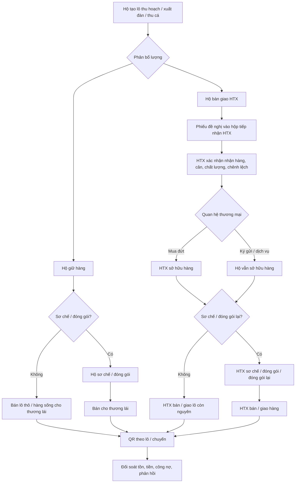
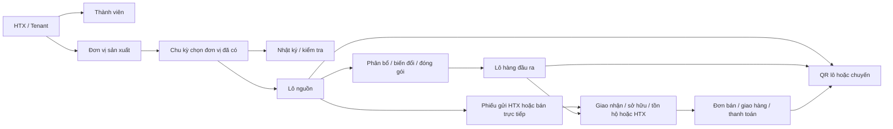

# ĐẶC TẢ YÊU CẦU PHẦN MỀM (SRS)

## Hệ thống quản lý sản xuất, kinh doanh và truy xuất nguồn gốc cho HTX nông nghiệp Hưng Yên

| Thuộc tính | Giá trị |
|---|---|
| Phiên bản | 2.1 – cập nhật ranh giới dữ liệu hộ/HTX, vùng–vụ và hai kho |
| Ngày cập nhật | 29/09/2026 |
| Phạm vi | Web quản trị, Zalo Mini App, API và trang truy xuất công khai |
| HTX thí điểm | HTX dịch vụ nông nghiệp An Ninh; HTX chăn nuôi và kinh doanh gà Đông Tảo; HTX cây ăn quả đặc sản và NTTS Quyết Thắng |
| Trạng thái | Dự thảo SRS; các điểm cần HTX xác nhận được liệt kê ở mục 18 |

> **Nguyên tắc đọc:** Đây là yêu cầu của hệ thống cần đạt, không phải mô tả rằng mã nguồn hiện tại đã đáp ứng. Tên địa bàn, quy trình sản xuất, chứng nhận, cách giao dịch thực tế và chỉ tiêu thí điểm cần đối chiếu với từng HTX trước khi nghiệm thu. Khi tài liệu thuyết minh hoặc SRS cũ khác với quyết định mới của chủ dự án, quyết định mới trong tài liệu này được ưu tiên.

| Lịch sử phiên bản | Nội dung chính |
|---|---|
| 2.0 (28/09/2026) | SRS hợp nhất Web, Mini App, API, QR và ba loại hình sản xuất. |
| 2.1 (29/09/2026) | Chốt vùng độc lập với vụ/lứa; giới hạn dữ liệu hộ; phiếu hộ gửi HTX; tách Kho vật tư/Kho thành phẩm, hàng sở hữu/ký gửi; bổ sung luồng dữ liệu demo và nghiệm thu. |

## 1. Mục đích, phạm vi và nguồn đầu vào

### 1.1. Mục đích

Hệ thống lưu và liên kết dữ liệu từ thành viên, đơn vị sản xuất, chu kỳ sản xuất, nhật ký, thu hoạch đến hàng hóa, giao nhận, bán hàng và truy xuất. Một nền tảng phục vụ nhiều HTX, có thể bật/tắt phân hệ và cấu hình danh mục theo loại hình **trồng trọt, chăn nuôi, thủy sản** mà không sửa mã nguồn chỉ để thêm HTX, giống, đơn vị tính, công việc hoặc quy trình mới.

### 1.2. Thành phần hệ thống

| Thành phần | Trách nhiệm chính |
|---|---|
| **Web quản trị/Portal** | Quản trị hệ thống và từng HTX; tạo, duyệt, khóa thành viên; cấu hình danh mục/quy trình/quyền; lập kế hoạch; quản lý dữ liệu sản xuất, kho, tiêu thụ, công nợ, báo cáo, đối soát và xử lý sai lệch. |
| **Zalo Mini App** | Người dùng đã được cấp quyền đăng nhập; xem công việc và dữ liệu được phân công; ghi nhật ký, sự kiện sản xuất, thu hoạch, giao nhận, đóng gói, bán hàng tại hiện trường tùy vai trò; xem thông báo và QR. **Không có tạo thành viên, đăng ký thành viên hoặc phê duyệt thành viên.** |
| **API và cơ sở dữ liệu tập trung** | Xác thực, phân quyền, kiểm tra quy tắc nghiệp vụ, lưu giao dịch, truy vết thay đổi, đồng bộ Web/Mini App, phát hành mã truy xuất. |
| **Trang truy xuất công khai** | Mở từ QR, trình bày dữ liệu đã được HTX duyệt công bố; không yêu cầu đăng nhập và không lộ dữ liệu cá nhân, giá mua hay thông tin nội bộ. |

SRS bao gồm luồng bán trực tiếp của hộ và luồng bán qua HTX; sơ chế/đóng gói là bước **tùy chọn**. Cơ sở dữ liệu phải hỗ trợ một lô chia nhiều nhánh, gom nhiều lô vào một mẻ hợp lệ và giữ được nguồn gốc ở mỗi nhánh.

### 1.3. Ngoài phạm vi mặc định của thí điểm

Kế toán tổng hợp, hóa đơn điện tử có giá trị pháp lý, thanh toán trực tuyến, quản lý vận tải theo thời gian thực, sàn thương mại điện tử và kiểm nghiệm tự động không được ngầm coi là đã có. Hệ thống cần điểm tích hợp hoặc xuất dữ liệu khi được đặt hàng riêng. Bản xem trước chứng từ trên Mini App không phải hóa đơn điện tử đã phát hành.

### 1.4. Đầu vào để biên soạn

- Tài liệu thuyết minh `07.07.2026.Thuyết minh Hưng Yên V5.docx` do người dùng cung cấp: kiến trúc Web/Mini App/API/QR, mô-đun thí điểm, dịch vụ nông nghiệp, sản xuất, tiêu thụ, đánh giá chỉ số trước/sau.
- Bản tổng hợp nghiệp vụ Mini App và SRS cũ của dự án: vai trò hiện có, vùng/mùa vụ/nhật ký/thu hoạch/sơ chế/đóng gói, bán hàng, kho vật tư.
- Các quyết định trong trao đổi: mobile chỉ đăng nhập, quản lý/phê duyệt thành viên trên Web; cả hai cách bán trực tiếp và qua HTX; truy xuất lô không đóng gói; tạo vùng trước rồi tạo vụ/lứa chọn vùng; dữ liệu riêng của hộ không tự động mở cho HTX; tách Kho vật tư và Kho thành phẩm; phân biệt hàng HTX sở hữu với hàng hộ ký gửi.

## 2. Thuật ngữ và nguyên tắc mô hình

| Thuật ngữ | Định nghĩa dùng trong hệ thống |
|---|---|
| HTX/tenant | Đơn vị sở hữu không gian dữ liệu riêng. |
| Thành viên/hộ | Chủ thể tham gia sản xuất; có thể là người dùng Mini App hoặc chỉ là hồ sơ nghiệp vụ. |
| Đơn vị sản xuất | Vùng/thửa ruộng, vườn/lô cây, chuồng/trại, ao hoặc lồng/bè nuôi; là hồ sơ tương đối ổn định, có loại hình, vị trí, chủ/quản lý, diện tích hoặc sức chứa và trạng thái riêng. Khi tạo **không bắt buộc chọn vụ/lứa**. |
| Chu kỳ sản xuất | Vụ lúa, vụ/quy trình chăm sóc vườn, lứa nuôi gà, lứa nuôi thủy sản. Khi tạo vụ/lứa phải chọn đơn vị sản xuất đã có; một đơn vị được dùng qua nhiều chu kỳ. Nếu một kế hoạch vụ chung bao phủ nhiều đơn vị, nhật ký và sản lượng vẫn quy về cặp đơn vị–chu kỳ rõ ràng. |
| Quy trình/SOP | Bộ bước, nhắc việc, biểu mẫu và điều kiện kiểm tra; có phiên bản, ngày hiệu lực. |
| Lô thu hoạch/xuất đàn/thu cá | Lượng đầu ra ban đầu gắn với nguồn sản xuất và thời gian; gọi chung là **lô nguồn**. |
| Mẻ sơ chế/chế biến | Sự kiện biến đổi hàng hóa, có đầu vào, đầu ra, hao hụt và người thực hiện. |
| Lô đóng gói | Sự kiện chuyển hàng sang quy cách bao bì/nhãn; có thể do hộ hoặc HTX thực hiện, có thể là đóng gói lại. |
| Lô hàng hóa | Đơn vị có thể tồn kho, chuyển giao hoặc bán; có chủ sở hữu, địa điểm giữ hàng, trạng thái và chuỗi nguồn gốc. |
| Kho vật tư | Kho HTX quản lý đầu vào sản xuất; hộ chỉ xem phiếu vật tư đã cấp cho mình. Vật tư cấp rời kho HTX khi phiếu được xác nhận. |
| Kho thành phẩm | Kho HTX giữ hàng **có thể bán**, gồm hàng thô, hàng sống, hàng sơ chế hoặc đã đóng gói; có cả hàng HTX sở hữu và hàng hộ ký gửi. Tên kho không có nghĩa mọi hàng đều đã đóng gói. |
| Tồn tại hộ | Hàng còn do hộ giữ tại nhà/trại/vườn; chỉ hộ và người được ủy quyền cụ thể được xem. Không thuộc Kho thành phẩm HTX. |
| Giao nhận | Sự kiện bàn giao vật chất có bên giao/bên nhận, cân thực tế, chất lượng, chứng từ, thời gian. |
| Mua đứt/ký gửi/dịch vụ đóng gói | Quan hệ thương mại khác nhau; phải ghi rõ để tính tồn, doanh thu, công nợ và trách nhiệm. |
| QR truy xuất | Mã liên kết tới bản công bố của lô hàng hoặc chuyến giao; không phụ thuộc bắt buộc vào bao bì. |

Tất cả lượng và tiền phải có đơn vị và độ chính xác cấu hình được. “Chủ sở hữu hàng”, “đơn vị đang giữ hàng”, “vị trí vật lý” và “bên bán” là các thuộc tính khác nhau. Việc hàng vào kho HTX không tự động chứng minh HTX đã mua hàng. Cùng `tenant_id` không đồng nghĩa mọi nhân viên HTX được xem dữ liệu riêng của mọi hộ.

## 3. Bối cảnh ba HTX và cấu hình thí điểm

| HTX | Đơn vị/chủ thể sản xuất | Chu kỳ và sự kiện đặc thù | Đầu ra và dịch vụ cần hỗ trợ |
|---|---|---|---|
| **An Ninh – lúa sạch** | Vùng trồng, thửa ruộng, hộ, mã vùng trồng nếu có | Vụ Xuân/Mùa; gieo cấy, bón phân, phòng trừ, tưới, kiểm tra; lịch máy cấy/gặt/sấy | Lúa tươi/lúa khô, gạo sau xay xát, phân hạng, thu mua, sấy/xay xát/đóng bao, bán và QR |
| **Đông Tảo – gà** | Hộ, chuồng/trại, đàn/lứa, giống | Nhập đàn, thức ăn, cân mẫu, tiêm phòng, dùng thuốc, bệnh, hao hụt/chết, kiểm tra trước xuất | Gà sống hoặc sản phẩm sơ chế theo cấu hình; xuất đàn từng phần, bán trực tiếp/qua HTX, đối soát |
| **Quyết Thắng – nhãn, thủy sản** | Vườn/lô cây lâu năm; ao hoặc lồng/bè nuôi, vị trí xác nhận thực tế | Cây: chăm sóc theo năm/vụ thu quả, ra hoa, phòng sâu bệnh, thu hái. Cá: thả giống, thức ăn, môi trường nước, bệnh, hao hụt, thu hoạch | Nhãn tươi/sơ chế/đóng gói; cá sống/tươi, bán theo lô/chuyến; giao nhận, QR và công nợ |

Không cố định tên xã/huyện, vị trí lồng cá hay tiêu chuẩn chứng nhận vào mã nguồn. Hồ sơ HTX và đơn vị sản xuất lưu địa chỉ hành chính hiện hành, tên lịch sử nếu cần, tọa độ có nguồn xác minh và thời điểm cập nhật. Bảng trên là cấu hình khởi tạo, không giới hạn HTX mới.

## 4. Tác nhân và phân quyền

| Mã | Vai trò | Web | Mini App | Giới hạn chính |
|---|---|---|---|---|
| R01 | Quản trị hệ thống | Toàn hệ thống theo phân quyền vận hành | Không bắt buộc | Tạo HTX, cấu hình nền tảng, quản lý tenant và tài khoản quản trị; truy cập dữ liệu HTX phải được ghi log. |
| R02 | Quản lý HTX | Quản trị nghiệp vụ HTX theo quyền | Dashboard, phê duyệt tác nghiệp, ghi/duyệt giao dịch khi được cấp | Theo dõi vùng, vụ/lứa, nhật ký và chỉ tiêu sản xuất; dữ liệu lô/tồn riêng của hộ chỉ qua giao dịch đã chia sẻ hoặc ủy quyền cụ thể. |
| R03 | Kỹ thuật viên/tổ sản xuất | Kế hoạch, đơn vị, chu kỳ, SOP, nhật ký, kiểm tra theo phân công | Công việc hiện trường, nhật ký, kiểm tra; thu hoạch HTX tự sản xuất khi được cấp | Không tạo/sửa lô riêng của hộ nếu chưa được hộ ủy quyền cụ thể; không mặc nhiên xem kho, bán hàng của hộ; không tự duyệt giao dịch của mình khi yêu cầu hai người. |
| R04 | Kế toán/kinh doanh/kho | Khách hàng, giá, hợp đồng, hai kho HTX, phiếu hộ gửi HTX, đơn hàng, giao hàng, công nợ | Hộp phiếu giao HTX, hai kho và đơn theo quyền | Không duyệt quyền xem toàn bộ lô/tồn của hộ; chỉ xem nguồn đã gửi ở mức cần cho tiếp nhận/truy xuất. Không tự thay đổi nhật ký nguồn gốc đã chốt. |
| R06 | Thành viên/hộ sản xuất | Chỉ nếu HTX cấp tài khoản Web riêng; mặc định không | Xem vùng/vụ được giao, nhật ký, lô và tồn của chính hộ, vật tư đã cấp, phiếu giao HTX và đơn bán trực tiếp của hộ | Không tạo/duyệt thành viên, không tạo/xóa đơn vị sản xuất hoặc tự mở chu kỳ nếu chưa cấp quyền. |
| R07 | Người quét QR | Trang công khai | Có thể mở trang công khai trong Zalo | Chỉ xem trường công khai của mã hợp lệ. |

R05/tổ trưởng chỉ là **vai trò cấu hình tùy chọn** nếu HTX thực sự có tổ sản xuất. Không có quyền tạo hay duyệt thành viên trên Mini App. Quyền thực tế là tổ hợp `tenant + vai trò + hành động + phạm vi dữ liệu + điều kiện duyệt`; cùng một người có thể kiêm vai trò nhưng hành động nhạy cảm vẫn tách người lập và người duyệt khi cấu hình yêu cầu.

### 4.1. Ranh giới dữ liệu hộ và HTX

| Nhóm dữ liệu | Hộ R06 | HTX R02/R03/R04 |
|---|---|---|
| Vùng/đơn vị, vụ/lứa, kế hoạch, nhật ký, kiểm tra | Của hộ hoặc được giao | R02 và R03 xem/theo tác nghiệp trong phạm vi HTX và phân công; R04 chỉ khi nghiệp vụ cần. |
| Lô nguồn, thu hoạch, bán trực tiếp, tồn hàng còn do hộ giữ | Của hộ | Không có quyền liệt kê hoặc mở chi tiết mặc định. R04/R02 chỉ thấy **bản chụp nguồn tối thiểu** của lượng hộ đã gửi trong phiếu giao HTX, và truy xuất theo giao dịch đó. |
| Phiếu hộ đề nghị bán đứt/ký gửi cho HTX | Hộ gửi xem phiếu và tiến độ | R04/R02 nhận trong hộp phiếu HTX, xác nhận cân/chất lượng, duyệt hoặc từ chối theo quyền; R03 chỉ khi được phân công tiếp nhận. |
| Kho vật tư HTX | Chỉ phiếu đã cấp cho hộ và lịch sử nhận/sử dụng nếu có | Người được cấp quyền quản lý nhập, xuất, cấp phát, hoàn trả, kiểm kê. |
| Kho thành phẩm HTX | Chỉ hàng ký gửi của chính hộ và đối soát liên quan, không thấy hàng hộ khác | Người được cấp quyền xem hàng HTX giữ, tách rõ HTX sở hữu và hàng hộ ký gửi. |
| QR công khai | Theo trường được duyệt | Theo trường được duyệt; dữ liệu riêng không tự công khai vì được liên kết nguồn. |

Quyền truy cập phải áp dụng cho **danh sách, chi tiết qua ID, tìm kiếm, thống kê có thể nhận dạng, ảnh/tệp đính kèm và xuất dữ liệu**. HTX có thể xem số liệu dự báo/tổng hợp sản xuất theo vùng và vụ/lứa mà không cần mở toàn bộ lô cá nhân. Việc hộ gửi một phiếu chỉ chia sẻ lượng và dữ liệu nguồn phục vụ phiếu đó; không cấp quyền duyệt toàn bộ kho tại hộ. Ủy quyền đặc biệt phải có phạm vi, thời hạn và nhật ký kiểm toán.

### 4.2. Ma trận kênh tối thiểu

| Nghiệp vụ | Web | Mini App |
|---|---|---|
| Tạo, sửa, duyệt, khóa thành viên; gắn tài khoản Zalo | Có, người có quyền | **Không**; chỉ đăng nhập và xem thông tin được phép |
| Cấu hình danh mục, SOP, đơn vị tính, biểu mẫu, quyền, trạng thái | Có | Chỉ đọc dữ liệu hiệu lực để nhập liệu |
| Tạo vùng độc lập; tạo vụ/lứa chọn vùng; kế hoạch, phân công, dịch vụ | Tạo/duyệt/đối soát | Xem hoặc tác nghiệp theo vai trò; không ép chọn vụ khi tạo vùng |
| Kho vật tư HTX, cấp phát | Quản lý nhập/xuất/cấp/kiểm kê | Người HTX được quyền tác nghiệp; hộ chỉ xem vật tư đã cấp cho mình |
| Kho thành phẩm HTX và tồn tại hộ | HTX quản lý hàng đang giữ, tách chủ sở hữu; hộ xem phần của mình nếu có Web | HTX xem hàng đang giữ; hộ xem tồn riêng và hàng ký gửi của mình |
| Nhật ký, kiểm tra, thu hoạch | Tạo, hiệu chỉnh có log, duyệt | Nhập tại hiện trường và xem lịch sử theo quyền |
| Nhập hàng, sơ chế, đóng gói, bán, giao nhận | Đầy đủ và đối soát | Thao tác hiện trường được cấp quyền; giao dịch cần duyệt vẫn chờ Web hoặc người có quyền |
| Công nợ, báo cáo tổng hợp, xuất dữ liệu | Đầy đủ | Số liệu rút gọn và công nợ liên quan theo quyền |
| QR công khai | Cấu hình, duyệt, thu hồi, xem lượt quét | Tạo/yêu cầu phát hành khi đủ quyền; quét và chia sẻ |

## 5. Quy trình nghiệp vụ xuyên suốt

### 5.1. Từ lập kế hoạch đến đầu ra

1. Web tạo HTX, danh mục, thành viên, **đơn vị sản xuất độc lập với vụ/lứa**, giống/sản phẩm, SOP và phân quyền. Đơn vị có thể đang hoạt động nhưng chưa có chu kỳ.
2. Khi lập vụ/lứa, người có quyền chọn đơn vị sản xuất đã tồn tại, giống/con, SOP, ngày, sản lượng dự kiến, lịch công việc, dịch vụ và người phụ trách; Mini App nhận công việc. Trạng thái đơn vị và trạng thái chu kỳ được quản lý riêng.
3. Hộ/kỹ thuật viên ghi nhật ký, vật tư, môi trường, dịch bệnh, ảnh và số liệu; người có quyền kiểm tra, yêu cầu bổ sung hoặc xác nhận.
4. Người được phép tạo lô nguồn từ chu kỳ và đơn vị sản xuất; ghi khối lượng/số con, phân hạng, chất lượng và chủ sở hữu ban đầu. Hộ thấy lô và tồn của mình; HTX chưa được liệt kê lô này nếu hộ chưa gửi hàng hoặc chưa ủy quyền.
5. Từ lô nguồn, hộ có thể bán trực tiếp hoặc lập phiếu **bán đứt/ký gửi cho HTX**, chỉ rõ lượng. Phiếu vào hộp tiếp nhận của HTX; trước khi xác nhận nhận hàng, lượng đề nghị được giữ khỏi lượng khả dụng của hộ nhưng chưa cộng Kho thành phẩm HTX. Vị trí thực tế trong giai đoạn vận chuyển/chờ cân được ghi theo trạng thái giao nhận. Sau xác nhận, hàng được chuyển theo lượng cân chốt và đúng chủ sở hữu.
6. Hàng ở hộ hoặc HTX có thể sơ chế, đóng gói, bán/giao, hoặc chia nhiều nhánh; không ép đủ tất cả bước. Hàng HTX giữ và có thể bán được quản lý ở Kho thành phẩm, tách hàng HTX sở hữu với hàng ký gửi.
7. Xác nhận đơn giữ lượng khả dụng; giao xuất thực tế trừ tồn vật lý đúng một lần; hủy giải phóng phần giữ chưa xuất. Bán hàng phát sinh đối soát tiền/công nợ, phản hồi và báo cáo. QR có thể phát hành cho lô hoặc chuyến bán phù hợp.

### 5.2. Hai nhánh tiêu thụ bắt buộc

**Quy tắc:** Câu “hộ đóng gói rồi bán cho HTX, HTX đóng gói lại” là một luồng hợp lệ. Phải có **hai sự kiện đóng gói khác nhau**, hai bên thực hiện, quan hệ giữa bao bì cũ và mới, lượng tháo gói/hao hụt và liên kết ngược tới cùng lô nguồn. Nếu HTX chỉ dán nhãn bổ sung mà không thay bao bì, ghi một sự kiện dán nhãn, không giả tạo mẻ sơ chế mới. Bán trực tiếp của hộ là giao dịch do hộ sở hữu; HTX chỉ được ghi nhận/báo cáo trong phạm vi thỏa thuận, không tự cộng vào doanh thu của HTX.

### 5.3. Các trường hợp sản xuất đặc thù

- **Lúa:** một vụ có nhiều lần thu hoạch và có thể bán lúa tươi; sấy/xay xát tạo đầu ra khác đơn vị/quy cách, ghi tỷ lệ thu hồi, cám/tấm/phụ phẩm nếu quản lý. Dịch vụ máy cấy, gặt, sấy có yêu cầu, lịch, nghiệm thu khối lượng và chi phí.
- **Gà:** một đàn/lứa có nhập bổ sung, hao hụt và xuất bán từng phần; tồn theo con và khối lượng cân. Nhật ký vaccine/thuốc lưu thời gian ngừng thuốc theo hướng dẫn chuyên môn được HTX phê duyệt. Cảnh báo không thay thế quyết định thú y.
- **Nhãn:** vườn cây tồn tại qua nhiều năm; chu kỳ chăm sóc/thu hoạch theo vụ gắn cùng đơn vị vườn. Thu hái nhiều đợt, phân loại theo danh mục, sơ chế/đóng gói tùy đơn hàng.
- **Thủy sản:** ao và lồng/bè là cùng nhóm loại hình nhưng có trường cấu hình riêng; một lứa nuôi có thả giống, số lượng/khối lượng, thức ăn, đo nước, bệnh, hao hụt, thu hoạch nhiều lần. Có thể bán cá sống trực tiếp theo chuyến, QR gắn chuyến hoặc lô.

### 5.4. Xử lý giao dịch sai, trả hàng và thu hồi

Giao dịch đã chốt không bị sửa âm thầm. Người có quyền tạo chứng từ điều chỉnh/đảo chiều, nêu lý do, người duyệt và liên kết chứng từ gốc. Trả hàng phải chỉ rõ nguồn bán, lượng nhận lại, tình trạng chất lượng, nơi nhận và quyết định nhập lại/loại bỏ. Khi phát hiện rủi ro chất lượng, Web đánh dấu lô bị cách ly hoặc thu hồi; QR công khai thể hiện trạng thái phù hợp và các lô hậu duệ liên quan được tra ra.

## 6. Yêu cầu chức năng chung và Web Portal

Quy ước ưu tiên: **P0** cần cho vận hành thí điểm; **P1** mở rộng sau khi chốt nhu cầu, nhưng mô hình dữ liệu không được ngăn cản. Mỗi yêu cầu có mã dùng để thiết kế, kiểm thử và nghiệm thu.

### 6.1. Quản trị nền tảng, HTX và danh mục

| ID | Mức | Yêu cầu và tiêu chí chấp nhận |
|---|---|---|
| SYS-01 | P0 | R01 tạo/khóa HTX, cấu hình tên, địa chỉ, logo, loại hình, múi giờ, tính năng bật, chính sách quyền. Dữ liệu và mã số nghiệp vụ không lẫn giữa HTX. |
| SYS-02 | P0 | Web quản lý tài khoản, vai trò, phạm vi đơn vị sản xuất, trạng thái hoạt động; API kiểm tra quyền ở máy chủ cho mọi yêu cầu. |
| SYS-03 | P0 | Danh mục phiên bản hóa: giống cây/con, sản phẩm, công việc, vật tư, dịch vụ, phân hạng, đơn vị tính, lý do hao hụt, đối tác, loại hình đơn vị sản xuất. Thêm mục mới qua Web và dùng được ngay ở API/Mini App sau đồng bộ. |
| SYS-04 | P0 | Cấu hình SOP/biểu mẫu theo ngành, sản phẩm, HTX: bước, trường bắt buộc, kiểm tra giá trị, nhắc lịch, tài liệu, phiên bản hiệu lực. Hồ sơ cũ vẫn tham chiếu phiên bản tại thời điểm ghi. |
| SYS-05 | P0 | Cấu hình chuyển đổi đơn vị chỉ khi có hệ số hợp lệ và cùng đại lượng; ví dụ kg ↔ tấn. Không tự quy đổi con ↔ kg nếu không có cân thực tế. |
| SYS-06 | P0 | Web quản lý thông báo, tài liệu kỹ thuật, mẫu QR công khai, trường được công bố và chính sách lưu trữ. |
| SYS-07 | P1 | Nhập/xuất danh mục qua mẫu có kiểm tra trùng mã, đơn vị, tenant và báo cáo lỗi theo dòng. |

### 6.2. Thành viên, đơn vị sản xuất và kế hoạch

| ID | Mức | Yêu cầu và tiêu chí chấp nhận |
|---|---|---|
| WEB-MEM-01 | P0 | Web tạo, sửa, xét duyệt, khóa/mở khóa hồ sơ thành viên/hộ; lưu lịch sử trạng thái và người duyệt. Không có API công khai cho Mini App tự đăng ký hoặc duyệt. |
| WEB-MEM-02 | P0 | Web gắn tài khoản đăng nhập/Zalo với thành viên đã được duyệt; kiểm tra trùng định danh theo chính sách HTX; chuyển HTX hoặc đổi liên kết phải được người có quyền xác nhận. |
| WEB-MEM-03 | P0 | Web lưu hồ sơ HTX, giấy tờ/tài liệu, hiệu lực và quyền xem; không công bố giấy tờ cá nhân qua QR. |
| WEB-UNIT-01 | P0 | Web tạo đơn vị sản xuất có loại hình, địa chỉ/tọa độ, diện tích hoặc sức chứa, chủ/quản lý, mã vùng/lồng/chuồng, trạng thái; **không yêu cầu chọn vụ/lứa**. Lưu lịch sử thay đổi; loại hình điều khiển bộ trường, đơn vị, biểu mẫu và quy tắc phù hợp. |
| WEB-UNIT-02 | P0 | Một đơn vị sản xuất có nhiều chu kỳ theo thời gian; vườn cây không bị tạo lại mỗi năm; chuồng/lồng có thể nuôi nhiều lứa liên tiếp. Trạng thái đơn vị độc lập với chu kỳ; đơn vị ngừng/đóng không được chọn cho chu kỳ mới, trừ trường hợp được duyệt. Không cho chu kỳ trùng bất hợp lý theo quy tắc loại hình. |
| WEB-PLAN-01 | P0 | Web lập vụ/lứa bằng cách **chọn đơn vị sản xuất đã có**, giống/con, SOP, mốc thời gian, sản lượng dự kiến, lịch, nhân lực, vật tư, dịch vụ và thu hoạch; phân công người thực hiện/kiểm tra. Nếu kế hoạch chung có nhiều đơn vị, tạo liên kết đơn vị–chu kỳ để ghi nhật ký/sản lượng riêng. |
| WEB-PLAN-02 | P0 | Yêu cầu dịch vụ nông nghiệp có loại dịch vụ, đơn vị, khối lượng, lịch đề nghị, lịch xác nhận, người phục vụ, kết quả thực hiện và đối soát chi phí. Áp dụng trước tiên cho cấy/gặt/sấy An Ninh. |
| WEB-PLAN-03 | P0 | Yêu cầu vật tư có người đề nghị, vật tư, số lượng, kho nguồn, trạng thái duyệt/cấp phát/nhận; số lượng cấp phát được liên kết nhật ký sử dụng. |

### 6.3. Theo dõi sản xuất và kiểm soát chất lượng

| ID | Mức | Yêu cầu và tiêu chí chấp nhận |
|---|---|---|
| WEB-PROD-01 | P0 | Web xem/tạo/kiểm tra nhật ký theo đơn vị, chu kỳ và bước SOP; ghi thời gian thực tế, người thực hiện, vật tư, lượng, ảnh/tệp, ghi chú và nguồn nhập Web/Mini App. |
| WEB-PROD-02 | P0 | Khi thời điểm thuộc nhiều chu kỳ hoặc ngoài mọi chu kỳ, hệ thống yêu cầu chọn/xác nhận; không âm thầm gắn vào chu kỳ hiện tại. |
| WEB-PROD-03 | P0 | Cấu hình thời hạn tự sửa nhật ký, mặc định 24 giờ cho hộ. Sau hạn, thay đổi phải qua yêu cầu hiệu chỉnh và lịch sử duyệt. |
| WEB-PROD-04 | P0 | Biểu mẫu theo loại hình hỗ trợ tiêm phòng/thuốc/hao hụt đàn; chăm sóc cây lâu năm; thức ăn, môi trường nước và hao hụt thủy sản. Trường mới cấu hình được, không sửa cấu trúc màn hình cho mỗi giống. |
| WEB-PROD-05 | P0 | Kỹ thuật viên ghi kết quả kiểm tra, mức độ đạt, yêu cầu khắc phục và hạn xử lý; mọi quyết định duyệt chất lượng có người, thời điểm, tiêu chí. |
| WEB-PROD-06 | P1 | Cảnh báo lịch SOP, nguy cơ quá hạn, tồn vật tư thấp, chu kỳ thiếu nhật ký và các chỉ số bất thường theo ngưỡng cấu hình. |

### 6.4. Thu hoạch, chuyển giao, chế biến và hàng hóa

| ID | Mức | Yêu cầu và tiêu chí chấp nhận |
|---|---|---|
| WEB-HAR-01 | P0 | Tạo lô nguồn từ chu kỳ/đơn vị sản xuất, thời gian, người thu, số lượng/khối lượng, đơn vị, phân hạng theo danh mục, ảnh và chứng từ. Sản lượng phân hạng không vượt tổng hợp lệ. |
| WEB-HAR-02 | P0 | Một lô nguồn chia thành nhiều phần cho bán trực tiếp, bàn giao HTX, sơ chế, đóng gói hoặc tồn. Tổng đã phân bổ không vượt lượng khả dụng; thao tác đồng thời phải được khóa/kiểm tra giao dịch ở API. |
| WEB-HAR-03 | P0 | Danh sách “Nguồn cung thu hoạch” của HTX chỉ gồm lô **HTX tự sản xuất** và phiếu/lượng hộ đã chủ động gửi HTX. Lô hộ chưa gửi, tồn tại hộ và đơn bán trực tiếp của hộ không xuất hiện trong danh sách/tìm kiếm/xuất của R02/R04. Phiếu gửi chia sẻ bản chụp nguồn tối thiểu để nhận và truy xuất. |
| WEB-TRF-01 | P0 | Giao nhận hộ→HTX và HTX→đối tác có phiếu, bên giao/nhận, số cân hai bên, chênh lệch, lý do, chất lượng, địa điểm, thời điểm, ảnh/chữ ký xác nhận nếu áp dụng. |
| WEB-TRF-02 | P0 | Phiếu hộ gửi **mua đứt/ký gửi/dịch vụ** vào hộp tiếp nhận HTX, có mã phiếu, mã lô nguồn, hộ, lượng đề nghị, trạng thái, giá/điều khoản nếu có. R04/R02 mở trực tiếp từ thông báo; xác nhận lượng nhận, chất lượng, chênh lệch và duyệt/từ chối. Phiếu chưa chốt chỉ giữ lượng hộ đã đề nghị, chưa tạo tồn vật lý HTX. Chốt mua đứt đổi chủ sang HTX; chốt ký gửi giữ hộ là chủ, HTX là bên giữ; dịch vụ không tự đổi chủ. |
| WEB-PROC-01 | P0 | Ghi sự kiện sơ chế/chế biến tùy sản phẩm, có nhiều lô đầu vào/nhiều dòng đầu ra, loại sản phẩm, lượng, hao hụt/phụ phẩm, người làm và ngày thực hiện. Truy vết tỷ lệ đóng góp hoặc lượng nguồn theo từng đầu ra. |
| WEB-PACK-01 | P0 | Hộ hoặc HTX có thể đóng gói từ lượng khả dụng; lưu người thực hiện, chủ hàng, quy cách, bao bì, số lượng gói, trọng lượng/đơn vị và nhãn. Bước này có thể bỏ qua. |
| WEB-PACK-02 | P0 | Cho phép HTX đóng gói lại hàng đã nhận/đã được hộ đóng gói; ghi nguồn gói cũ, lượng tháo, đầu ra, bao bì mới, hao hụt và QR cũ/mới; không tạo thêm sản lượng. |
| WEB-MAT-01 | P0 | **Kho vật tư HTX** là phân hệ/menu riêng: nhập mua/nhận, tồn, cấp hộ, hoàn trả, điều chỉnh và kiểm kê; có sổ phát sinh theo vật tư, lô/hạn dùng nếu áp dụng, người thực hiện và phiếu nguồn. Xác nhận cấp phát trừ tồn HTX; phiếu chưa xác nhận không trừ. |
| WEB-MAT-02 | P0 | Hộ chỉ xem vật tư **đã cấp cho chính hộ** và lịch sử nhận/hoàn/sử dụng có ghi nhận; không thấy tồn, giá mua hoặc phiếu của hộ khác ở Kho vật tư HTX. Không gọi lượng đã cấp là “tồn tại hộ” nếu chưa có ghi sử dụng và kiểm kê tại hộ. |
| WEB-STK-01 | P0 | **Kho thành phẩm HTX** là phân hệ/menu riêng, quản lý hàng HTX đang giữ và có thể bán (thô/sống/sơ chế/đóng gói): nhập, xuất, chuyển vị trí, điều chỉnh, cách ly, kiểm kê. Mỗi dòng tồn có lô, sản phẩm, lượng, đơn vị, chủ sở hữu, bên giữ và vị trí; tách rõ **HTX sở hữu** và **hộ ký gửi** trong danh sách, bộ lọc, tổng hợp và xuất dữ liệu. Không đưa tồn tại hộ vào kho này. |
| WEB-STK-02 | P0 | Đối soát hai kho với cấp phát, giao nhận, biến đổi, đóng gói và bán/giao; tách sổ phát sinh vật tư và hàng bán được. Hiển thị sai lệch, yêu cầu chứng từ điều chỉnh và chặn tồn âm; ngoại lệ có duyệt phải lưu dấu vết. |
| WEB-STK-03 | P1 | Quản lý kho chi tiết theo vị trí, hạn dùng, nhiệt độ/bảo quản, mã kệ và kiểm kê định kỳ cho HTX bật phân hệ này. |
| WEB-STK-04 | P0 | Hộ xem tồn hàng do hộ giữ, tách lượng khả dụng và lượng đang giữ cho phiếu/đơn; HTX chỉ thấy tồn hàng do HTX giữ. Hộ theo dõi phần hàng ký gửi đang ở HTX và đối soát của chính hộ. Chuyển nơi giữ phải qua giao nhận đã chốt. |

### 6.5. Bán hàng, công nợ, QR và báo cáo

| ID | Mức | Yêu cầu và tiêu chí chấp nhận |
|---|---|---|
| WEB-SALE-01 | P0 | Danh mục khách hàng/thương lái/đại lý, kênh, hợp đồng hoặc thỏa thuận, bảng giá theo hiệu lực; lưu lịch sử thay đổi. |
| WEB-SALE-02 | P0 | Đơn bán có **bên bán pháp lý** (hộ/HTX), bên mua, nguồn hàng, lượng, đơn vị, giá, thuế/phí nếu dùng, điều kiện giao nhận, trạng thái. Bán trực tiếp của hộ không tự tính là doanh thu HTX. |
| WEB-SALE-03 | P0 | Một đơn có nhiều lô; một lô có thể cấp nhiều đơn trong lượng còn lại. Đơn nháp không ảnh hưởng tồn; xác nhận đơn giữ lượng khả dụng, **giao/xuất thực tế** mới trừ tồn vật lý; hủy giải phóng phần giữ chưa giao đúng một lần. Bán trực tiếp trừ tồn tại hộ, không ảnh hưởng kho HTX. |
| WEB-SALE-07 | P0 | Đơn bán hàng ký gửi ghi hộ là chủ hàng, HTX là bên bán hộ/đại diện theo thỏa thuận, phí/hoa hồng và khoản phải trả hộ. Giao hàng trừ đúng dòng tồn ký gửi; đối soát không biến hàng ký gửi thành hàng HTX sở hữu hoặc doanh thu bán hàng sở hữu của HTX. |
| WEB-SALE-04 | P0 | Ghi chuyến giao, lượng xuất/nhận, chênh lệch, người nhận, thời gian, chứng từ; xác định số lượng tính tiền theo điều khoản được cấu hình. |
| WEB-SALE-05 | P0 | Theo dõi phải thu/phải trả liên quan đơn và phiếu mua hàng, thanh toán từng phần, hạn, trạng thái, đối soát; chứng từ xem trước không thay hóa đơn pháp lý. |
| WEB-SALE-06 | P0 | Ghi phản hồi khách hàng, khiếu nại, ảnh, lô liên quan, cách xử lý và trạng thái kết thúc. |
| WEB-QR-01 | P0 | Phát hành QR cho lô hàng hóa hoặc chuyến giao, gồm cả lúa chưa đóng bao, gà/cá sống và hàng bán trực tiếp. QR chứa URL/định danh tra cứu, không chứa dữ liệu nhạy cảm trong mã. |
| WEB-QR-02 | P0 | Web cấu hình, xem trước và duyệt dữ liệu công bố; thu hồi/tạm dừng QR khi lô bị cách ly, chứng nhận hết hiệu lực hoặc dữ liệu sai; bản công bố ghi phiên bản. |
| WEB-REP-01 | P0 | Dashboard theo HTX và quyền: thành viên hoạt động, đơn vị/chu kỳ, nhật ký đúng hạn, dự báo/sản lượng tổng hợp, hao hụt, mua/bán, tồn, công nợ, QR, phản hồi. Tồn HTX tách vật tư/thành phẩm và hàng sở hữu/ký gửi; số liệu hộ riêng không hiện thành danh sách lô hoặc tồn cá nhân cho R02/R04. Có bộ lọc thời gian, loại hình, sản phẩm. |
| WEB-REP-02 | P0 | Báo cáo chỉ số trước/sau thí điểm lưu **định nghĩa, kỳ đo, giá trị gốc, giá trị cuối, nguồn dữ liệu và người xác nhận**; không mặc định số liệu trong thuyết minh là kết quả thực tế. |
| WEB-REP-03 | P1 | Xuất CSV/XLSX/PDF theo quyền; có nhật ký xuất và ẩn dữ liệu cá nhân theo phạm vi. |

## 7. Yêu cầu chức năng Zalo Mini App

Mini App dùng chung API và trạng thái với Web; hiển thị chức năng theo quyền máy chủ trả về. Giao diện ưu tiên thao tác nhanh trên điện thoại, chữ dễ đọc, ít trường bắt buộc và cho chụp ảnh tại hiện trường.

| ID | Mức | Yêu cầu và tiêu chí chấp nhận |
|---|---|---|
| MOB-AUTH-01 | P0 | Người dùng đăng nhập bằng cơ chế Zalo được nền tảng hỗ trợ; API xác minh thông tin/phiên, đối chiếu tài khoản **đã được Web cấp và liên kết**. Người chưa có quyền nhận thông báo liên hệ HTX; không có màn hình tự tạo thành viên. |
| MOB-AUTH-02 | P0 | Hiển thị HTX đang làm việc, vai trò, phạm vi dữ liệu; nếu thuộc nhiều HTX, chọn ngữ cảnh và mọi giao dịch mang đúng tenant. Đăng xuất/thu hồi quyền có hiệu lực ở API. |
| MOB-WORK-01 | P0 | Trang đầu hiển thị công việc, lịch vụ/lứa, yêu cầu dịch vụ/vật tư, thông báo và số liệu ngắn gọn theo vai trò. |
| MOB-UNIT-01 | P0 | Hộ xem đơn vị sản xuất, chu kỳ hiện tại/lịch sử, SOP và người phụ trách; không tự tạo/xóa thửa/vườn/chuồng/lồng hoặc tự mở vụ theo quyền mặc định. Màn R03 được cấp quyền có thể tạo đơn vị **không chọn vụ**, rồi tạo vụ/lứa chọn đơn vị đã có. Giao diện và trạng thái hai đối tượng tách biệt. |
| MOB-LOG-01 | P0 | Hộ/kỹ thuật viên ghi nhật ký theo mẫu động, ảnh và thời gian thực hiện; xác định chu kỳ theo thời gian và yêu cầu xác nhận khi mơ hồ. Hiển thị thời hạn sửa và trạng thái đồng bộ/duyệt. |
| MOB-LOG-02 | P0 | Mẫu đặc thù hỗ trợ lúa, gà, nhãn, cá theo cấu hình Web; không có nhãn trường cố định như “thửa lúa” cho mọi HTX. |
| MOB-HAR-01 | P0 | Người có quyền tạo lô nguồn tại hiện trường, nhập lượng/đơn vị/phân hạng, ảnh; hộ xem lô, lượng đã dùng/còn lại và giao dịch của chính mình. Màn “Nguồn cung thu hoạch” R04 chỉ lấy lô HTX tự sản xuất và phiếu hộ gửi HTX, không hiện lô hộ chưa gửi. |
| MOB-TRF-01 | P0 | Hộ từ chi tiết lô tạo phiếu bán đứt hoặc ký gửi cho HTX với lượng cụ thể, hoặc ghi bán trực tiếp; phiếu có mã/trạng thái và xuất hiện ngay trong **hộp tiếp nhận HTX** của R04/R02. Người nhận được quyền xác nhận cân, chất lượng, chênh lệch, duyệt/từ chối. Thông báo mở đúng phiếu; dữ liệu dùng chung hai vai trò, không tạo bản sao rời. |
| MOB-PACK-01 | P0 | Người có quyền ghi sơ chế/đóng gói tại hiện trường và xem lô nguồn; cho phép bỏ qua đóng gói. Đóng gói lại chỉ khả dụng khi quyền và lượng nguồn hợp lệ. |
| MOB-SALE-01 | P0 | Theo vai trò, tạo/đề nghị đơn bán trực tiếp của hộ hoặc đơn HTX, ghi giao hàng và thanh toán; chỉ hiển thị giá/công nợ thuộc phạm vi được cấp. |
| MOB-MAT-01 | P0 | Menu **Kho vật tư** của HTX hiện tồn và phiếu nhập/cấp theo quyền; R06 chỉ xem danh sách vật tư đã cấp cho mình và lịch sử, không thấy tồn kho HTX. |
| MOB-STK-01 | P0 | Menu **Kho thành phẩm** R04/R02 chỉ hiện hàng HTX đang giữ, tách thẻ/bộ lọc “HTX sở hữu” và “Hộ ký gửi”; R06 xem tồn hàng tại hộ và tình trạng hàng ký gửi của mình ở các màn tương ứng. Không hiển thị tồn tại hộ trong kho HTX. |
| MOB-QR-01 | P0 | Xem, quét, chia sẻ QR đã phát hành; yêu cầu phát hành từ lô/chuyến chưa đóng gói nếu có quyền; không tự công bố thông tin chưa duyệt. |
| MOB-NOTI-01 | P0 | Nhận thông báo phân công, sắp đến hạn, yêu cầu bổ sung, duyệt/từ chối, giao nhận, hàng bán và phản hồi; mở đúng hồ sơ liên quan. |
| MOB-OFF-01 | P1 | Khi mất mạng, biểu mẫu được phép lưu nháp cục bộ, hiển thị chưa đồng bộ, đồng bộ lại với khóa chống tạo trùng và xử lý xung đột; các bước duyệt/bán/xuất kho chỉ có hiệu lực khi máy chủ xác nhận. |

**Ranh giới thành viên:** Mini App chỉ đăng nhập và dùng quyền do Web cấp. Mọi nút, luồng và API dành riêng Mini App để đăng ký mới, tạo, sửa hồ sơ thành viên thuộc quyền quản trị, xét duyệt hoặc phê duyệt thành viên đều bị loại khỏi phạm vi. Người quản lý có thể **xem** danh sách theo quyền để phối hợp sản xuất.

## 8. API và trang truy xuất công khai

| ID | Mức | Yêu cầu và tiêu chí chấp nhận |
|---|---|---|
| API-01 | P0 | Một API nghiệp vụ dùng chung cho Web và Mini App, xác thực nguồn gọi và kiểm tra `tenant + vai trò + hành động + chủ sở hữu + bên giữ + quan hệ giao dịch/ủy quyền` ở máy chủ. Kiểm tra trên danh sách, chi tiết ID, tìm kiếm, tổng hợp, ảnh/tệp và xuất; không tin vai trò/chủ sở hữu do client gửi. |
| API-02 | P0 | Giao dịch phân bổ, nhập/xuất, đóng gói, bán và giao hàng phải nguyên tử; có khóa phiên bản/idempotency key để tránh gửi lặp khi mạng yếu. |
| API-03 | P0 | Mọi thay đổi trạng thái, số lượng, quyền sở hữu, giá, chứng nhận, bản công bố QR có audit: ai, lúc nào, trước/sau, lý do và nguồn kênh. |
| API-04 | P0 | API trả danh mục/biểu mẫu/nhắc việc theo tenant, loại hình, phiên bản hiệu lực; Mini App không cần phát hành mã mới khi HTX thêm giống/quy trình/trường dữ liệu được hỗ trợ. |
| API-05 | P0 | Truy vấn phả hệ lô theo cả chiều nguồn→đầu ra và đầu ra→nguồn, qua chia, gom, sơ chế, đóng gói lại và giao nhận. |
| API-06 | P1 | Có phiên bản API, phân trang/lọc, tài liệu hợp đồng dữ liệu, mã lỗi ổn định và cơ chế tích hợp xuất/nhập ngoài. |
| API-07 | P0 | Web và Mini App dùng cùng định danh lô/phiếu/đơn/tồn và cùng nguồn trạng thái. Lập phiếu hộ gửi HTX làm mới hộp tiếp nhận và thông báo đúng HTX; xác nhận/từ chối cập nhật cả hai phía. Dữ liệu demo/seed phải tuân cùng hợp đồng và bất biến, không có danh sách giả riêng theo vai trò. |
| PUB-01 | P0 | URL QR mở trang công khai trên điện thoại không cần đăng nhập, hiển thị tên HTX/chủ thể được phép công bố, sản phẩm, vùng nguồn mức phù hợp, chu kỳ, nhật ký tóm tắt đã duyệt, sự kiện thu hoạch, sơ chế/đóng gói nếu có, chứng nhận còn hiệu lực và trạng thái lô. |
| PUB-02 | P0 | Trang công khai thể hiện nhiều nguồn khi trộn/gom; không gán sai một vườn hoặc một hộ cho toàn bộ lô. Có trạng thái không tìm thấy/hết hiệu lực/thu hồi; không lộ số điện thoại cá nhân, giá mua, công nợ hoặc vị trí nhạy cảm. |

## 9. Mô hình dữ liệu khái niệm

Các thực thể chính (tên kỹ thuật có thể đổi khi thiết kế):

| Thực thể | Thuộc tính tối thiểu và quan hệ |
|---|---|
| `Cooperative` | Mã tenant, tên, hồ sơ địa bàn, cấu hình và trạng thái. |
| `User`, `Membership`, `RoleGrant` | Định danh đăng nhập, thành viên/hộ liên quan, HTX, vai trò, phạm vi, hiệu lực, trạng thái duyệt. |
| `CatalogItem`, `UnitConversion`, `SOPVersion`, `FormSchema` | Danh mục đa tenant, loại hình, ngày hiệu lực, phiên bản, ràng buộc nhập liệu. |
| `ProductionUnit` | Loại ruộng/vườn/chuồng/ao/lồng; vị trí, chủ, diện tích/sức chứa, mã ngoài, trạng thái và lịch sử độc lập với chu kỳ. |
| `ProductionCycle`, `CycleUnit`, `Plan`, `Task`, `ServiceRequest` | Vụ/lứa tham chiếu đơn vị đã có (hoặc quan hệ `CycleUnit` nếu kế hoạch nhiều đơn vị), sản phẩm/giống, mốc thời gian, dự kiến, phân công, SOP phiên bản áp dụng. |
| `DiaryEvent`, `Inspection` | Sự kiện thực tế theo cặp đơn vị–chu kỳ, người làm, thời điểm, vật tư, ảnh, kết quả kiểm tra, điều chỉnh. |
| `MaterialWarehouse`, `MaterialLedger`, `MaterialIssue` | Kho vật tư HTX, lô vật tư, nhập/xuất/cấp/hoàn/điều chỉnh; hộ nhận, lượng xác nhận và lịch sử. |
| `SourceLot` | Đầu ra ban đầu từ chu kỳ, lượng, phân hạng, chủ sở hữu, trạng thái. |
| `Transformation`, `LotInput`, `LotOutput` | Sơ chế, chế biến, phân tách, gom hoặc đóng gói; các dòng vào/ra, lượng, hao hụt/phụ phẩm, tỷ lệ nguồn. |
| `HandlingUnit`, `PackagingEvent` | Bao/gói/chuyến, quy cách, nhãn, người thực hiện; liên kết đóng gói lại. |
| `TransferRequest`, `TransferReceipt`, `OwnershipEvent` | Phiếu hộ đề nghị gửi HTX, lượng giữ/chờ, bàn giao/chốt cân, điều khoản mua/ký gửi/dịch vụ và sự kiện chuyển quyền sở hữu. |
| `ProductStock`, `ProductStockLedger`, `StockReservation` | Tồn sản phẩm tại hộ hoặc HTX; lô, chủ sở hữu, bên giữ, vị trí, loại hình sở hữu/ký gửi, lượng vật lý, lượng giữ, lượng khả dụng và mọi phát sinh. Kho thành phẩm HTX là các dòng có bên giữ là HTX. |
| `SalesOrder`, `OrderAllocation`, `Delivery`, `Payment`, `Feedback` | Bên bán, bên mua, nguồn lô, giá, số lượng giữ/xuất/nhận, công nợ, phản hồi. |
| `QRPublication`, `Certificate`, `AuditEvent` | Mã/trạng thái/bản công bố, chứng nhận và hiệu lực, lịch sử thao tác. |

Quan hệ lô **không** chỉ là một khóa `harvestLotId` trên thành phẩm: một đầu ra có thể có nhiều đầu vào và một đầu vào có nhiều đầu ra. Mỗi cạnh phả hệ lưu lượng/đơn vị và loại chuyển đổi. Trường snapshot được giữ cho bản công bố QR và chứng từ đã phát hành, đồng thời vẫn có liên kết về hồ sơ gốc để kiểm toán.

## 10. Quy tắc nghiệp vụ bất biến

1. **Cách ly HTX và hộ:** mọi dữ liệu nghiệp vụ có `tenant_id`; truy vấn/ghi và QR kiểm tra tenant. Trong tenant, lô/tồn tại hộ chỉ mở theo chủ hộ, ủy quyền cụ thể hoặc bản chụp nguồn của giao dịch hộ gửi HTX. Mã có thể trùng giữa HTX nhưng định danh toàn hệ thống là duy nhất.
2. **Bảo toàn lượng:** lượng đầu ra + hao hụt + phụ phẩm được giải thích bằng lượng đầu vào theo đơn vị tương thích; phân bổ chưa và đã chốt không vượt lượng nguồn khả dụng. Chênh lệch cân phải có ngưỡng hoặc phê duyệt.
3. **Không cộng trùng:** lượng thu hoạch, lượng nhập HTX, lượng đóng gói và lượng bán là các chỉ tiêu khác nhau. Một lô chuyển qua nhiều bước không được cộng lặp thành nhiều “sản lượng”.
4. **Chủ sở hữu độc lập với bên giữ:** mua đứt đổi chủ theo chứng từ chốt; ký gửi không đổi chủ dù HTX giữ; dịch vụ sơ chế/đóng gói không tự đổi chủ. Kho thành phẩm HTX chứa cả hai loại nhưng báo cáo và đơn bán phân biệt rõ; báo cáo doanh thu dùng bên bán và quyền lợi thực tế theo thỏa thuận.
5. **Không ép bao bì:** có thể bán lúa thô, gà/cá sống, nhãn chưa đóng gói. QR có thể gắn lô/chuyến; quy tắc phát hành tùy sản phẩm và kênh.
6. **Chu kỳ và SOP lịch sử:** nhật ký/thu hoạch tham chiếu chu kỳ rõ ràng; thay SOP hoặc giống trong danh mục không sửa dữ liệu đã ghi.
7. **Phê duyệt:** phiếu nhập mua, điều chỉnh tồn, giá bất thường, thu hồi QR và thay đổi sau chốt có thể yêu cầu người duyệt khác người lập theo cấu hình.
8. **Hạn dùng/chứng nhận:** chỉ hiển thị chứng nhận đang hiệu lực và phù hợp lô; không suy ra chứng nhận của HTX đồng nghĩa mọi lô đạt chuẩn.
9. **Sửa sai có dấu vết:** giao dịch đã chốt dùng đảo/điều chỉnh, không xóa vật lý; giao dịch nháp có thể hủy. Lý do và người tác động luôn lưu.
10. **Quyền hộ:** hộ chỉ thao tác trên đơn vị, chu kỳ, lô, tồn và giao dịch của mình hoặc được ủy quyền rõ ràng; không truy cập tài chính của hộ khác. HTX không được quyền duyệt lô/tồn riêng tại hộ chỉ vì cùng tenant.
11. **Phiếu gửi và chuyển kho:** lượng đang chờ HTX xác nhận làm giảm lượng hộ khả dụng; nơi giữ thực tế có thể là hộ, đang vận chuyển hoặc khu chờ nhận nhưng **không phải tồn có thể bán trong Kho thành phẩm HTX**. Chốt phiếu nhập HTX theo cân nhận và đổi chủ chỉ khi mua đứt. Từ chối/hủy giải phóng lượng giữ, đồng thời ghi nhận nơi trả hàng nếu đã vận chuyển. Không nhân đôi lượng giữa hai nơi.
12. **Hai kho riêng:** vật tư cấp hộ trừ Kho vật tư sau xác nhận; sản phẩm bán được không đi vào sổ vật tư. Kho thành phẩm HTX chỉ có hàng HTX giữ; tồn tại hộ quản lý riêng và không xuất hiện trong báo cáo kho HTX.
13. **Đặt giữ và xuất hàng:** đơn nháp không làm đổi lượng; đơn xác nhận giữ lượng khả dụng; giao/xuất trừ tồn vật lý; hủy giải phóng phần giữ chưa giao. Mỗi sự kiện có định danh chống áp dụng lặp.

## 11. Vòng đời và trạng thái

| Đối tượng | Trạng thái đề xuất | Quy tắc chuyển chính |
|---|---|---|
| Thành viên | Nháp → Chờ duyệt → Hoạt động → Tạm khóa/Ngừng | Tạo/duyệt/khóa chỉ Web; tài khoản Mini App chỉ dùng sau khi hoạt động và liên kết. |
| Đơn vị sản xuất | Dự kiến → Đang sử dụng ↔ Tạm ngừng → Ngừng sử dụng | Tạo được khi chưa có vụ/lứa; đổi trạng thái có lý do/lịch sử. Tạm ngừng/ngừng sử dụng chặn chọn cho chu kỳ mới; không xóa chu kỳ cũ. Mở lại sau ngừng sử dụng cần người có quyền phê duyệt. |
| Chu kỳ | Dự kiến → Đang thực hiện → Chờ tổng kết → Kết thúc/Hủy | Kết thúc không xóa nhật ký/lô; mở lại có phê duyệt và lý do. |
| Nhật ký | Nháp → Đã gửi → Cần bổ sung/Đã xác nhận → Đã khóa | Sửa sau hạn theo yêu cầu hiệu chỉnh. |
| Lô nguồn | Nháp → Đã xác nhận → Đang phân bổ → Hết lượng/Đã đóng → Cách ly/Thu hồi | Cách ly chặn bán và phát hành QR mới. |
| Phiếu giao nhận | Đề nghị → Đang giao → Đã nhận chờ đối soát → Đã chốt/Từ chối/Hủy | Đề nghị giữ lượng hộ nhưng chưa tạo tồn HTX; chốt cập nhật lượng vật lý, bên giữ và chủ sở hữu theo loại giao dịch. |
| Đơn bán | Nháp → Đã xác nhận → Đã giữ hàng → Giao một phần/Đã giao → Hoàn tất/Hủy | Hủy/giảm lượng hoàn trả phần giữ hàng chưa xuất. |
| QR | Nháp → Đã duyệt/công bố → Tạm dừng/Thu hồi | Trang công khai phản ánh trạng thái hiệu lực. |

Trạng thái được cấu hình tên hiển thị theo HTX nhưng các ý nghĩa cốt lõi trên phải giữ để API và báo cáo thống nhất.

## 12. Báo cáo, chỉ số và đối soát

| Chỉ số | Công thức/nguồn dữ liệu tối thiểu |
|---|---|
| Tỷ lệ thành viên hoạt động | Thành viên có ít nhất một giao dịch hợp lệ trong kỳ / thành viên đã duyệt thuộc phạm vi. |
| Tỷ lệ nhật ký đúng hạn | Nhật ký nộp đúng mốc theo SOP / nhật ký đến hạn; loại trừ công việc hủy hợp lệ. |
| Sản lượng thu hoạch | Tổng lô nguồn đã xác nhận theo sản phẩm và kỳ; không cộng thêm lượng sơ chế/đóng gói. |
| Tỷ lệ hao hụt | Hao hụt từng mẻ / lượng đầu vào cùng đơn vị sau quy đổi hợp lệ. |
| Tỷ lệ truy xuất | Lượng hoặc số lô bán có QR hợp lệ / lượng hoặc số lô bán thuộc phạm vi; nêu rõ cách tính. |
| Doanh thu HTX | Giá trị đơn mà HTX là bên bán, sau điều chỉnh/trả hàng theo chính sách; bán trực tiếp của hộ báo cáo riêng. |
| Tỷ lệ đơn giao đúng hẹn | Đơn/chuyến giao trước hoặc đúng hạn / đơn/chuyến đã hoàn tất có hạn giao. |
| Công nợ quá hạn | Tổng dư phải thu/phải trả quá hạn tại thời điểm báo cáo, tách mua hàng hộ và bán cho khách. |
| Sai lệch tồn | Tồn kiểm kê − tồn sổ, theo lô, chủ sở hữu, nơi giữ hàng. |
| Tồn vật tư HTX | Nhập xác nhận − cấp/xuất xác nhận + hoàn trả xác nhận ± điều chỉnh; không bao gồm lượng đã cấp đang ở hộ. |
| Tồn thành phẩm HTX | Nhập nhận đã chốt + đầu ra biến đổi − đầu vào biến đổi − lượng đã giao ± trả/điều chỉnh; tách HTX sở hữu và hộ ký gửi, không gồm tồn tại hộ. |
| Lượng khả dụng để bán | Tồn vật lý hợp lệ − lượng đã giữ cho phiếu/đơn; tính riêng theo chủ sở hữu và nơi giữ. |

Các biểu đồ có thể so sánh **baseline – endline** của thí điểm, nhưng hệ thống phải lưu số liệu gốc, kỳ đo, phương pháp và người xác nhận. Số mục tiêu trong thuyết minh là mục tiêu đề xuất, không phải dữ liệu thực đo.

## 13. Yêu cầu phi chức năng

| ID | Yêu cầu kiểm chứng được |
|---|---|
| NFR-01 | Toàn bộ giao tiếp Web/Mini App/API/QR dùng HTTPS; mật khẩu Web băm an toàn, phiên có thời hạn, thu hồi quyền có hiệu lực; bí mật tích hợp không lưu trên client. |
| NFR-02 | API kiểm tra tenant, vai trò, chủ hộ, bên giữ và quan hệ chia sẻ/ủy quyền cho cả đọc, ghi, tìm kiếm, tổng hợp, xuất tệp và tải ảnh; kiểm thử chéo tenant, chéo hộ trong cùng HTX và đoán ID phải bị từ chối. |
| NFR-03 | Mục tiêu thí điểm: 95% yêu cầu đọc thông thường dưới 2 giây tại tải và mạng đã thống nhất; nghiệp vụ báo cáo lớn xử lý bất đồng bộ hoặc phân trang. Ngưỡng chính thức chốt khi có hạ tầng và dữ liệu mẫu. |
| NFR-04 | Giao dịch kho/bán tránh mất cập nhật đồng thời; thao tác gửi lại không tạo bản ghi hoặc trừ tồn hai lần. |
| NFR-05 | Có sao lưu tự động, kiểm thử khôi phục định kỳ, mục tiêu RPO/RTO và thời gian lưu dữ liệu được chủ dự án phê duyệt trước nghiệm thu vận hành. |
| NFR-06 | Nhật ký kiểm toán không cho người dùng nghiệp vụ sửa/xóa; hỗ trợ truy vết dữ liệu từ màn hình và xuất khi có quyền. |
| NFR-07 | Giao diện tiếng Việt, định dạng ngày/đơn vị/tiền rõ, vùng chạm và cỡ chữ phù hợp điện thoại; thông báo lỗi chỉ rõ trường và cách sửa. |
| NFR-08 | Khi mạng yếu, trạng thái đang gửi/đã nhận/chưa đồng bộ minh bạch; không hiển thị giao dịch thành công trước khi API xác nhận. |
| NFR-09 | Dữ liệu cá nhân công khai tối thiểu; cấu hình mục đích sử dụng, thời hạn lưu, quyền xem/sửa theo chính sách được đơn vị chủ quản phê duyệt. |
| NFR-10 | Cấu hình HTX mới (danh mục, SOP, biểu mẫu, vai trò, module bật/tắt) được kiểm thử không cần sửa mã nguồn; chỉ ngoại lệ là tích hợp/phép tính đặc thù chưa được mô hình hóa và phải được ghi nhận như thay đổi phạm vi. |

## 14. Giao diện, tích hợp và thông báo

- **Web:** trang tổng quan theo vai trò; bộ lọc HTX, thời gian, đơn vị, sản phẩm; trang cấu hình phân biệt dữ liệu hiệu lực/nháp; màn hình đối soát hiển thị chứng từ nguồn và lịch sử quyết định. “Kho vật tư” và “Kho thành phẩm” là hai mục riêng; trong kho thành phẩm hiện nhãn chủ hàng, bên giữ và nhóm hàng ký gửi.
- **Mini App:** hành động chính trong ít bước, có xác nhận trước khi chốt cân/xuất/bán; danh sách có tìm kiếm/mã lô, trạng thái và quyền rõ. R04 có hộp phiếu hộ gửi HTX, mở từ thông báo vào đúng phiếu. R06 xem “Tồn của tôi” và “Vật tư đã cấp”; màn HTX không gộp tồn hộ vào kho HTX. Dùng mẫu nhập động theo loại hình nhưng nhãn nghiệp vụ tự nhiên với người dùng lớn tuổi.
- **QR:** trang công khai tương thích trình duyệt điện thoại, hiển thị nguồn nhiều lô, thời gian sự kiện và trạng thái công bố. Có thể in/tải tem khi đơn vị cần; tem không phải điều kiện để cấp QR.
- **Tích hợp Zalo:** dùng cơ chế xác thực, chia sẻ, thông báo trong giới hạn quyền và chính sách nền tảng hiện hành; các quyền bổ sung phải được cấu hình/được người dùng cấp theo yêu cầu thực tế. Không lấy số điện thoại làm bằng chứng duy nhất của quyền thành viên.
- **Tích hợp ngoài:** hợp đồng API/export cho kế toán, hóa đơn điện tử, thiết bị cân, cảm biến, bản đồ hoặc đơn vị vận chuyển nếu giai đoạn sau yêu cầu; dữ liệu nhập phải qua kiểm tra và audit như nhập tay.

## 15. Kịch bản nghiệm thu nghiệp vụ (UAT)

| ID | Kịch bản | Kết quả cần có |
|---|---|---|
| UAT-01 | Web tạo HTX mới, thêm giống/sản phẩm, đơn vị tính, SOP, biểu mẫu và quyền. | Mini App đọc đúng cấu hình sau đồng bộ; không cần sửa mã ứng dụng. |
| UAT-02 | Web tạo và duyệt hộ, liên kết tài khoản; hộ đăng nhập Zalo. | Hộ thấy đúng HTX/phạm vi; không có tạo/duyệt thành viên trên mobile. |
| UAT-03 | Tài khoản chưa duyệt hoặc đã khóa đăng nhập Mini App. | Không vào dữ liệu nghiệp vụ; hướng dẫn liên hệ HTX. |
| UAT-04 | An Ninh tạo thửa chưa có vụ, sau đó lập vụ Xuân và Mùa lần lượt chọn thửa; ghi nhật ký ngày thuộc vụ cũ. | Tạo thửa không hỏi mùa vụ; hai vụ dùng cùng thửa, trạng thái thửa và vụ tách biệt; nhật ký gắn vụ đúng hoặc yêu cầu xác nhận khi mơ hồ. |
| UAT-05 | Yêu cầu máy gặt/sấy, bố trí lịch, xác nhận thực hiện và chi phí. | Có dấu vết từ yêu cầu đến nghiệm thu, không ghi trùng dịch vụ. |
| UAT-06 | Gà nhập đàn 500 con, chết 10, bán 200 con sống, còn 290. | Số con và khối lượng cân theo lần xuất chính xác; QR không buộc đóng gói. |
| UAT-07 | Vườn nhãn qua hai năm sản xuất. | Cùng đơn vị vườn, hai chu kỳ/nhật ký/đợt thu riêng. |
| UAT-08 | Cá nuôi lồng thu nhiều đợt và bán sống theo chuyến. | Nguồn lồng/lứa và lượng còn lại đúng; QR chuyến xem được nguồn. |
| UAT-09 | Hộ thu 1.000 kg nhãn: 300 kg bán trực tiếp không gói, 200 kg hộ đóng gói bán thương lái, 500 kg bàn giao HTX. | Ba nhánh có phả hệ chung; tổng phân bổ 1.000 kg; doanh thu HTX không gồm 500 kg chưa bán. |
| UAT-10 | Trong 500 kg HTX nhận, 300 kg mua đứt, 200 kg ký gửi; HTX đóng gói lại 100 kg đã được hộ đóng gói. | Chủ sở hữu và tồn theo từng phần đúng; sự kiện đóng gói lại không tạo thêm 100 kg. |
| UAT-11 | Giao HTX lệch cân 5 kg, hai bên xác nhận và người có quyền duyệt. | Phiếu hiển thị lượng đề nghị/nhận/chênh lệch, cập nhật tồn theo lượng chốt. |
| UAT-12 | Gạo được xay từ hai lô lúa, có hao hụt và phụ phẩm. | QR thành phẩm hiện cả hai nguồn; tổng đầu ra/hao hụt/phụ phẩm cân đối. |
| UAT-13 | Hai người đồng thời phân bổ/bán hết cùng một lô. | Chỉ giao dịch hợp lệ được chốt; không âm tồn hoặc bán vượt. |
| UAT-14 | Đơn bán giao một phần, trả lại một phần, thanh toán hai lần. | Tồn, doanh thu, công nợ và trạng thái đơn đối soát được từ chứng từ. |
| UAT-15 | Người dùng sửa nhật ký quá hạn 24 giờ. | Không sửa trực tiếp; tạo yêu cầu hiệu chỉnh/duyệt và audit. |
| UAT-16 | Thu hồi lô có QR đã phát hành. | Chặn cấp/bán tiếp theo cấu hình; trang QR thể hiện trạng thái và truy được các lô hậu duệ. |
| UAT-17 | Người dùng HTX A đoán mã API/lô của HTX B. | API từ chối và không lộ dữ liệu; sự kiện truy cập được ghi nhận phù hợp. |
| UAT-18 | Mini App gửi lại phiếu thu hoạch/giao nhận do mất mạng. | Không tạo trùng hoặc trừ tồn hai lần; người dùng thấy trạng thái đồng bộ. |
| UAT-19 | Quét QR của lô chưa đóng gói. | Trang công khai hiển thị lô và nguồn hợp lệ, không có bước đóng gói giả. |
| UAT-20 | So sánh baseline và endline. | Mỗi chỉ số có công thức, thời kỳ, nguồn dữ liệu, người xác nhận; không lấy mục tiêu làm kết quả. |
| UAT-21 | Hộ An Ninh có lô 1.500 kg, gửi HTX 1.000 kg bán đứt và 300 kg ký gửi; 200 kg để tại hộ. R04 mở “Nguồn cung thu hoạch” và hộp phiếu. | Trước xác nhận, HTX thấy hai phiếu với cùng lô nguồn và không có 1.300 kg tồn HTX; sau xác nhận, Kho thành phẩm HTX có 1.000 kg HTX sở hữu + 300 kg hộ ký gửi; hộ còn 200 kg tại hộ. R04 không thấy lô khác của hộ chưa gửi. |
| UAT-22 | HTX bán/giao 200 kg hàng mua đứt và 100 kg hàng ký gửi từ UAT-21; hộ bán trực tiếp 50 kg từ tồn tại hộ. | Kho HTX còn 800 kg sở hữu + 200 kg ký gửi; hộ còn 150 kg tại hộ. Bán ký gửi sinh đối soát hộ/hoa hồng; bán trực tiếp không thành doanh thu hoặc xuất kho HTX. Đơn nháp không đổi tồn, hủy giữ hàng hoàn lại lượng khả dụng. |
| UAT-23 | R04 dùng API danh sách, ID chi tiết, ảnh và xuất để lấy lô/tồn tại hộ chưa gửi; R03 không được ủy quyền thử mở đơn bán hộ. | Từ chối mọi đường truy cập; tổng hợp HTX chỉ hiện số liệu cho phép, không suy ra hồ sơ cá nhân. Sau khi hộ gửi phiếu, R04 chỉ thấy bản chụp nguồn gắn đúng lượng phiếu. |
| UAT-24 | HTX nhập 100 kg phân bón, cấp 30 kg cho hộ A; hộ B mở màn vật tư. | Kho vật tư còn 70 kg sau phiếu cấp được xác nhận; hộ A thấy phiếu 30 kg, hộ B không thấy; không tự hiển thị 30 kg là tồn vật tư của hộ A nếu chưa theo dõi sử dụng/kiểm kê. Kho thành phẩm không đổi. |
| UAT-25 | Hộ tạo phiếu ký gửi trên Mini App, R04 nhận thông báo và xử lý trên Mini App/Web, sau đó chuyển vai trò lại R06. | Cùng một mã phiếu/lô, lượng, trạng thái trên mọi màn và phiên; thông báo mở đúng phiếu. Tải lại ứng dụng hoặc seed demo không tạo bản sao hay lộ lô hộ chưa gửi. |
| UAT-26 | Tạo vùng trạng thái tạm ngừng rồi thử mở vụ/lứa mới; mở lại vùng có phê duyệt. | Không cho chọn vùng tạm ngừng theo mặc định; sau mở lại mới chọn được. Vụ cũ và nhật ký cũ vẫn tra được. |

## 16. Dữ liệu khởi tạo và chuyển đổi từ phiên bản cũ

1. Chuẩn hóa các khái niệm `FarmZone`, mùa vụ, lô thu hoạch cũ thành **đơn vị sản xuất – chu kỳ – lô nguồn**; chuyển khóa vụ khỏi hồ sơ vùng sang liên kết chu kỳ chọn vùng. Cho phép vùng chưa có chu kỳ, giữ mã cũ làm mã tham chiếu và không làm mất nhật ký.
2. Dữ liệu sơ chế đang nằm trong lô thu hoạch có thể hiển thị cùng hồ sơ lô trên Mini App, nhưng khi đồng bộ về miền dữ liệu phải là **sự kiện biến đổi có đầu vào/đầu ra** để hỗ trợ nhiều bước và phả hệ. Không nhất thiết thêm tab sơ chế độc lập trên Mini App.
3. Lô đóng gói cũ gắn một lô thu hoạch được chuyển thành một cạnh nguồn. Mô hình mới cho phép nhiều nguồn, nhiều bước đóng gói và bỏ qua đóng gói.
4. Chuyển kho cũ thành hai phân hệ/sổ: **Kho vật tư HTX** và **Kho thành phẩm HTX**. Phân loại từng dòng sản phẩm theo chủ sở hữu và bên giữ; dòng tại hộ tách khỏi kho HTX. Phiếu ký gửi cũ không được gán lại chủ hàng thành HTX. Không dùng một trường tồn tổng cho nhiều chủ/nơi giữ.
5. Màn hình hoặc quyền R05 tạo/duyệt thành viên trên Mini App trong SRS cũ phải bỏ; mọi giao dịch này chỉ thực hiện qua Web. Tài khoản Zalo không tự sinh hồ sơ thành viên.
6. Đơn bán cũ chưa gắn lô/bên bán cần được bổ sung hoặc gắn trạng thái “dữ liệu lịch sử chưa đủ truy xuất”; không tự suy ra nguồn lô.
7. Dữ liệu mock/demo cần đánh dấu và tách khỏi dữ liệu vận hành, nhưng vẫn dùng **một nguồn dữ liệu quan hệ và định danh thống nhất** giữa R06/R04/Web/Mini App. Seed phải tạo vùng → vụ/lứa chọn vùng → lô → phiếu gửi → xác nhận → tồn/sổ phát sinh → đơn/giao hàng theo thứ tự hợp lệ. Tránh tạo danh sách lô, phiếu, tồn độc lập theo màn/vai trò. Trước nghiệm thu kiểm thử qua API và dữ liệu thật/giả lập được kiểm soát.
8. Nếu dữ liệu cũ đã hiện tồn hộ trong danh sách HTX, chặn ở API theo quyền mới và đối soát lại sổ trước khi hiển thị. Bản ghi thiếu chủ sở hữu, bên giữ hoặc quan hệ phiếu phải đưa vào hàng chờ làm sạch; không suy đoán là hàng HTX.

## 17. Tiêu chí hoàn thành thí điểm

- Ba HTX có không gian dữ liệu, quyền và danh mục riêng; quy trình lúa, gà, nhãn, thủy sản vận hành được theo cùng kiến trúc.
- Web thực hiện quản lý/duyệt thành viên, cấu hình, lập kế hoạch, đối soát và báo cáo; Mini App đăng nhập bằng tài khoản đã cấp và thực hiện tác nghiệp tại hiện trường.
- Ít nhất các luồng trực tiếp, qua HTX, đóng gói tùy chọn, đóng gói lại, bán hàng sống/chưa gói và QR theo lô/chuyến chạy qua UAT với số lượng, quyền sở hữu, tồn và doanh thu đúng. Kiểm thử riêng quyền riêng tư hộ, hai kho, hàng ký gửi và dữ liệu đồng nhất giữa vai trò/kênh.
- Dữ liệu truy xuất công khai được duyệt và không lộ dữ liệu nội bộ; có cơ chế tạm dừng/thu hồi.
- Có hướng dẫn sử dụng, đào tạo theo vai trò, cấu hình HTX, dữ liệu mẫu/baseline, kết quả UAT và biên bản xác nhận điểm mở còn lại.

## 18. Điểm cần HTX/chủ dự án xác nhận trước khi khóa thiết kế

| Mã | Câu hỏi cần chốt | Giá trị mặc định để thiết kế không bị tắc |
|---|---|---|
| O-01 | Hộ được bán trực tiếp trong mọi sản phẩm/kênh hay cần HTX xác nhận? | Hỗ trợ cả hai; chính sách bật/tắt theo HTX và sản phẩm. |
| O-02 | Khi HTX nhận hàng, tỷ lệ mua đứt/ký gửi/dịch vụ và thời điểm chuyển sở hữu? | Chọn rõ trên từng phiếu, không tự suy đoán. |
| O-03 | Các ngưỡng hao hụt, lệch cân, phân hạng, đơn vị tính và quy tắc giá? | Danh mục/ngưỡng cấu hình, giao dịch vượt ngưỡng chờ duyệt. |
| O-04 | Gà/cá sống có yêu cầu chứng từ kiểm dịch, thời gian ngừng thuốc hoặc chỉ tiêu môi trường nào? | Trường/SOP tùy sản phẩm; không tự tuyên bố đạt chuẩn. |
| O-05 | Quyết Thắng quản lý ao, lồng/bè ở vị trí nào và cấp độ công bố vị trí trên QR? | Hỗ trợ cả ao và lồng; vị trí và mức công bố xác nhận khi khảo sát. |
| O-06 | HTX nào cần vị trí kho chi tiết, sơ chế/chế biến nhiều bước, hợp đồng, công nợ và thanh toán từng phần trong giai đoạn 1? | **Hai kho và phân biệt hàng mua đứt/ký gửi là P0 cho cả ba**; mức chi tiết vị trí và bước chế biến bật theo HTX. |
| O-07 | Ai được duyệt dữ liệu QR, xử lý thu hồi, duyệt giá và điều chỉnh sau chốt? | R02 hoặc người được ủy quyền khác người lập khi cần. |
| O-08 | Chỉ tiêu baseline/endline, kỳ đo, số liệu gốc và tiêu chí nghiệm thu chính thức? | Lưu công thức và nguồn; chưa điền số giả. |
| O-09 | Mức độ offline, số lượng người dùng đồng thời, hạ tầng và RPO/RTO? | Thiết kế có idempotency và lưu nháp; ngưỡng nghiệm thu hiệu năng/khôi phục chốt theo hạ tầng. |
| O-10 | Phiếu ký gửi bán hộ tính giá, phí/hoa hồng, thuế và kỳ thanh toán cho hộ thế nào? | Lưu điều khoản trên từng phiếu/hợp đồng; chưa mặc định tỷ lệ hoa hồng hoặc cách hạch toán pháp lý. |
| O-11 | HTX có được ủy quyền xem toàn bộ tồn tại hộ trong trường hợp nào? | Mặc định không; chỉ cấp theo mục đích, phạm vi, thời hạn và người duyệt cụ thể nếu HTX/chủ hộ thống nhất. |

## 19. Truy vết quyết định nghiệp vụ

| Quyết định | Vị trí thể hiện |
|---|---|
| SRS cho **cả Web và Zalo Mini App** | Mục 1, 4, 6, 7, 8 |
| Mobile chỉ đăng nhập, không tạo/duyệt thành viên | Mục 1.2, 4.1, `WEB-MEM-01/02`, `MOB-AUTH-01`, UAT-02/03 |
| Hộ tự thu hoạch/đóng gói/bán thương lái | Mục 5.2, `WEB-SALE-02`, UAT-09 |
| Hộ bán cho HTX, HTX nhận và có thể đóng gói lại rồi bán | Mục 5.2, `WEB-TRF-02`, `WEB-PACK-02`, UAT-10 |
| Đóng gói tùy chọn và QR cho hàng chưa đóng gói | Mục 5.2, `WEB-QR-01`, `MOB-QR-01`, UAT-19 |
| Ba loại hình dùng danh mục/SOP cấu hình | Mục 3, `SYS-03/04`, `API-04`, NFR-10, UAT-01 |
| Tạo vùng độc lập, vụ/lứa chọn vùng, trạng thái riêng | Mục 2, 5.1, `WEB-UNIT-01/02`, `WEB-PLAN-01`, `MOB-UNIT-01`, UAT-04/26 |
| Hộ giữ riêng lô, thu hoạch, tồn; HTX chỉ nhận phần hộ gửi | Mục 4.1, `WEB-HAR-03`, `WEB-TRF-02`, `API-01`, UAT-21/23/25 |
| Kho vật tư HTX và lịch sử cấp hộ | `WEB-MAT-01/02`, `MOB-MAT-01`, UAT-24 |
| Kho thành phẩm HTX tách hàng sở hữu/ký gửi, không gồm tồn tại hộ | `WEB-STK-01/04`, `MOB-STK-01`, `WEB-SALE-07`, UAT-21/22 |
| Một nguồn dữ liệu giữa R06/R04 và hai kênh | `API-07`, mục 16, UAT-25 |

---

**Ghi chú kiểm soát phiên bản:** Bản 2.1 ghi nhận các quyết định nghiệp vụ đã chốt trong trao đổi đến ngày 29/09/2026. Các điểm ở mục 18 là tham số/chính sách còn cần xác nhận, không làm thay đổi các ranh giới P0 nêu trên. Phụ lục mẫu dữ liệu, wireframe và hợp đồng API sẽ được lập khi chuyển sang thiết kế chi tiết.
