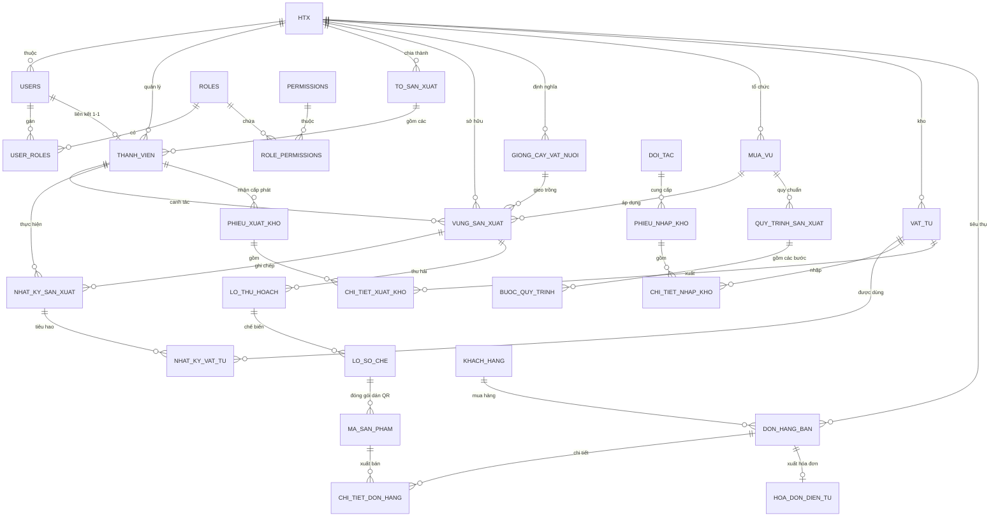

# THIẾT KẾ CƠ SỞ DỮ LIỆU CHI TIẾT (DATABASE SCHEMA DESIGN)
## Hệ thống CSDL thông tin sản xuất phục vụ quản trị HTX và truy xuất nguồn gốc
### Thí điểm tại 03 Hợp tác xã tỉnh Hưng Yên (An Ninh, Đông Tảo, Quyết Thắng)
*Tài liệu kỹ thuật đồng hành cùng SRS v1.1 — Phục vụ Backend .NET Core API & Zalo Mini App*

---

## 1. NGUYÊN TẮC THIẾT KẾ CSDL

1. **Multi-tenancy (Đa người thuê theo HTX)**:
   - Dùng chung một cơ sở dữ liệu tập trung (`PostgreSQL` / `SQL Server`).
   - Mọi bảng dữ liệu nghiệp vụ đều có cột `htx_id` làm khóa ngoại liên kết tới bảng `htx`.
   - Phân tách logic dữ liệu ở tầng Repository/Query Filter trong API, đảm bảo tài khoản HTX này không thể truy cập chéo dữ liệu của HTX khác (trừ vai trò Super Admin `R01`).
2. **Xác thực linh hoạt (Zalo Mini App & Web Admin)**:
   - Tài khoản người dùng lưu trong bảng `users`.
   - Người dùng Web Admin (R01, R02, R03, R04) sử dụng `username` + `password_hash` (PBKDF2/BCrypt) + OTP.
   - Thành viên nông dân (R06) và Tổ trưởng (R05) trên Zalo Mini App đăng nhập hoàn toàn qua `zalo_user_id` và số điện thoại định danh, **không lưu mật khẩu**.
3. **Phân quyền dựa trên vai trò (RBAC)**:
   - Bảng `roles`, `permissions`, `user_roles`, `role_permissions` cho phép tùy biến cấu hình chi tiết theo Module 1 (CN-1.2).
4. **Bảo toàn và lưu vết dữ liệu (Audit Trail & Chống giả mạo)**:
   - Mọi bảng nghiệp vụ cốt lõi đều chứa các cột: `created_at`, `created_by`, `updated_at`, `updated_by`, `is_deleted` (xóa mềm).
   - Bản ghi nhật ký sản xuất (`nhat_ky_san_xuat`) sau khi quá 24h sẽ được gắn cờ `is_locked = TRUE`, thời gian `locked_at`, kèm chuỗi `ma_hash_toan_ven` (SHA-256 mã hóa nội dung và hình ảnh) để chứng minh tính nguyên bản phục vụ kiểm định truy xuất nguồn gốc.
5. **Chuỗi truy xuất nguồn gốc khép kín (Seed-to-Table Traceability)**:
   - `HTX` → `Thành viên` → `Vùng sản xuất` → `Mùa vụ/Quy trình` → `Nhật ký đồng ruộng` → `Lô thu hoạch` → `Lô sơ chế` → `Mã sản phẩm / Tem QR Code` → `Đơn hàng bán`.

---

## 2. SƠ ĐỒ THỰC THỂ QUAN HỆ TỔNG QUAN (ERD)



---

## 3. DANH SÁCH 38 BẢNG DỮ LIỆU CHI TIẾT

Hệ thống được tổ chức thành **8 phân hệ nghiệp vụ**:

| Phân hệ | Số lượng bảng | Bảng chính |
|---|:---:|---|
| **1. Quản trị hệ thống & Xác thực** | 8 | `htx`, `roles`, `permissions`, `role_permissions`, `users`, `user_roles`, `system_configs`, `audit_logs` |
| **2. Danh mục dùng chung & Đối tác** | 6 | `master_data`, `giong_cay_vat_nuoi`, `mua_vu`, `doi_tac`, `khach_hang`, `cong_tac_vien` |
| **3. Thành viên & Vùng sản xuất** | 3 | `to_san_xuat`, `thanh_vien`, `vung_san_xuat` |
| **4. Sản xuất & Nhật ký đồng ruộng** | 4 | `quy_trinh_san_xuat`, `buoc_quy_trinh`, `nhat_ky_san_xuat`, `nhat_ky_vat_tu` |
| **5. Thu hoạch, Đóng gói & QR Traceability** | 4 | `lo_thu_hoach`, `lo_so_che`, `ma_san_pham`, `lich_su_quet_qr` |
| **6. Quản lý Kho & Vật tư nông nghiệp** | 5 | `vat_tu`, `phieu_nhap_kho`, `chi_tiet_nhap_kho`, `phieu_xuat_kho`, `chi_tiet_xuat_kho` |
| **7. Quản lý Bán hàng & Hóa đơn điện tử** | 3 | `don_hang_ban`, `chi_tiet_don_hang`, `hoa_don_dien_tu` |
| **8. Hồ sơ HTX, Thư viện & Thông báo** | 5 | `danh_muc_tai_lieu`, `tai_lieu_htx`, `tai_lieu_ky_thuat`, `thong_bao`, `user_thong_bao` |

---

### PHÂN HỆ 1: QUẢN TRỊ HỆ THỐNG & XÁC THỰC

#### 1. `htx` (Hợp tác xã)
Lưu thông tin pháp lý của các HTX thí điểm và mở rộng.
- `id` (INT, PK, Auto Increment)
- `ma_htx` (VARCHAR(30), Unique, Not Null) — Mã HTX (VD: `HTX_ANNINH`, `HTX_DONGTAO`, `HTX_QUYETTHANG`)
- `ten_htx` (VARCHAR(255), Not Null) — Tên đầy đủ của Hợp tác xã
- `dia_chi` (VARCHAR(500), Not Null) — Địa chỉ trụ sở chính tại tỉnh Hưng Yên
- `nguoi_dai_dien` (VARCHAR(150), Not Null) — Giám đốc / Chủ tịch HĐQT
- `so_dien_thoai` (VARCHAR(20), Not Null) — Hotline liên hệ
- `email` (VARCHAR(150)) — Email chính thức
- `logo_url` (VARCHAR(500)) — Đường dẫn logo phục vụ in tem QR và hiển thị
- `nganh_nghe_chinh` (VARCHAR(255)) — Lúa chất lượng cao / Gà đặc sản / Cây ăn quả & Thủy sản
- `mo_ta` (TEXT) — Giới thiệu tổng quan về HTX
- `trang_thai` (VARCHAR(20), Default: 'ACTIVE') — ACTIVE, INACTIVE
- `created_at`, `updated_at`, `is_deleted`

#### 2. `roles` (Vai trò)
Định nghĩa 6 vai trò chính theo tài liệu SRS.
- `id` (INT, PK)
- `code` (VARCHAR(20), Unique, Not Null) — `R01` (Admin), `R02` (Ban QT), `R03` (Cán bộ KT), `R04` (Kế toán), `R05` (Tổ trưởng), `R06` (Thành viên)
- `name` (VARCHAR(100), Not Null) — Tên hiển thị vai trò
- `description` (VARCHAR(255))
- `is_system` (BOOLEAN, Default: TRUE)

#### 3. `permissions` (Danh mục quyền chức năng)
- `id` (INT, PK)
- `code` (VARCHAR(50), Unique, Not Null) — VD: `DIARY_VIEW`, `DIARY_CREATE`, `DIARY_APPROVE`, `MEMBER_APPROVE`
- `name` (VARCHAR(150), Not Null)
- `module` (VARCHAR(50), Not Null) — `M1`, `M2`, `M3`
- `action` (VARCHAR(20)) — `VIEW`, `CREATE`, `UPDATE`, `DELETE`, `APPROVE`, `EXPORT`

#### 4. `role_permissions` (Bảng liên kết vai trò - quyền)
- `role_id` (INT, FK -> roles.id)
- `permission_id` (INT, FK -> permissions.id)
- PK(`role_id`, `permission_id`)

#### 5. `users` (Tài khoản & Định danh người dùng)
Hỗ trợ cả xác thực Web Admin và Zalo Mini App.
- `id` (BIGINT, PK, Auto Increment)
- `htx_id` (INT, FK -> htx.id, Nullable cho Admin R01)
- `username` (VARCHAR(50), Nullable, Unique) — Dành cho tài khoản Web Admin
- `password_hash` (VARCHAR(255), Nullable) — Dành cho Web Admin (null đối với tài khoản chỉ dùng Zalo)
- `zalo_user_id` (VARCHAR(100), Nullable, Index) — Định danh Zalo User ID từ Zalo Platform
- `phone_number` (VARCHAR(20), Not Null, Index) — Số điện thoại xác thực chính
- `full_name` (VARCHAR(150), Not Null) — Họ và tên người dùng
- `avatar_url` (VARCHAR(500)) — Ảnh đại diện lấy từ Zalo hoặc upload
- `email` (VARCHAR(150))
- `status` (VARCHAR(20), Default: 'PENDING') — `ACTIVE`, `PENDING` (chờ duyệt), `REJECTED`, `INACTIVE`
- `failed_login_attempts` (INT, Default: 0) — Đếm lần sai mật khẩu trên Web Admin (quá 5 lần khóa 15p)
- `locked_until` (TIMESTAMP, Nullable)
- `last_login_at` (TIMESTAMP)
- `created_at`, `updated_at`, `is_deleted`

#### 6. `user_roles` (Bảng liên kết người dùng - vai trò)
- `user_id` (BIGINT, FK -> users.id)
- `role_id` (INT, FK -> roles.id)
- PK(`user_id`, `role_id`)

#### 7. `system_configs` (Cấu hình tham số hệ thống - CN-1.4)
- `id` (INT, PK)
- `htx_id` (INT, FK -> htx.id, Nullable cho cấu hình toàn hệ thống)
- `config_key` (VARCHAR(100), Not Null) — VD: `DIARY_LOCK_HOURS`, `MAX_OTP_ATTEMPTS`, `REMINDER_FREQUENCY`
- `config_value` (TEXT, Not Null)
- `data_type` (VARCHAR(20)) — `NUMBER`, `STRING`, `BOOLEAN`, `JSON`
- `description` (VARCHAR(255))
- `updated_at`, `updated_by`

#### 8. `audit_logs` (Nhật ký truy vết thao tác hệ thống - CN-2.5.10 / Mục 9)
- `id` (BIGINT, PK)
- `htx_id` (INT, FK -> htx.id, Nullable)
- `user_id` (BIGINT, FK -> users.id, Nullable)
- `action` (VARCHAR(50), Not Null) — `INSERT`, `UPDATE`, `DELETE`, `APPROVE`, `EXPORT`, `LOGIN`
- `table_name` (VARCHAR(100), Not Null)
- `record_id` (VARCHAR(100), Not Null)
- `old_values` (JSONB / NVARCHAR(MAX)) — Dữ liệu cũ trước khi sửa
- `new_values` (JSONB / NVARCHAR(MAX)) — Dữ liệu mới cập nhật
- `ip_address` (VARCHAR(45))
- `user_agent` (VARCHAR(500))
- `created_at` (TIMESTAMP, Default: CURRENT_TIMESTAMP)

---

### PHÂN HỆ 2: DANH MỤC DÙNG CHUNG & ĐỐI TÁC

#### 9. `master_data` (Danh mục dùng chung - CN-1.5)
- `id` (INT, PK)
- `category_code` (VARCHAR(50), Not Null) — `DON_VI_TINH`, `LOAI_VAT_TU`, `LOAI_SAN_PHAM`, `LOAI_CONG_VIEC`
- `item_code` (VARCHAR(50), Not Null) — VD: `KG`, `TAN`, `CON`, `GIEOCAY`, `BONPHAN`, `PHUNTHUOC`
- `item_name` (VARCHAR(150), Not Null) — Tên hiển thị (Kg, Tấn, Con, Gieo cấy, Bón phân...)
- `sort_order` (INT, Default: 0)
- `is_active` (BOOLEAN, Default: TRUE)

#### 10. `giong_cay_vat_nuoi` (Giống cây trồng / con nuôi theo HTX - CN-2.1.3)
- `id` (INT, PK)
- `htx_id` (INT, FK -> htx.id, Not Null)
- `ma_giong` (VARCHAR(50), Not Null) — `BT7` (Bắc Thơm 7), `GA_DONGTAO_THUAN`, `NHAN_LONG_HY`
- `ten_giong` (VARCHAR(150), Not Null)
- `loai_hinh` (VARCHAR(30), Not Null) — `TRONG_TROT`, `CHAN_NUOI`, `THUY_SAN`
- `dac_tinh` (TEXT) — Mô tả hình thái, yêu cầu chăm sóc
- `thoi_gian_sinh_truong_ngay` (INT) — Số ngày từ gieo/nuôi đến thu hoạch dự kiến
- `trang_thai` (VARCHAR(20), Default: 'ACTIVE')

#### 11. `mua_vu` (Cấu hình mùa vụ / Lứa nuôi - CN-2.1.5)
- `id` (INT, PK)
- `htx_id` (INT, FK -> htx.id, Not Null)
- `ma_mua_vu` (VARCHAR(50), Not Null) — `VU_XUAN_2026`, `LUA_GA_01_2026`, `VU_NHAN_2026`
- `ten_mua_vu` (VARCHAR(150), Not Null)
- `nam` (INT, Not Null) — 2026
- `ngay_bat_dau` (DATE, Not Null)
- `ngay_ket_thuc` (DATE, Not Null)
- `loai_hinh` (VARCHAR(30), Not Null)
- `trang_thai` (VARCHAR(20), Default: 'DANG_DIEN_RA') — `CHUAN_BI`, `DANG_DIEN_RA`, `KET_THUC`

#### 12. `doi_tac` (Nhà cung cấp / Đơn vị liên kết - CN-2.1.7)
- `id` (INT, PK)
- `htx_id` (INT, FK -> htx.id, Not Null)
- `ma_doi_tac` (VARCHAR(50), Not Null)
- `ten_doi_tac` (VARCHAR(255), Not Null)
- `loai_doi_tac` (VARCHAR(50)) — `NHA_CUNG_CAP_GIONG`, `PHAN_BON_THUOC`, `BAO_TIEU_SAN_PHAM`
- `nguoi_lien_he` (VARCHAR(100))
- `so_dien_thoai` (VARCHAR(20))
- `dia_chi` (VARCHAR(300))
- `ma_so_thue` (VARCHAR(50))

#### 13. `khach_hang` (Khách hàng / Thương lái mua sản phẩm - CN-2.1.11)
- `id` (INT, PK)
- `htx_id` (INT, FK -> htx.id, Not Null)
- `ma_khach_hang` (VARCHAR(50), Not Null)
- `ten_khach_hang` (VARCHAR(200), Not Null)
- `loai_khach_hang` (VARCHAR(30), Default: 'THUONG_LAI') — `THUONG_LAI`, `DAI_LY`, `BAN_LE`
- `so_dien_thoai` (VARCHAR(20), Not Null)
- `dia_chi` (VARCHAR(300))
- `cong_no_hien_tai` (DECIMAL(18,2), Default: 0)

#### 14. `cong_tac_vien` (Cộng tác viên thu mua/phân phối - CN-2.1.9)
- `id` (INT, PK)
- `htx_id` (INT, FK -> htx.id, Not Null)
- `ma_ctv` (VARCHAR(50), Not Null)
- `ho_ten` (VARCHAR(150), Not Null)
- `so_dien_thoai` (VARCHAR(20), Not Null)
- `khu_vuc_phu_trach` (VARCHAR(255))
- `ty_le_hoa_hong` (DECIMAL(5,2), Default: 0)

---

### PHÂN HỆ 3: THÀNH VIÊN & VÙNG SẢN XUẤT

#### 15. `to_san_xuat` (Tổ sản xuất của HTX)
- `id` (INT, PK)
- `htx_id` (INT, FK -> htx.id, Not Null)
- `ma_to` (VARCHAR(50), Not Null) — VD: `TO_LUA_01`, `TO_GA_THUAN`
- `ten_to` (VARCHAR(150), Not Null)
- `to_truong_user_id` (BIGINT, FK -> users.id, Nullable) — Người giữ vai trò R05 Tổ trưởng
- `mo_ta` (VARCHAR(255))

#### 16. `thanh_vien` (Hồ sơ thành viên / Hộ nông dân - CN-2.3 & CN-3.2)
- `id` (BIGINT, PK, Auto Increment)
- `htx_id` (INT, FK -> htx.id, Not Null)
- `to_id` (INT, FK -> to_san_xuat.id, Nullable)
- `user_id` (BIGINT, FK -> users.id, Unique, Nullable) — Liên kết 1-1 với tài khoản
- `ma_thanh_vien` (VARCHAR(50), Unique, Not Null) — VD: `TV-AN-001`, `TV-DT-012`
- `ho_ten` (VARCHAR(150), Not Null)
- `cccd` (VARCHAR(20)) — Số Căn cước công dân
- `ngay_sinh` (DATE)
- `gioi_tinh` (VARCHAR(10)) — Nam, Nữ
- `so_dien_thoai` (VARCHAR(20), Not Null)
- `dia_chi` (VARCHAR(300), Not Null) — Thôn, xã thuộc địa bàn Hưng Yên
- `tong_dien_tich_m2` (DECIMAL(12,2), Default: 0) — Tổng quy mô canh tác
- `ngay_gia_nhap` (DATE, Default: CURRENT_DATE)
- `trang_thai` (VARCHAR(20), Default: 'PENDING') — `PENDING` (chờ duyệt), `ACTIVE`, `REJECTED`, `INACTIVE`
- `nguoi_duyet_id` (BIGINT, FK -> users.id, Nullable)
- `ngay_duyet` (TIMESTAMP, Nullable)
- `ly_do_tu_choi` (TEXT, Nullable)
- `created_at`, `updated_at`, `is_deleted`

#### 17. `vung_san_xuat` (Vùng trồng / Chuồng trại / Ao nuôi - CN-2.4 & CN-3.3)
- `id` (BIGINT, PK, Auto Increment)
- `htx_id` (INT, FK -> htx.id, Not Null)
- `thanh_vien_id` (BIGINT, FK -> thanh_vien.id, Not Null) — Hộ nông dân phụ trách
- `ma_vung` (VARCHAR(50), Not Null) — VD: `VT-AN-01`, `CT-DT-03`, `VN-QT-05`
- `ten_vung` (VARCHAR(200), Not Null) — VD: Ruộng lúa Bãi Soi, Chuồng gà lứa 1, Vườn nhãn gốc cổ
- `loai_vung` (VARCHAR(30), Not Null) — `RUONG_LUA`, `CHUONG_GA`, `VUON_CAY`, `AO_CA`
- `dien_tich_m2` (DECIMAL(12,2)) — Diện tích đất / mặt nước
- `quy_mo_so_luong` (INT) — Số lượng cây / đầu con
- `dia_chi_thua_dat` (VARCHAR(300))
- `toa_do_lat` (DECIMAL(10,8), Nullable)
- `toa_do_lng` (DECIMAL(11,8), Nullable)
- `giong_hien_tai_id` (INT, FK -> giong_cay_vat_nuoi.id)
- `mua_vu_hien_tai_id` (INT, FK -> mua_vu.id)
- `ngay_xuong_giong` (DATE)
- `san_luong_du_kien_kg` (DECIMAL(12,2)) — Dự báo sản lượng (CN-2.4.4 / CN-3.3.4)
- `ngay_du_kien_thu_hoach` (DATE)
- `trang_thai` (VARCHAR(20), Default: 'DANG_CANH_TAC') — `DANG_CANH_TAC`, `DA_THU_HOACH`, `NGHI_VU`

---

### PHÂN HỆ 4: QUẢN LÝ SẢN XUẤT & NHẬT KÝ ĐỒNG RUỘNG

#### 18. `quy_trinh_san_xuat` (Cấu hình quy trình chuẩn - CN-2.5.1)
- `id` (INT, PK)
- `htx_id` (INT, FK -> htx.id, Not Null)
- `mua_vu_id` (INT, FK -> mua_vu.id, Nullable)
- `giong_id` (INT, FK -> giong_cay_vat_nuoi.id, Nullable)
- `ma_quy_trinh` (VARCHAR(50), Not Null)
- `ten_quy_trinh` (VARCHAR(255), Not Null) — VD: Quy trình VietGAP Lúa vụ Xuân 2026
- `tieu_chuan` (VARCHAR(50)) — `VIETGAP`, `GLOBALGAP`, `OCOP_4SAO`, `HUUC_O`
- `mo_ta` (TEXT)
- `trang_thai` (VARCHAR(20), Default: 'ACTIVE')

#### 19. `buoc_quy_trinh` (Các bước công đoạn trong quy trình - CN-2.5.2)
- `id` (INT, PK)
- `quy_trinh_id` (INT, FK -> quy_trinh_san_xuat.id, Not Null)
- `thu_tu` (INT, Not Null) — Bước 1, 2, 3...
- `ten_buoc` (VARCHAR(200), Not Null) — VD: Làm đất, Gieo cấy, Bón lót, Bón thúc, Phòng trừ sâu bệnh
- `ngay_tuoi_bat_dau` (INT) — Áp dụng theo ngày tuổi của cây/con
- `ngay_tuoi_ket_thuc` (INT)
- `huong_dan_ky_thuat` (TEXT) — Hướng dẫn thao tác cho nông dân
- `vat_tu_khuyen_nghi` (VARCHAR(300))

#### 20. `nhat_ky_san_xuat` (Nhật ký đồng ruộng - CN-2.5 & CN-3.5)
Trọng tâm dữ liệu nông dân thao tác hàng ngày qua Zalo Mini App.
- `id` (BIGINT, PK, Auto Increment)
- `htx_id` (INT, FK -> htx.id, Not Null)
- `vung_san_xuat_id` (BIGINT, FK -> vung_san_xuat.id, Not Null)
- `thanh_vien_id` (BIGINT, FK -> thanh_vien.id, Not Null)
- `ngay_thuc_hien` (DATE, Not Null) — Mặc định ngày hôm nay
- `cong_viec_ids` (JSONB / NVARCHAR(MAX), Not Null) — Danh sách các công việc đã chọn trong 1 lần ghi: `["LÀM_ĐẤT", "BÓN_PHÂN", "TƯỚI_NƯỚC"]`
- `noi_dung_ghi_chu` (TEXT) — Ghi chú ngắn gọn hoặc ghi âm chuyển văn bản
- `hinh_anh_urls` (JSONB / NVARCHAR(MAX)) — Mảng chứa các đường dẫn ảnh chụp thực tế tại ruộng/chuồng: `["https://.../img1.jpg"]`
- `nguoi_ghi_ho_user_id` (BIGINT, FK -> users.id, Nullable) — Nếu Tổ trưởng (R05) ghi hộ thành viên lớn tuổi
- `is_locked` (BOOLEAN, Default: FALSE) — Sau 24h tự động khóa bản ghi (CN-2.5.10, CN-3.5.6)
- `locked_at` (TIMESTAMP, Nullable)
- `ma_hash_toan_ven` (VARCHAR(64), Nullable) — Chuỗi SHA-256 mã hóa toàn bộ dữ liệu nhật ký sau khi khóa để chống sửa đổi trái phép
- `created_at` (TIMESTAMP, Default: CURRENT_TIMESTAMP)
- `updated_at` (TIMESTAMP, Default: CURRENT_TIMESTAMP)
- `is_deleted` (BOOLEAN, Default: FALSE)

#### 21. `nhat_ky_vat_tu` (Vật tư nông nghiệp tiêu hao trong nhật ký)
- `id` (BIGINT, PK)
- `nhat_ky_id` (BIGINT, FK -> nhat_ky_san_xuat.id, Not Null)
- `vat_tu_id` (INT, FK -> vat_tu.id, Nullable)
- `ten_vat_tu_khac` (VARCHAR(150), Nullable)
- `so_luong` (DECIMAL(10,2), Not Null)
- `don_vi_tinh` (VARCHAR(30), Not Null)
- `ghi_chu` (VARCHAR(255))

---

### PHÂN HỆ 5: THU HOẠCH, ĐÓNG GÓI & QR TRACEABILITY

#### 22. `lo_thu_hoach` (Lô thu hoạch - CN-2.8 & CN-3.6)
- `id` (BIGINT, PK, Auto Increment)
- `htx_id` (INT, FK -> htx.id, Not Null)
- `vung_san_xuat_id` (BIGINT, FK -> vung_san_xuat.id, Not Null)
- `thanh_vien_id` (BIGINT, FK -> thanh_vien.id, Not Null)
- `ma_lo_thu_hoach` (VARCHAR(50), Unique, Not Null) — VD: `TH-AN-2026-001`
- `ngay_thu_hoach` (DATE, Not Null)
- `san_luong_kg` (DECIMAL(12,2), Not Null) — Sản lượng thu hoạch thực tế
- `don_vi_tinh` (VARCHAR(20), Default: 'Kg')
- `chat_luong` (VARCHAR(50), Default: 'LOAI_1') — `LOAI_1`, `LOAI_2`, `XUAT_KHAU`
- `hinh_anh_urls` (JSONB / NVARCHAR(MAX))
- `ghi_chu` (TEXT)
- `trang_thai` (VARCHAR(20), Default: 'DA_THU_HOACH') — `DA_THU_HOACH`, `DANG_SO_CHE`, `DA_DONG_GOI`

#### 23. `lo_so_che` (Lô sơ chế, đóng bao thô - CN-2.9)
- `id` (BIGINT, PK, Auto Increment)
- `htx_id` (INT, FK -> htx.id, Not Null)
- `lo_thu_hoach_id` (BIGINT, FK -> lo_thu_hoach.id, Not Null)
- `ma_lo_so_che` (VARCHAR(50), Unique, Not Null) — VD: `SC-AN-2026-001`
- `ngay_so_che` (DATE, Not Null)
- `phuong_phap_so_che` (VARCHAR(255), Not Null) — VD: Sấy lạnh, xay xát tách trấu, làm sạch phân loại
- `san_luong_dau_vao_kg` (DECIMAL(12,2), Not Null)
- `san_luong_dau_ra_kg` (DECIMAL(12,2), Not Null)
- `ty_le_hao_hut_pt` (DECIMAL(5,2)) — Tự động tính: `(1 - dau_ra/dau_vao) * 100`
- `nguoi_phu_trach_user_id` (BIGINT, FK -> users.id)
- `hinh_anh_urls` (JSONB)
- `trang_thai` (VARCHAR(20), Default: 'HOAN_THANH')

#### 24. `ma_san_pham` (Mã sản phẩm / Tem QR đóng gói thương phẩm - CN-2.10 & CN-3.7)
Khóa then chốt để người tiêu dùng quét mã QR tra cứu toàn bộ chuỗi sản xuất.
- `id` (BIGINT, PK, Auto Increment)
- `htx_id` (INT, FK -> htx.id, Not Null)
- `lo_so_che_id` (BIGINT, FK -> lo_so_che.id, Nullable)
- `lo_thu_hoach_id` (BIGINT, FK -> lo_thu_hoach.id, Not Null)
- `ma_dinh_danh_sp` (VARCHAR(60), Unique, Not Null) — Mã duy nhất in trên tem (VD: `HY-AN-LUA-2026-001-A`)
- `ten_san_pham` (VARCHAR(255), Not Null) — Gạo sạch An Ninh túi 5kg / Gà Đông Tảo đóng gói hút chân không
- `quy_cach_dong_goi` (VARCHAR(100), Not Null) — Gói 1kg, Túi 5kg, Thùng 10 con...
- `so_luong_don_vi` (INT, Not Null) — Số lượng tem / gói phát hành
- `ngay_dong_goi` (DATE, Not Null)
- `han_su_dung` (DATE)
- `ma_qr_code` (VARCHAR(500), Not Null) — Chuỗi URL hoặc mã hash mã hóa trong QR
- `url_truy_xuat` (VARCHAR(500), Not Null) — Đường dẫn trang tra cứu công khai (CN-2.12.1)
- `mau_tem_in` (VARCHAR(50), Default: 'TEM_CHUAN_HTX') — Mẫu thiết kế tem in của HTX
- `tong_so_luot_quet` (INT, Default: 0) — Thống kê mức độ quan tâm của thị trường
- `trang_thai` (VARCHAR(20), Default: 'DANG_LUU_HANH') — `DANG_LUU_HANH`, `DA_BAN_HET`, `THU_HOI`

#### 25. `lich_su_quet_qr` (Log thống kê lượt quét QR công khai - CN-2.12 & CN-3.10)
- `id` (BIGINT, PK)
- `ma_san_pham_id` (BIGINT, FK -> ma_san_pham.id, Not Null)
- `thoi_gian_quet` (TIMESTAMP, Default: CURRENT_TIMESTAMP)
- `ip_address` (VARCHAR(45))
- `user_agent` (VARCHAR(300))
- `dia_ban_uoc_tinh` (VARCHAR(150)) — Dựa theo GeoIP (VD: Hà Nội, TP.HCM)

---

### PHÂN HỆ 6: QUẢN LÝ KHO & VẬT TƯ NÔNG NGHIỆP

#### 26. `vat_tu` (Danh mục vật tư nông nghiệp & Tồn kho - CN-2.7.1)
- `id` (INT, PK)
- `htx_id` (INT, FK -> htx.id, Not Null)
- `ma_vat_tu` (VARCHAR(50), Not Null) — `VT-PB-NPK01`, `VT-TB-BOocDo`, `VT-TA-CAMCON`
- `ten_vat_tu` (VARCHAR(200), Not Null)
- `loai_vat_tu` (VARCHAR(50), Not Null) — `PHAN_BON`, `THUOC_BVTV`, `THUC_AN_CHAN_NUOI`, `GIONG`, `BAO_BI`
- `don_vi_tinh` (VARCHAR(30), Not Null) — Bao, Kg, Chai, Gói, Can
- `ton_kho_hien_tai` (DECIMAL(12,2), Default: 0) — Tự động cập nhật qua phiếu nhập/xuất
- `ton_kho_toi_thieu` (DECIMAL(12,2), Default: 10) — Ngưỡng cảnh báo sắp hết vật tư
- `don_gia_binh_quan` (DECIMAL(18,2), Default: 0)
- `trang_thai` (VARCHAR(20), Default: 'ACTIVE')

#### 27. `phieu_nhap_kho` (Phiếu nhập kho vật tư - CN-2.7.4)
- `id` (BIGINT, PK)
- `htx_id` (INT, FK -> htx.id, Not Null)
- `ma_phieu_nhap` (VARCHAR(50), Unique, Not Null) — `PNK-2026-001`
- `doi_tac_id` (INT, FK -> doi_tac.id, Not Null) — Nhà cung cấp
- `ngay_nhap` (DATE, Not Null)
- `tong_tien` (DECIMAL(18,2), Default: 0)
- `nguoi_lap_user_id` (BIGINT, FK -> users.id, Not Null) — Kế toán R04
- `ghi_chu` (TEXT)
- `trang_thai` (VARCHAR(20), Default: 'HOAN_THANH') — `NHAP`, `HOAN_THANH`, `DA_HUY`

#### 28. `chi_tiet_nhap_kho` (Chi tiết các mặt hàng trong phiếu nhập)
- `id` (BIGINT, PK)
- `phieu_nhap_id` (BIGINT, FK -> phieu_nhap_kho.id, Not Null)
- `vat_tu_id` (INT, FK -> vat_tu.id, Not Null)
- `so_luong` (DECIMAL(12,2), Not Null)
- `don_gia` (DECIMAL(18,2), Not Null)
- `thanh_tien` (DECIMAL(18,2), Not Null)
- `han_su_dung` (DATE)
- `so_lo_san_xuat` (VARCHAR(50))

#### 29. `phieu_xuat_kho` (Phiếu xuất kho vật tư cấp phát - CN-2.7.7)
- `id` (BIGINT, PK)
- `htx_id` (INT, FK -> htx.id, Not Null)
- `ma_phieu_xuat` (VARCHAR(50), Unique, Not Null) — `PXK-2026-001`
- `thanh_vien_nhan_id` (BIGINT, FK -> thanh_vien.id, Not Null) — Thành viên/Hộ nhận cấp phát
- `vung_san_xuat_id` (BIGINT, FK -> vung_san_xuat.id, Nullable)
- `ngay_xuat` (DATE, Not Null)
- `ly_do_xuat` (VARCHAR(255)) — Cấp phân bón đợt 1 vụ Xuân, cấp thuốc phòng bệnh
- `nguoi_lap_user_id` (BIGINT, FK -> users.id, Not Null)
- `trang_thai` (VARCHAR(20), Default: 'HOAN_THANH')

#### 30. `chi_tiet_xuat_kho` (Chi tiết vật tư xuất kho)
- `id` (BIGINT, PK)
- `phieu_xuat_id` (BIGINT, FK -> phieu_xuat_kho.id, Not Null)
- `vat_tu_id` (INT, FK -> vat_tu.id, Not Null)
- `so_luong` (DECIMAL(12,2), Not Null) — Ràng buộc: không được vượt quá `ton_kho_hien_tai`
- `don_gia` (DECIMAL(18,2), Default: 0)
- `thanh_tien` (DECIMAL(18,2), Default: 0)

---

### PHÂN HỆ 7: TIÊU THỤ, ĐƠN HÀNG & HÓA ĐƠN ĐIỆN TỬ

#### 31. `don_hang_ban` (Đơn hàng tiêu thụ sản phẩm - CN-2.11 & CN-3.9)
- `id` (BIGINT, PK, Auto Increment)
- `htx_id` (INT, FK -> htx.id, Not Null)
- `ma_don_hang` (VARCHAR(50), Unique, Not Null) — `DH-2026-001`
- `khach_hang_id` (INT, FK -> khach_hang.id, Not Null)
- `thanh_vien_ban_id` (BIGINT, FK -> thanh_vien.id, Nullable) — Nếu hộ thành viên trực tiếp bán qua Mini App
- `nguoi_lap_user_id` (BIGINT, FK -> users.id, Not Null)
- `ngay_dat` (TIMESTAMP, Default: CURRENT_TIMESTAMP)
- `tong_tien_hang` (DECIMAL(18,2), Not Null)
- `chiet_khau` (DECIMAL(18,2), Default: 0)
- `tong_thanh_toan` (DECIMAL(18,2), Not Null)
- `phuong_thuc_thanh_toan` (VARCHAR(30), Default: 'TIEN_MAT') — `TIEN_MAT`, `CHUYEN_KHOAN`
- `trang_thai_thanh_toan` (VARCHAR(30), Default: 'CHUA_THANH_TOAN') — `CHUA_THANH_TOAN`, `DA_THANH_TOAN`, `CONG_NO`
- `trang_thai_don_hang` (VARCHAR(30), Default: 'MOI') — `MOI`, `DANG_GIAO`, `HOAN_THANH`, `DA_HUY`
- `ghi_chu` (TEXT)

#### 32. `chi_tiet_don_hang` (Các mặt hàng trong đơn)
- `id` (BIGINT, PK)
- `don_hang_id` (BIGINT, FK -> don_hang_ban.id, Not Null)
- `ma_san_pham_id` (BIGINT, FK -> ma_san_pham.id, Nullable) — Liên kết với mã tem QR nếu có
- `ten_san_pham` (VARCHAR(255), Not Null)
- `so_luong` (DECIMAL(10,2), Not Null)
- `don_vi_tinh` (VARCHAR(30), Not Null)
- `don_gia` (DECIMAL(18,2), Not Null)
- `thanh_tien` (DECIMAL(18,2), Not Null)

#### 33. `hoa_don_dien_tu` (Hóa đơn điện tử tích hợp bên thứ ba - CN-2.11.4)
- `id` (BIGINT, PK)
- `htx_id` (INT, FK -> htx.id, Not Null)
- `don_hang_id` (BIGINT, FK -> don_hang_ban.id, Unique, Not Null)
- `ma_so_hoa_don` (VARCHAR(50), Not Null) — Số hóa đơn theo Tổng cục Thuế
- `ky_hieu_hoa_don` (VARCHAR(20), Not Null) — VD: `1C26TAA`
- `ngay_phat_hanh` (DATE, Not Null)
- `tong_tien_chua_thue` (DECIMAL(18,2), Not Null)
- `thue_suat_vat` (DECIMAL(5,2), Default: 0) — Sản phẩm nông sản sơ chế thường 0% hoặc 5%
- `tien_thue` (DECIMAL(18,2), Default: 0)
- `tong_tien_thanh_toan` (DECIMAL(18,2), Not Null)
- `don_vi_cung_cap_hd` (VARCHAR(50)) — `VNPT`, `VIETTEL`, `MISA`
- `file_pdf_url` (VARCHAR(500)) — Link tải hóa đơn PDF
- `file_xml_url` (VARCHAR(500)) — Dữ liệu gốc XML
- `trang_thai_ky` (VARCHAR(30), Default: 'DA_KY') — `CHO_KY`, `DA_KY`, `HUY_BO`

---

### PHÂN HỆ 8: HỒ SƠ HTX, THƯ VIỆN KỸ THUẬT & THÔNG BÁO

#### 34. `danh_muc_tai_lieu` (Phân loại hồ sơ tài liệu HTX - CN-2.2.1)
- `id` (INT, PK)
- `htx_id` (INT, FK -> htx.id, Not Null)
- `ten_danh_muc` (VARCHAR(150), Not Null) — Hồ sơ OCOP, Chứng nhận VietGAP, Báo cáo kiểm toán, Hợp đồng chuỗi

#### 35. `tai_lieu_htx` (Tập tin hồ sơ / minh chứng HTX - CN-2.2.2)
- `id` (BIGINT, PK)
- `htx_id` (INT, FK -> htx.id, Not Null)
- `danh_muc_id` (INT, FK -> danh_muc_tai_lieu.id, Not Null)
- `ten_tai_lieu` (VARCHAR(255), Not Null)
- `mo_ta` (TEXT)
- `file_url` (VARCHAR(500), Not Null)
- `file_size_bytes` (BIGINT)
- `file_ext` (VARCHAR(20)) — `pdf`, `doc`, `jpg`, `png`
- `nguoi_upload_user_id` (BIGINT, FK -> users.id)
- `created_at` (TIMESTAMP, Default: CURRENT_TIMESTAMP)

#### 36. `tai_lieu_ky_thuat` (Thư viện kỹ thuật canh tác nông nghiệp - CN-1.6)
Hiển thị trên Zalo Mini App cho thành viên tham khảo quy trình canh tác.
- `id` (INT, PK)
- `htx_id` (INT, FK -> htx.id, Nullable nếu dùng chung toàn tỉnh)
- `loai_cay_con` (VARCHAR(50), Not Null) — `LUA`, `GA_DONGTAO`, `NHAN_LONG`, `THUY_SAN`
- `tieu_de` (VARCHAR(255), Not Null)
- `noi_dung_tom_tat` (TEXT)
- `file_dinh_kem_url` (VARCHAR(500))
- `video_huong_dan_url` (VARCHAR(500))
- `luot_xem` (INT, Default: 0)
- `trang_thai` (VARCHAR(20), Default: 'ACTIVE')

#### 37. `thong_bao` (Thông báo điều hành & Nhắc nhở - CN-1.7 & CN-3.11)
- `id` (BIGINT, PK, Auto Increment)
- `htx_id` (INT, FK -> htx.id, Nullable nếu gửi từ Sở/Admin toàn tỉnh)
- `tieu_de` (VARCHAR(255), Not Null)
- `noi_dung` (TEXT, Not Null)
- `loai_thong_bao` (VARCHAR(50), Not Null) — `NHAC_NHAT_KY`, `LICH_HOP_HTX`, `CANH_BAO_SAU_BENH`, `DUYET_THANH_VIEN`
- `doi_tuong_nhan` (VARCHAR(30), Default: 'TOAN_BO') — `TOAN_BO`, `THEO_TO`, `THEO_VAI_TRO`, `CA_NHAN`
- `target_filters` (JSONB) — Lưu ID tổ hoặc ID thành viên nhận
- `nguoi_gui_user_id` (BIGINT, FK -> users.id)
- `thoi_gian_gui` (TIMESTAMP, Default: CURRENT_TIMESTAMP)
- `trang_thai` (VARCHAR(20), Default: 'DA_GUI')

#### 38. `user_thong_bao` (Trạng thái đọc thông báo của từng thành viên)
- `id` (BIGINT, PK)
- `thong_bao_id` (BIGINT, FK -> thong_bao.id, Not Null)
- `user_id` (BIGINT, FK -> users.id, Not Null)
- `da_doc` (BOOLEAN, Default: FALSE)
- `thoi_gian_doc` (TIMESTAMP, Nullable)

---

## 4. KỊCH BẢN TẠO CSDL HOÀN CHỈNH (SQL DDL SCRIPT)

Kịch bản DDL chuẩn (tương thích PostgreSQL & SQL Server). Dưới đây được tối ưu theo cú pháp chuẩn PostgreSQL / ANSI SQL có thể chạy trực tiếp:

```sql
-- ==============================================================================
-- CƠ SỞ DỮ LIỆU THÔNG TIN SẢN XUẤT PHỤC VỤ QUẢN TRỊ HTX VÀ TRUY XUẤT NGUỒN GỐC
-- TỈNH HƯNG YÊN (THÍ ĐIỂM 03 HTX: AN NINH, ĐÔNG TẢO, QUYẾT THẮNG)
-- ==============================================================================

-- 1. BẢNG HỢP TÁC XÃ (Multi-tenant Root)
CREATE TABLE htx (
    id SERIAL PRIMARY KEY,
    ma_htx VARCHAR(30) UNIQUE NOT NULL,
    ten_htx VARCHAR(255) NOT NULL,
    dia_chi VARCHAR(500) NOT NULL,
    nguoi_dai_dien VARCHAR(150) NOT NULL,
    so_dien_thoai VARCHAR(20) NOT NULL,
    email VARCHAR(150),
    logo_url VARCHAR(500),
    nganh_nghe_chinh VARCHAR(255),
    mo_ta TEXT,
    trang_thai VARCHAR(20) DEFAULT 'ACTIVE',
    created_at TIMESTAMP DEFAULT CURRENT_TIMESTAMP,
    updated_at TIMESTAMP DEFAULT CURRENT_TIMESTAMP,
    is_deleted BOOLEAN DEFAULT FALSE
);

-- 2. BẢNG VAI TRÒ (Roles)
CREATE TABLE roles (
    id SERIAL PRIMARY KEY,
    code VARCHAR(20) UNIQUE NOT NULL,
    name VARCHAR(100) NOT NULL,
    description VARCHAR(255),
    is_system BOOLEAN DEFAULT TRUE
);

-- 3. BẢNG QUYỀN (Permissions)
CREATE TABLE permissions (
    id SERIAL PRIMARY KEY,
    code VARCHAR(50) UNIQUE NOT NULL,
    name VARCHAR(150) NOT NULL,
    module VARCHAR(50) NOT NULL,
    action VARCHAR(20) NOT NULL
);

-- 4. BẢNG VAI TRÒ - QUYỀN
CREATE TABLE role_permissions (
    role_id INT REFERENCES roles(id) ON DELETE CASCADE,
    permission_id INT REFERENCES permissions(id) ON DELETE CASCADE,
    PRIMARY KEY (role_id, permission_id)
);

-- 5. BẢNG NGƯỜI DÙNG & XÁC THỰC (Users)
CREATE TABLE users (
    id BIGSERIAL PRIMARY KEY,
    htx_id INT REFERENCES htx(id),
    username VARCHAR(50) UNIQUE,
    password_hash VARCHAR(255),
    zalo_user_id VARCHAR(100),
    phone_number VARCHAR(20) NOT NULL,
    full_name VARCHAR(150) NOT NULL,
    avatar_url VARCHAR(500),
    email VARCHAR(150),
    status VARCHAR(20) DEFAULT 'PENDING',
    failed_login_attempts INT DEFAULT 0,
    locked_until TIMESTAMP,
    last_login_at TIMESTAMP,
    created_at TIMESTAMP DEFAULT CURRENT_TIMESTAMP,
    updated_at TIMESTAMP DEFAULT CURRENT_TIMESTAMP,
    is_deleted BOOLEAN DEFAULT FALSE
);
CREATE INDEX idx_users_zalo_user_id ON users(zalo_user_id);
CREATE INDEX idx_users_phone ON users(phone_number);
CREATE INDEX idx_users_htx_id ON users(htx_id);

-- 6. BẢNG NGƯỜI DÙNG - VAI TRÒ
CREATE TABLE user_roles (
    user_id BIGINT REFERENCES users(id) ON DELETE CASCADE,
    role_id INT REFERENCES roles(id) ON DELETE CASCADE,
    PRIMARY KEY (user_id, role_id)
);

-- 7. BẢNG CẤU HÌNH HỆ THỐNG
CREATE TABLE system_configs (
    id SERIAL PRIMARY KEY,
    htx_id INT REFERENCES htx(id),
    config_key VARCHAR(100) NOT NULL,
    config_value TEXT NOT NULL,
    data_type VARCHAR(20) DEFAULT 'STRING',
    description VARCHAR(255),
    updated_at TIMESTAMP DEFAULT CURRENT_TIMESTAMP,
    updated_by BIGINT REFERENCES users(id)
);

-- 8. BẢNG AUDIT LOG
CREATE TABLE audit_logs (
    id BIGSERIAL PRIMARY KEY,
    htx_id INT REFERENCES htx(id),
    user_id BIGINT REFERENCES users(id),
    action VARCHAR(50) NOT NULL,
    table_name VARCHAR(100) NOT NULL,
    record_id VARCHAR(100) NOT NULL,
    old_values JSONB,
    new_values JSONB,
    ip_address VARCHAR(45),
    user_agent VARCHAR(500),
    created_at TIMESTAMP DEFAULT CURRENT_TIMESTAMP
);

-- 9. BẢNG DANH MỤC DÙNG CHUNG (Master Data)
CREATE TABLE master_data (
    id SERIAL PRIMARY KEY,
    category_code VARCHAR(50) NOT NULL,
    item_code VARCHAR(50) NOT NULL,
    item_name VARCHAR(150) NOT NULL,
    sort_order INT DEFAULT 0,
    is_active BOOLEAN DEFAULT TRUE,
    CONSTRAINT uq_category_item UNIQUE (category_code, item_code)
);

-- 10. BẢNG GIỐNG CÂY TRỒNG / VẬT NUÔI
CREATE TABLE giong_cay_vat_nuoi (
    id SERIAL PRIMARY KEY,
    htx_id INT NOT NULL REFERENCES htx(id),
    ma_giong VARCHAR(50) NOT NULL,
    ten_giong VARCHAR(150) NOT NULL,
    loai_hinh VARCHAR(30) NOT NULL, -- TRONG_TROT, CHAN_NUOI, THUY_SAN
    dac_tinh TEXT,
    thoi_gian_sinh_truong_ngay INT,
    trang_thai VARCHAR(20) DEFAULT 'ACTIVE'
);

-- 11. BẢNG MÙA VỤ / LỨA NUÔI
CREATE TABLE mua_vu (
    id SERIAL PRIMARY KEY,
    htx_id INT NOT NULL REFERENCES htx(id),
    ma_mua_vu VARCHAR(50) NOT NULL,
    ten_mua_vu VARCHAR(150) NOT NULL,
    nam INT NOT NULL,
    ngay_bat_dau DATE NOT NULL,
    ngay_ket_thuc DATE NOT NULL,
    loai_hinh VARCHAR(30) NOT NULL,
    trang_thai VARCHAR(20) DEFAULT 'DANG_DIEN_RA'
);

-- 12. BẢNG ĐỐI TÁC CUNG CẤP VẬT TƯ
CREATE TABLE doi_tac (
    id SERIAL PRIMARY KEY,
    htx_id INT NOT NULL REFERENCES htx(id),
    ma_doi_tac VARCHAR(50) NOT NULL,
    ten_doi_tac VARCHAR(255) NOT NULL,
    loai_doi_tac VARCHAR(50),
    nguoi_lien_he VARCHAR(100),
    so_dien_thoai VARCHAR(20),
    dia_chi VARCHAR(300),
    ma_so_thue VARCHAR(50)
);

-- 13. BẢNG KHÁCH HÀNG / THƯƠNG LÁI
CREATE TABLE khach_hang (
    id SERIAL PRIMARY KEY,
    htx_id INT NOT NULL REFERENCES htx(id),
    ma_khach_hang VARCHAR(50) NOT NULL,
    ten_khach_hang VARCHAR(200) NOT NULL,
    loai_khach_hang VARCHAR(30) DEFAULT 'THUONG_LAI',
    so_dien_thoai VARCHAR(20) NOT NULL,
    dia_chi VARCHAR(300),
    cong_no_hien_tai DECIMAL(18,2) DEFAULT 0
);

-- 14. BẢNG CỘNG TÁC VIÊN
CREATE TABLE cong_tac_vien (
    id SERIAL PRIMARY KEY,
    htx_id INT NOT NULL REFERENCES htx(id),
    ma_ctv VARCHAR(50) NOT NULL,
    ho_ten VARCHAR(150) NOT NULL,
    so_dien_thoai VARCHAR(20) NOT NULL,
    khu_vuc_phu_trach VARCHAR(255),
    ty_le_hoa_hong DECIMAL(5,2) DEFAULT 0
);

-- 15. BẢNG TỔ SẢN XUẤT
CREATE TABLE to_san_xuat (
    id SERIAL PRIMARY KEY,
    htx_id INT NOT NULL REFERENCES htx(id),
    ma_to VARCHAR(50) NOT NULL,
    ten_to VARCHAR(150) NOT NULL,
    to_truong_user_id BIGINT REFERENCES users(id),
    mo_ta VARCHAR(255)
);

-- 16. BẢNG THÀNH VIÊN / HỘ NÔNG DÂN
CREATE TABLE thanh_vien (
    id BIGSERIAL PRIMARY KEY,
    htx_id INT NOT NULL REFERENCES htx(id),
    to_id INT REFERENCES to_san_xuat(id),
    user_id BIGINT UNIQUE REFERENCES users(id),
    ma_thanh_vien VARCHAR(50) UNIQUE NOT NULL,
    ho_ten VARCHAR(150) NOT NULL,
    cccd VARCHAR(20),
    ngay_sinh DATE,
    gioi_tinh VARCHAR(10),
    so_dien_thoai VARCHAR(20) NOT NULL,
    dia_chi VARCHAR(300) NOT NULL,
    tong_dien_tich_m2 DECIMAL(12,2) DEFAULT 0,
    ngay_gia_nhap DATE DEFAULT CURRENT_DATE,
    trang_thai VARCHAR(20) DEFAULT 'PENDING',
    nguoi_duyet_id BIGINT REFERENCES users(id),
    ngay_duyet TIMESTAMP,
    ly_do_tu_choi TEXT,
    created_at TIMESTAMP DEFAULT CURRENT_TIMESTAMP,
    updated_at TIMESTAMP DEFAULT CURRENT_TIMESTAMP,
    is_deleted BOOLEAN DEFAULT FALSE
);
CREATE INDEX idx_thanh_vien_htx ON thanh_vien(htx_id);

-- 17. BẢNG VÙNG SẢN XUẤT (Ruộng, Chuồng, Vườn, Ao)
CREATE TABLE vung_san_xuat (
    id BIGSERIAL PRIMARY KEY,
    htx_id INT NOT NULL REFERENCES htx(id),
    thanh_vien_id BIGINT NOT NULL REFERENCES thanh_vien(id),
    ma_vung VARCHAR(50) NOT NULL,
    ten_vung VARCHAR(200) NOT NULL,
    loai_vung VARCHAR(30) NOT NULL, -- RUONG_LUA, CHUONG_GA, VUON_CAY, AO_CA
    dien_tich_m2 DECIMAL(12,2),
    quy_mo_so_luong INT,
    dia_chi_thua_dat VARCHAR(300),
    toa_do_lat DECIMAL(10,8),
    toa_do_lng DECIMAL(11,8),
    giong_hien_tai_id INT REFERENCES giong_cay_vat_nuoi(id),
    mua_vu_hien_tai_id INT REFERENCES mua_vu(id),
    ngay_xuong_giong DATE,
    san_luong_du_kien_kg DECIMAL(12,2),
    ngay_du_kien_thu_hoach DATE,
    trang_thai VARCHAR(20) DEFAULT 'DANG_CANH_TAC',
    created_at TIMESTAMP DEFAULT CURRENT_TIMESTAMP,
    updated_at TIMESTAMP DEFAULT CURRENT_TIMESTAMP,
    is_deleted BOOLEAN DEFAULT FALSE
);

-- 18. BẢNG QUY TRÌNH SẢN XUẤT CHUẨN (SOP)
CREATE TABLE quy_trinh_san_xuat (
    id SERIAL PRIMARY KEY,
    htx_id INT NOT NULL REFERENCES htx(id),
    mua_vu_id INT REFERENCES mua_vu(id),
    giong_id INT REFERENCES giong_cay_vat_nuoi(id),
    ma_quy_trinh VARCHAR(50) NOT NULL,
    ten_quy_trinh VARCHAR(255) NOT NULL,
    tieu_chuan VARCHAR(50), -- VIETGAP, OCOP_4SAO...
    mo_ta TEXT,
    trang_thai VARCHAR(20) DEFAULT 'ACTIVE'
);

-- 19. BẢNG CÁC BƯỚC TRONG QUY TRÌNH
CREATE TABLE buoc_quy_trinh (
    id SERIAL PRIMARY KEY,
    quy_trinh_id INT NOT NULL REFERENCES quy_trinh_san_xuat(id) ON DELETE CASCADE,
    thu_tu INT NOT NULL,
    ten_buoc VARCHAR(200) NOT NULL,
    ngay_tuoi_bat_dau INT,
    ngay_tuoi_ket_thuc INT,
    huong_dan_ky_thuat TEXT,
    vat_tu_khuyen_nghi VARCHAR(300)
);

-- 20. BẢNG NHẬT KÝ ĐỒNG RUỘNG (Cốt lõi Zalo Mini App)
CREATE TABLE nhat_ky_san_xuat (
    id BIGSERIAL PRIMARY KEY,
    htx_id INT NOT NULL REFERENCES htx(id),
    vung_san_xuat_id BIGINT NOT NULL REFERENCES vung_san_xuat(id),
    thanh_vien_id BIGINT NOT NULL REFERENCES thanh_vien(id),
    ngay_thuc_hien DATE NOT NULL,
    cong_viec_ids JSONB NOT NULL, -- Hỗ trợ chọn nhiều công việc trong 1 lần ghi
    noi_dung_ghi_chu TEXT,
    hinh_anh_urls JSONB,
    nguoi_ghi_ho_user_id BIGINT REFERENCES users(id),
    is_locked BOOLEAN DEFAULT FALSE,
    locked_at TIMESTAMP,
    ma_hash_toan_ven VARCHAR(64), -- SHA-256 mã hóa chống giả mạo
    created_at TIMESTAMP DEFAULT CURRENT_TIMESTAMP,
    updated_at TIMESTAMP DEFAULT CURRENT_TIMESTAMP,
    is_deleted BOOLEAN DEFAULT FALSE
);
CREATE INDEX idx_nhat_ky_vung ON nhat_ky_san_xuat(vung_san_xuat_id);
CREATE INDEX idx_nhat_ky_thanh_vien ON nhat_ky_san_xuat(thanh_vien_id);
CREATE INDEX idx_nhat_ky_ngay ON nhat_ky_san_xuat(ngay_thuc_hien);

-- 21. BẢNG VẬT TƯ TIÊU HAO TRONG NHẬT KÝ
CREATE TABLE nhat_ky_vat_tu (
    id BIGSERIAL PRIMARY KEY,
    nhat_ky_id BIGINT NOT NULL REFERENCES nhat_ky_san_xuat(id) ON DELETE CASCADE,
    vat_tu_id INT,
    ten_vat_tu_khac VARCHAR(150),
    so_luong DECIMAL(10,2) NOT NULL,
    don_vi_tinh VARCHAR(30) NOT NULL,
    ghi_chu VARCHAR(255)
);

-- 22. BẢNG LÔ THU HOẠCH
CREATE TABLE lo_thu_hoach (
    id BIGSERIAL PRIMARY KEY,
    htx_id INT NOT NULL REFERENCES htx(id),
    vung_san_xuat_id BIGINT NOT NULL REFERENCES vung_san_xuat(id),
    thanh_vien_id BIGINT NOT NULL REFERENCES thanh_vien(id),
    ma_lo_thu_hoach VARCHAR(50) UNIQUE NOT NULL,
    ngay_thu_hoach DATE NOT NULL,
    san_luong_kg DECIMAL(12,2) NOT NULL,
    don_vi_tinh VARCHAR(20) DEFAULT 'Kg',
    chat_luong VARCHAR(50) DEFAULT 'LOAI_1',
    hinh_anh_urls JSONB,
    ghi_chu TEXT,
    trang_thai VARCHAR(20) DEFAULT 'DA_THU_HOACH',
    created_at TIMESTAMP DEFAULT CURRENT_TIMESTAMP,
    updated_at TIMESTAMP DEFAULT CURRENT_TIMESTAMP,
    is_deleted BOOLEAN DEFAULT FALSE
);

-- 23. BẢNG LÔ SƠ CHẾ
CREATE TABLE lo_so_che (
    id BIGSERIAL PRIMARY KEY,
    htx_id INT NOT NULL REFERENCES htx(id),
    lo_thu_hoach_id BIGINT NOT NULL REFERENCES lo_thu_hoach(id),
    ma_lo_so_che VARCHAR(50) UNIQUE NOT NULL,
    ngay_so_che DATE NOT NULL,
    phuong_phap_so_che VARCHAR(255) NOT NULL,
    san_luong_dau_vao_kg DECIMAL(12,2) NOT NULL,
    san_luong_dau_ra_kg DECIMAL(12,2) NOT NULL,
    ty_le_hao_hut_pt DECIMAL(5,2),
    nguoi_phu_trach_user_id BIGINT REFERENCES users(id),
    hinh_anh_urls JSONB,
    trang_thai VARCHAR(20) DEFAULT 'HOAN_THANH',
    created_at TIMESTAMP DEFAULT CURRENT_TIMESTAMP
);

-- 24. BẢNG MÃ SẢN PHẨM & TEM QR TRACEABILITY
CREATE TABLE ma_san_pham (
    id BIGSERIAL PRIMARY KEY,
    htx_id INT NOT NULL REFERENCES htx(id),
    lo_so_che_id BIGINT REFERENCES lo_so_che(id),
    lo_thu_hoach_id BIGINT NOT NULL REFERENCES lo_thu_hoach(id),
    ma_dinh_danh_sp VARCHAR(60) UNIQUE NOT NULL,
    ten_san_pham VARCHAR(255) NOT NULL,
    quy_cach_dong_goi VARCHAR(100) NOT NULL,
    so_luong_don_vi INT NOT NULL,
    ngay_dong_goi DATE NOT NULL,
    han_su_dung DATE,
    ma_qr_code VARCHAR(500) NOT NULL,
    url_truy_xuat VARCHAR(500) NOT NULL,
    mau_tem_in VARCHAR(50) DEFAULT 'TEM_CHUAN_HTX',
    tong_so_luot_quet INT DEFAULT 0,
    trang_thai VARCHAR(20) DEFAULT 'DANG_LUU_HANH',
    created_at TIMESTAMP DEFAULT CURRENT_TIMESTAMP
);
CREATE INDEX idx_ma_san_pham_code ON ma_san_pham(ma_dinh_danh_sp);

-- 25. BẢNG LỊCH SỬ QUÉT QR TRUY XUẤT NGUỒN GỐC
CREATE TABLE lich_su_quet_qr (
    id BIGSERIAL PRIMARY KEY,
    ma_san_pham_id BIGINT NOT NULL REFERENCES ma_san_pham(id),
    thoi_gian_quet TIMESTAMP DEFAULT CURRENT_TIMESTAMP,
    ip_address VARCHAR(45),
    user_agent VARCHAR(300),
    dia_ban_uoc_tinh VARCHAR(150)
);

-- 26. BẢNG VẬT TƯ & TỒN KHO
CREATE TABLE vat_tu (
    id SERIAL PRIMARY KEY,
    htx_id INT NOT NULL REFERENCES htx(id),
    ma_vat_tu VARCHAR(50) NOT NULL,
    ten_vat_tu VARCHAR(200) NOT NULL,
    loai_vat_tu VARCHAR(50) NOT NULL,
    don_vi_tinh VARCHAR(30) NOT NULL,
    ton_kho_hien_tai DECIMAL(12,2) DEFAULT 0,
    ton_kho_toi_thieu DECIMAL(12,2) DEFAULT 10,
    don_gia_binh_quan DECIMAL(18,2) DEFAULT 0,
    trang_thai VARCHAR(20) DEFAULT 'ACTIVE'
);

-- 27. BẢNG PHIẾU NHẬP KHO
CREATE TABLE phieu_nhap_kho (
    id BIGSERIAL PRIMARY KEY,
    htx_id INT NOT NULL REFERENCES htx(id),
    ma_phieu_nhap VARCHAR(50) UNIQUE NOT NULL,
    doi_tac_id INT NOT NULL REFERENCES doi_tac(id),
    ngay_nhap DATE NOT NULL,
    tong_tien DECIMAL(18,2) DEFAULT 0,
    nguoi_lap_user_id BIGINT NOT NULL REFERENCES users(id),
    ghi_chu TEXT,
    trang_thai VARCHAR(20) DEFAULT 'HOAN_THANH',
    created_at TIMESTAMP DEFAULT CURRENT_TIMESTAMP
);

-- 28. BẢNG CHI TIẾT NHẬP KHO
CREATE TABLE chi_tiet_nhap_kho (
    id BIGSERIAL PRIMARY KEY,
    phieu_nhap_id BIGINT NOT NULL REFERENCES phieu_nhap_kho(id) ON DELETE CASCADE,
    vat_tu_id INT NOT NULL REFERENCES vat_tu(id),
    so_luong DECIMAL(12,2) NOT NULL,
    don_gia DECIMAL(18,2) NOT NULL,
    thanh_tien DECIMAL(18,2) NOT NULL,
    han_su_dung DATE,
    so_lo_san_xuat VARCHAR(50)
);

-- 29. BẢNG PHIẾU XUẤT KHO
CREATE TABLE phieu_xuat_kho (
    id BIGSERIAL PRIMARY KEY,
    htx_id INT NOT NULL REFERENCES htx(id),
    ma_phieu_xuat VARCHAR(50) UNIQUE NOT NULL,
    thanh_vien_nhan_id BIGINT NOT NULL REFERENCES thanh_vien(id),
    vung_san_xuat_id BIGINT REFERENCES vung_san_xuat(id),
    ngay_xuat DATE NOT NULL,
    ly_do_xuat VARCHAR(255),
    nguoi_lap_user_id BIGINT NOT NULL REFERENCES users(id),
    trang_thai VARCHAR(20) DEFAULT 'HOAN_THANH',
    created_at TIMESTAMP DEFAULT CURRENT_TIMESTAMP
);

-- 30. BẢNG CHI TIẾT XUẤT KHO
CREATE TABLE chi_tiet_xuat_kho (
    id BIGSERIAL PRIMARY KEY,
    phieu_xuat_id BIGINT NOT NULL REFERENCES phieu_xuat_kho(id) ON DELETE CASCADE,
    vat_tu_id INT NOT NULL REFERENCES vat_tu(id),
    so_luong DECIMAL(12,2) NOT NULL,
    don_gia DECIMAL(18,2) DEFAULT 0,
    thanh_tien DECIMAL(18,2) DEFAULT 0
);

-- 31. BẢNG ĐƠN HÀNG BÁN
CREATE TABLE don_hang_ban (
    id BIGSERIAL PRIMARY KEY,
    htx_id INT NOT NULL REFERENCES htx(id),
    ma_don_hang VARCHAR(50) UNIQUE NOT NULL,
    khach_hang_id INT NOT NULL REFERENCES khach_hang(id),
    thanh_vien_ban_id BIGINT REFERENCES thanh_vien(id),
    nguoi_lap_user_id BIGINT NOT NULL REFERENCES users(id),
    ngay_dat TIMESTAMP DEFAULT CURRENT_TIMESTAMP,
    tong_tien_hang DECIMAL(18,2) NOT NULL,
    chiet_khau DECIMAL(18,2) DEFAULT 0,
    tong_thanh_toan DECIMAL(18,2) NOT NULL,
    phuong_thuc_thanh_toan VARCHAR(30) DEFAULT 'TIEN_MAT',
    trang_thai_thanh_toan VARCHAR(30) DEFAULT 'CHUA_THANH_TOAN',
    trang_thai_don_hang VARCHAR(30) DEFAULT 'MOI',
    ghi_chu TEXT,
    created_at TIMESTAMP DEFAULT CURRENT_TIMESTAMP,
    updated_at TIMESTAMP DEFAULT CURRENT_TIMESTAMP,
    is_deleted BOOLEAN DEFAULT FALSE
);

-- 32. BẢNG CHI TIẾT ĐƠN HÀNG
CREATE TABLE chi_tiet_don_hang (
    id BIGSERIAL PRIMARY KEY,
    don_hang_id BIGINT NOT NULL REFERENCES don_hang_ban(id) ON DELETE CASCADE,
    ma_san_pham_id BIGINT REFERENCES ma_san_pham(id),
    ten_san_pham VARCHAR(255) NOT NULL,
    so_luong DECIMAL(10,2) NOT NULL,
    don_vi_tinh VARCHAR(30) NOT NULL,
    don_gia DECIMAL(18,2) NOT NULL,
    thanh_tien DECIMAL(18,2) NOT NULL
);

-- 33. BẢNG HÓA ĐƠN ĐIỆN TỬ
CREATE TABLE hoa_don_dien_tu (
    id BIGSERIAL PRIMARY KEY,
    htx_id INT NOT NULL REFERENCES htx(id),
    don_hang_id BIGINT UNIQUE NOT NULL REFERENCES don_hang_ban(id),
    ma_so_hoa_don VARCHAR(50) NOT NULL,
    ky_hieu_hoa_don VARCHAR(20) NOT NULL,
    ngay_phat_hanh DATE NOT NULL,
    tong_tien_chua_thue DECIMAL(18,2) NOT NULL,
    thue_suat_vat DECIMAL(5,2) DEFAULT 0,
    tien_thue DECIMAL(18,2) DEFAULT 0,
    tong_tien_thanh_toan DECIMAL(18,2) NOT NULL,
    don_vi_cung_cap_hd VARCHAR(50),
    file_pdf_url VARCHAR(500),
    file_xml_url VARCHAR(500),
    trang_thai_ky VARCHAR(30) DEFAULT 'DA_KY',
    created_at TIMESTAMP DEFAULT CURRENT_TIMESTAMP
);

-- 34. BẢNG PHÂN LOẠI HỒ SƠ TÀI LIỆU HTX
CREATE TABLE danh_muc_tai_lieu (
    id SERIAL PRIMARY KEY,
    htx_id INT NOT NULL REFERENCES htx(id),
    ten_danh_muc VARCHAR(150) NOT NULL
);

-- 35. BẢNG TẬP TIN HỒ SƠ HTX
CREATE TABLE tai_lieu_htx (
    id BIGSERIAL PRIMARY KEY,
    htx_id INT NOT NULL REFERENCES htx(id),
    danh_muc_id INT NOT NULL REFERENCES danh_muc_tai_lieu(id),
    ten_tai_lieu VARCHAR(255) NOT NULL,
    mo_ta TEXT,
    file_url VARCHAR(500) NOT NULL,
    file_size_bytes BIGINT,
    file_ext VARCHAR(20),
    nguoi_upload_user_id BIGINT REFERENCES users(id),
    created_at TIMESTAMP DEFAULT CURRENT_TIMESTAMP
);

-- 36. BẢNG THƯ VIỆN KỸ THUẬT NÔNG NGHIỆP
CREATE TABLE tai_lieu_ky_thuat (
    id SERIAL PRIMARY KEY,
    htx_id INT REFERENCES htx(id),
    loai_cay_con VARCHAR(50) NOT NULL,
    tieu_de VARCHAR(255) NOT NULL,
    noi_dung_tom_tat TEXT,
    file_dinh_kem_url VARCHAR(500),
    video_huong_dan_url VARCHAR(500),
    luot_xem INT DEFAULT 0,
    trang_thai VARCHAR(20) DEFAULT 'ACTIVE'
);

-- 37. BẢNG THÔNG BÁO HỆ THỐNG
CREATE TABLE thong_bao (
    id BIGSERIAL PRIMARY KEY,
    htx_id INT REFERENCES htx(id),
    tieu_de VARCHAR(255) NOT NULL,
    noi_dung TEXT NOT NULL,
    loai_thong_bao VARCHAR(50) NOT NULL,
    doi_tuong_nhan VARCHAR(30) DEFAULT 'TOAN_BO',
    target_filters JSONB,
    nguoi_gui_user_id BIGINT REFERENCES users(id),
    thoi_gian_gui TIMESTAMP DEFAULT CURRENT_TIMESTAMP,
    trang_thai VARCHAR(20) DEFAULT 'DA_GUI'
);

-- 38. BẢNG TRẠNG THÁI ĐỌC THÔNG BÁO
CREATE TABLE user_thong_bao (
    id BIGSERIAL PRIMARY KEY,
    thong_bao_id BIGINT NOT NULL REFERENCES thong_bao(id) ON DELETE CASCADE,
    user_id BIGINT NOT NULL REFERENCES users(id) ON DELETE CASCADE,
    da_doc BOOLEAN DEFAULT FALSE,
    thoi_gian_doc TIMESTAMP
);
```

---

## 5. DỮ LIỆU KHỞI TẠO MẪU (INITIAL SEED DATA)

```sql
-- 1. Seed 03 HTX Thí Điểm Hưng Yên
INSERT INTO htx (id, ma_htx, ten_htx, dia_chi, nguoi_dai_dien, so_dien_thoai, nganh_nghe_chinh) VALUES
(1, 'HTX_ANNINH', 'HTX Dịch vụ Nông nghiệp An Ninh', 'Xã An Ninh, huyện Tiên Lữ, tỉnh Hưng Yên', 'Ông Trần Văn Nam', '02213888999', 'Lúa sạch chất lượng cao'),
(2, 'HTX_DONGTAO', 'HTX Chăn nuôi và Kinh doanh Gà Đông Tảo', 'Xã Đông Tảo, huyện Khoái Châu, tỉnh Hưng Yên', 'Ông Lê Văn Cường', '02213777888', 'Gà đặc sản Đông Tảo thuần chủng'),
(3, 'HTX_QUYETTHANG', 'HTX Cây ăn quả Đặc sản và NTTS Quyết Thắng', 'Xã Tân Hưng, TP. Hưng Yên, tỉnh Hưng Yên', 'Bà Vũ Thị Duyên', '02213666555', 'Nhãn lồng đặc sản Hưng Yên & Thủy sản');

-- 2. Seed 6 Vai trò hệ thống
INSERT INTO roles (id, code, name, description) VALUES
(1, 'R01', 'Quản trị viên hệ thống', 'Quản trị toàn hệ thống, cấu hình tham số 3 HTX'),
(2, 'R02', 'Ban quản trị HTX', 'Giám đốc/Chủ tịch HTX: duyệt thành viên, xem dashboard báo cáo'),
(3, 'R03', 'Cán bộ kỹ thuật HTX', 'Quản lý quy trình, vùng sản xuất, giám sát nhật ký'),
(4, 'R04', 'Kế toán / Bán hàng', 'Quản lý kho vật tư, đơn hàng, hóa đơn điện tử'),
(5, 'R05', 'Tổ trưởng sản xuất', 'Quản lý thành viên tổ, hỗ trợ ghi nhật ký hộ nông dân lớn tuổi'),
(6, 'R06', 'Thành viên / Hộ nông dân', 'Ghi nhật ký, khai báo thu hoạch, đóng gói bán hàng');

-- 3. Seed Danh mục Đơn vị tính & Loại công việc (Master Data)
INSERT INTO master_data (category_code, item_code, item_name, sort_order) VALUES
('DON_VI_TINH', 'KG', 'Kilôgam (kg)', 1),
('DON_VI_TINH', 'TAN', 'Tấn', 2),
('DON_VI_TINH', 'SAO', 'Sào Bắc Bộ (360m²)', 3),
('DON_VI_TINH', 'CON', 'Con (đầu con)', 4),
('DON_VI_TINH', 'BAO', 'Bao', 5),
('LOAI_CONG_VIEC', 'LAM_DAT', 'Làm đất / Chuẩn bị chuồng', 1),
('LOAI_CONG_VIEC', 'GIEO_TRONG', 'Gieo cấy / Xuống giống', 2),
('LOAI_CONG_VIEC', 'BON_PHAN', 'Bón phân / Cho ăn', 3),
('LOAI_CONG_VIEC', 'PHUN_THUOC', 'Phun thuốc / Tiêm phòng vắc-xin', 4),
('LOAI_CONG_VIEC', 'TUOI_NUOC', 'Tưới nước / Thay nước ao', 5),
('LOAI_CONG_VIEC', 'THU_HOACH', 'Thu hoạch / Xuất chuồng', 6);
```

---

## 6. ĐÁNH GIÁ ĐÁP ỨNG YÊU CẦU PHI CHỨC NĂNG

| Tiêu chuẩn | Giải pháp thiết kế CSDL |
|---|---|
| **Multi-tenancy** | Mỗi bảng đều có `htx_id` kèm Foreign Key và Index. Tối ưu truy vấn dữ liệu theo HTX. |
| **Bảo mật & Xác thực** | `users` tách biệt rõ `password_hash` (Web) và `zalo_user_id` + `phone_number` (Mini App). Không bắt nông dân nhớ mật khẩu. |
| **Tính toàn vẹn nhật ký** | Cột `is_locked`, `locked_at` và `ma_hash_toan_ven` (SHA-256) đảm bảo hồ sơ truy xuất nguồn gốc không thể bị sửa trộm sau khi đã xác nhận. |
| **Tối ưu tốc độ di động** | Các trường dữ liệu phức tạp (`cong_viec_ids`, `hinh_anh_urls`) được lưu dưới dạng `JSONB`, giảm thiểu số lượng phép JOIN phức tạp khi Mini App tải nhật ký. |
| **Audit Trail** | Toàn bộ các thao tác nghiệp vụ quan trọng đều ghi log lại qua bảng `audit_logs`. |
