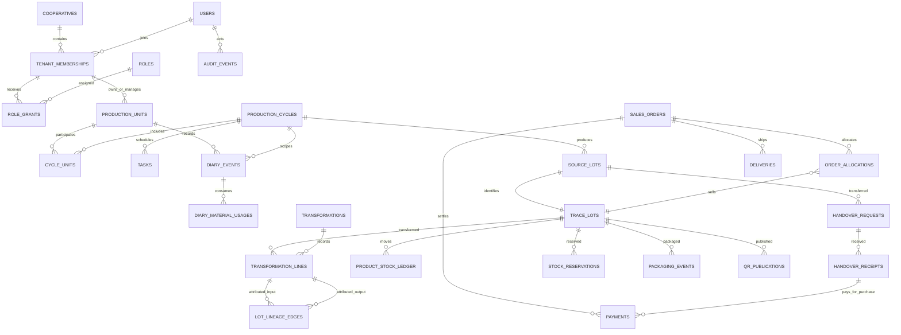
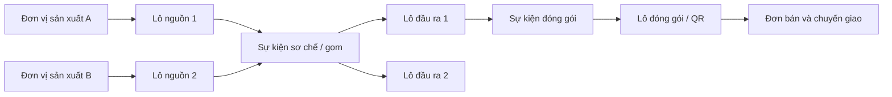

# Thiết kế cơ sở dữ liệu hệ thống HTX Hưng Yên

| Thuộc tính | Nội dung |
|---|---|
| Phiên bản | 2.0 — thiết kế dùng chung cho Web Portal, Zalo Mini App, API và QR công khai |
| Ngày | 30/09/2026 |
| Trạng thái | Đề xuất thiết kế vật lý; cần chốt DBMS, chính sách HTX và hợp đồng API trước khi lập migration |
| Tài liệu nghiệp vụ chính | [SRS Web/Mini App/API v2.1](SRS_He_Thong_HTX_Hung_Yen_Web_Zalo_v2.1.md) |
| Tài liệu demo | [Thiết kế luồng nghiệp vụ và dữ liệu](THIET_KE_LUONG_NGHIEP_VU_VA_DU_LIEU_DEMO.md) |

> Tài liệu này thay cho thiết kế v1.1 cũ. Đây là thiết kế đề xuất cho cả Web và mobile. Repo hiện chưa chứa mã backend, Web Portal hoặc migration CSDL; vì vậy các bảng và SQL bên dưới là hợp đồng để đội Web/API cùng rà soát, chưa phải schema đã cài trên môi trường chạy.

## 1. Mục tiêu và giả định kỹ thuật

Thiết kế dùng **một CSDL quan hệ tập trung** cho ba HTX thí điểm và các HTX mở rộng. Web và Mini App không có bảng nghiệp vụ hoặc danh sách lô riêng theo giao diện; hai kênh đọc/ghi cùng bản ghi qua API. Trang quét QR công khai chỉ truy cập một read model đã lọc dữ liệu, không được truy vấn trực tiếp các bảng nội bộ.

### 1.1. DBMS đề xuất

- PostgreSQL 15 trở lên; có thể bật PostGIS nếu cần truy vấn bản đồ/vùng tọa độ.
- Khóa chính UUID; mã nghiệp vụ như `TH-AN-2026-003`, `GN-QT-2026-002` là mã hiển thị duy nhất trong phạm vi HTX, không thay khóa chính.
- Ngày nghiệp vụ dùng `date`; thời điểm hệ thống dùng `timestamptz` lưu UTC. Giao diện đổi sang múi giờ `Asia/Ho_Chi_Minh`.
- Số lượng dùng `numeric`, không dùng kiểu dấu phẩy động. Mỗi lượng phải gắn đơn vị tính.
- JSONB chỉ dành cho biểu mẫu động đã phiên bản hóa, payload sự kiện ngoài và snapshot đã công bố. Quan hệ nghiệp vụ, dòng hàng, nguồn gốc và quyền phải là bảng có khóa ngoại.
- Nếu Web API đang chọn SQL Server, có thể giữ mô hình quan hệ, khóa và quy tắc dưới đây rồi chuyển kiểu dữ liệu/tính năng tương ứng; không triển khai hai schema khác nhau cho Web và mobile.

### 1.2. Phạm vi dữ liệu

1. Quản trị hệ thống, HTX/tenant, tài khoản, thành viên, vai trò, phân quyền và lịch sử phê duyệt.
2. Danh mục, đơn vị tính, cấu hình theo HTX, đơn vị sản xuất, vụ/lứa, kế hoạch, SOP, công việc, nhật ký và kiểm tra.
3. Kho vật tư HTX và lịch sử cấp phát riêng.
4. Lô thu hoạch, phiếu giao HTX, sơ chế, đóng gói/đóng gói lại, tồn sản phẩm, đơn bán, giao hàng, thanh toán và ký gửi.
5. QR truy xuất, hồ sơ/chứng nhận, thông báo, phản hồi, tệp đính kèm, kiểm toán và đồng bộ sự kiện.

Kế toán tổng hợp, hóa đơn điện tử pháp lý, thanh toán trực tuyến, vận tải thời gian thực và cảm biến không được coi là có sẵn. Schema có thể nối các phân hệ này sau khi có yêu cầu/hợp đồng tích hợp.

## 2. Quyết định dữ liệu cốt lõi

### 2.1. Tenant và các kênh

Mọi dữ liệu nghiệp vụ thuộc một `cooperative_id` (tenant). Dữ liệu đăng nhập là toàn cục; quan hệ người dùng–HTX–vai trò được lưu riêng. API lấy tenant từ phiên đã xác thực, không tin `cooperative_id`, vai trò hay chủ sở hữu do client gửi.

| Thao tác | Kênh dự kiến | Bản ghi dùng chung |
|---|---|---|
| Tạo/duyệt/khóa thành viên; danh mục, quyền, SOP, biểu mẫu | Web | `memberships`, `member_applications`, `role_grants`, `catalog_items`, `sop_versions`, `form_schemas` |
| Tạo đơn vị sản xuất và kế hoạch; phân công | Chủ yếu Web, R03 có thể thao tác trên mobile khi được cấp quyền | `production_units`, `production_cycles`, `plans`, `tasks` |
| Nhật ký, kiểm tra, thu hoạch, gửi HTX | Web hoặc Mini App theo quyền | `diary_events`, `source_lots`, `handover_requests` |
| Cân nhận, sơ chế, tồn, đơn, giao hàng, thanh toán | Web đầy đủ; Mini App thao tác hiện trường theo quyền | `handover_receipts`, `transformations`, `product_stock_ledger`, `sales_orders`, `deliveries`, `payments` |
| Quét QR | Trang công khai/Mini App | `qr_publications` và read model chỉ chứa trường công khai |

Không dùng `localStorage` làm nguồn dữ liệu production. Cơ sở dữ liệu phía server là nguồn chuẩn; Web/Mini App chỉ giữ cache/nháp cục bộ có trạng thái đồng bộ minh bạch.

### 2.2. Không gộp các khái niệm

| Khái niệm | Lưu ở đâu | Ví dụ |
|---|---|---|
| HTX sở hữu bản ghi | `cooperative_id` trên bảng tenant | Phiếu thuộc HTX Quyết Thắng |
| Chủ sở hữu hàng | Chủ thể trên số dư/ledger sản phẩm | Hộ Mai hoặc HTX Quyết Thắng |
| Bên đang giữ hàng | Bên giữ trên ledger và vị trí | Hộ Mai, HTX, đang vận chuyển |
| Vị trí vật lý | `stock_locations` | Kho trung tâm, khu chờ nhận, tại hộ |
| Bên bán | Đơn bán | Hộ bán trực tiếp hoặc HTX bán theo thỏa thuận |
| Người thao tác | `created_by_user_id`/`actor_membership_id` | R03 đóng gói thay hộ An |
| Nguồn hàng | Phiếu, dòng tồn, lô nguồn và quan hệ phả hệ | Hàng ký gửi từ phiếu GN-QT-2026-002 |

**Ký gửi:** hộ vẫn là chủ; HTX trở thành bên giữ sau khi nhận chốt. **Mua đứt:** chủ đổi sang HTX tại giao dịch nhận đã xác nhận. Dịch vụ sơ chế/đóng gói không tự đổi chủ.

### 2.3. Quy ước tenant an toàn ở khóa ngoại

Các bảng tenant cần có `cooperative_id NOT NULL`, `id UUID`, `UNIQUE (cooperative_id, id)`. FK giữa hai bảng nghiệp vụ dùng cả hai cột, ví dụ `(cooperative_id, production_unit_id)`, để DB không cho gắn nhầm bản ghi từ HTX khác dù ứng dụng có lỗi.

Mã lô/phiếu/đơn có unique theo tenant, ví dụ `UNIQUE (cooperative_id, lot_code)`. Các danh mục toàn hệ thống có thể không có tenant; danh mục tùy chỉnh có tenant hoặc ghi đè bằng bảng cấu hình tenant.

## 3. ERD tổng quan


```mermaid
erDiagram
    COOPERATIVES ||--o{ TENANT_MEMBERSHIPS : contains
    USERS ||--o{ TENANT_MEMBERSHIPS : joins
    TENANT_MEMBERSHIPS ||--o{ ROLE_GRANTS : receives
    ROLES ||--o{ ROLE_GRANTS : assigned
    TENANT_MEMBERSHIPS ||--o{ PRODUCTION_UNITS : owns_or_manages
    PRODUCTION_UNITS ||--o{ CYCLE_UNITS : participates
    PRODUCTION_CYCLES ||--o{ CYCLE_UNITS : includes
    PRODUCTION_CYCLES ||--o{ TASKS : schedules
    PRODUCTION_UNITS ||--o{ DIARY_EVENTS : records
    PRODUCTION_CYCLES ||--o{ DIARY_EVENTS : scopes
    DIARY_EVENTS ||--o{ DIARY_MATERIAL_USAGES : consumes
    PRODUCTION_CYCLES ||--o{ SOURCE_LOTS : produces
    SOURCE_LOTS ||--|| TRACE_LOTS : identifies
    SOURCE_LOTS ||--o{ HANDOVER_REQUESTS : transferred
    HANDOVER_REQUESTS ||--o{ HANDOVER_RECEIPTS : received
    TRACE_LOTS ||--o{ PRODUCT_STOCK_LEDGER : moves
    TRACE_LOTS ||--o{ TRANSFORMATION_LINES : transformed
    TRANSFORMATIONS ||--o{ TRANSFORMATION_LINES : records
    TRANSFORMATION_LINES ||--o{ LOT_LINEAGE_EDGES : attributed_input
    TRANSFORMATION_LINES ||--o{ LOT_LINEAGE_EDGES : attributed_output
    TRACE_LOTS ||--o{ STOCK_RESERVATIONS : reserved
    TRACE_LOTS ||--o{ PACKAGING_EVENTS : packaged
    SALES_ORDERS ||--o{ ORDER_ALLOCATIONS : allocates
    ORDER_ALLOCATIONS }o--|| TRACE_LOTS : sells
    SALES_ORDERS ||--o{ DELIVERIES : ships
    SALES_ORDERS ||--o{ PAYMENTS : settles
    HANDOVER_RECEIPTS ||--o{ PAYMENTS : pays_for_purchase
    TRACE_LOTS ||--o{ QR_PUBLICATIONS : published
    USERS ||--o{ AUDIT_EVENTS : acts
```

`SOURCE_LOTS`, `TRACE_LOTS`, biến đổi, đóng gói và dòng tồn có quan hệ rõ ràng. Sơ chế/đóng gói nhiều đầu vào–nhiều đầu ra được nối qua bảng dòng và cạnh phả hệ, không ép vào một `harvest_lot_id` duy nhất trên thành phẩm.

## 4. Danh mục bảng theo phân hệ

Tên bảng SQL đề xuất dùng snake_case tiếng Anh; tên tiếng Việt trong giao diện là độc lập. UUID và cột audit tiêu chuẩn được lược khỏi danh sách khi bảng đã ghi rõ “cột chung”.

### 4.1. Nền tảng, tài khoản, HTX và phân quyền Web

| Bảng | Cột nghiệp vụ chính | Khóa/ghi chú |
|---|---|---|
| `cooperatives` | `id`, `code`, `name`, `legal_name`, `address`, `province_code`, `timezone`, `status`, `logo_file_id`, `settings` | Gốc tenant; `code` unique toàn hệ thống. |
| `users` | `id`, `display_name`, `normalized_phone`, `email`, `avatar_file_id`, `status`, `last_login_at` | Định danh người; không gắn cứng vào một HTX. Điện thoại/email có thể cần mã hóa. |
| `auth_identities` | `user_id`, `provider`, `provider_subject`, `password_hash`, `verified_at`, `last_used_at` | `provider` như `web_password`, `zalo`; unique `(provider, provider_subject)`. Chỉ lưu hash mật khẩu Web, không lưu mật khẩu thô hoặc token Zalo dài hạn. |
| `tenant_memberships` | `id`, `cooperative_id`, `user_id`, `member_code`, `status`, `joined_at`, `approved_by_user_id`, `approved_at`, `group_id` | Quan hệ một user với một HTX; unique `(cooperative_id,user_id)` nếu chỉ một membership đang hoạt động. |
| `member_profiles` | `membership_id`, `identity_number_ciphertext`, `birth_date`, `gender`, `address`, `farm_contact`, `privacy_flags` | Hồ sơ hộ/thành viên; tách khỏi đăng nhập và quyền. Không đưa CCCD ra QR. |
| `member_applications` | `id`, `cooperative_id`, `applicant_name`, `phone`, `requested_member_code`, `status`, `submitted_at`, `reviewed_by`, `reviewed_at`, `rejection_reason` | Web tạo/duyệt; có thể tạo membership và gắn user sau khi duyệt. Mini App không tự đăng ký/duyệt theo SRS. |
| `membership_status_events` | `membership_id`, `old_status`, `new_status`, `reason`, `actor_user_id`, `created_at` | Lịch sử duyệt/khóa/mở thành viên. |
| `roles` | `id`, `code`, `name`, `description`, `scope_type`, `is_system` | Seed R01, R02, R03, R04, R06; R05 bật tùy HTX; R07 là quyền truy cập công khai, không nhất thiết là tài khoản nội bộ. |
| `platform_role_grants` | `id`, `user_id`, `role_id`, `valid_from`, `valid_to`, `granted_by_user_id` | Gán quyền R01 ở phạm vi toàn nền tảng, không gắn vào HTX; mọi thao tác quản trị toàn cục vẫn phải audit. |
| `permissions` | `id`, `code`, `module`, `action`, `resource`, `description` | Ví dụ `MEMBER_APPROVE`, `HANDOVER_RECEIVE`, `STOCK_EXPORT`. |
| `role_permissions` | `role_id`, `permission_id`, `condition_json` | PK ghép. Không thay kiểm tra phạm vi tài nguyên bằng RBAC thuần. |
| `role_grants` | `id`, `cooperative_id`, `membership_id`, `role_id`, `scope_type`, `scope_id`, `valid_from`, `valid_to`, `granted_by` | Vai trò có tenant, phạm vi, thời hạn; unique/constraint ngăn grant trùng hiệu lực. R01 dùng grant nền tảng riêng. |
| `data_shares` | `id`, `cooperative_id`, `owner_membership_id`, `recipient_membership_id`, `resource_type`, `resource_id`, `purpose`, `valid_from`, `valid_to`, `revoked_at`, `evidence_file_id` | Cấp quyền xem dữ liệu hộ có mục đích/thời hạn; mọi truy cập nhạy cảm được audit. |
| `tenant_settings` | `cooperative_id`, `setting_key`, `value_json`, `effective_from`, `updated_by` | Cấu hình HTX như đơn vị, ngưỡng, module bật/tắt. Unique `(cooperative_id,setting_key,effective_from)`. |
| `tenant_features` | `cooperative_id`, `feature_code`, `enabled`, `settings_json` | Bật dịch vụ An Ninh, theo dõi đàn Đông Tảo, thủy sản Quyết Thắng. |

### 4.2. Danh mục, sản phẩm, chứng nhận và tệp

| Bảng | Cột nghiệp vụ chính | Khóa/ghi chú |
|---|---|---|
| `catalog_categories` | `id`, `cooperative_id` nullable, `code`, `name`, `domain`, `is_global` | Nhóm giống, công việc, vật tư, sản phẩm, phân hạng, dịch vụ. |
| `catalog_items` | `id`, `cooperative_id` nullable, `category_id`, `code`, `name`, `attributes_json`, `valid_from`, `valid_to`, `status` | Phiên bản/danh mục theo tenant; code unique trong category + tenant. |
| `units_of_measure` | `id`, `code`, `name`, `dimension`, `precision_scale` | Ví dụ kg, tấn, con, bao, thùng. |
| `unit_conversions` | `id`, `cooperative_id`, `from_unit_id`, `to_unit_id`, `factor`, `valid_from`, `valid_to`, `approved_by` | Chỉ quy đổi cùng đại lượng; không tự đổi con sang kg. |
| `products` | `id`, `cooperative_id`, `code`, `name`, `product_type`, `unit_id`, `live_product`, `attributes_json`, `status` | Mặt hàng bán/thu hoạch; chứng nhận không nằm cứng trên sản phẩm. |
| `quality_profiles` | `id`, `cooperative_id`, `product_id`, `version`, `effective_from`, `effective_to`, `status` | Bộ tiêu chí chất lượng có phiên bản. |
| `quality_criteria` | `id`, `profile_id`, `code`, `name`, `unit_id`, `operator`, `target_value`, `tolerance`, `required` | Chuẩn độ ẩm, Brix, cỡ quả, cân mẫu, v.v. |
| `certificates` | `id`, `cooperative_id`, `issuer`, `certificate_no`, `standard_code`, `valid_from`, `valid_to`, `file_id`, `status` | Chứng nhận và hiệu lực. |
| `certificate_scopes` | `certificate_id`, `scope_type`, `scope_id`, `product_id` nullable | Gắn chứng nhận đúng HTX/vùng/sản phẩm/lô; không suy rằng mọi lô HTX đạt chuẩn. |
| `files` | `id`, `cooperative_id`, `storage_key`, `mime_type`, `size_bytes`, `checksum`, `uploaded_by`, `classification`, `created_at` | Metadata file; file thật ở object storage có ACL riêng, URL ký hạn chế. |
| `partners` | `id`, `cooperative_id`, `code`, `name`, `partner_type`, `contact_json`, `tax_code`, `status` | Nhà cung cấp, dịch vụ, thương lái; dữ liệu liên hệ hạn chế quyền. |
| `customers` | `id`, `cooperative_id`, `code`, `name`, `customer_type`, `contact_json`, `status` | Khách hàng/đại lý; công nợ không lưu thành một số sửa tùy ý mà tổng hợp từ chứng từ. |

### 4.3. Đơn vị sản xuất, vụ/lứa, kế hoạch và nhật ký

| Bảng | Cột nghiệp vụ chính | Khóa/ghi chú |
|---|---|---|
| `production_units` | `id`, `cooperative_id`, `code`, `name`, `unit_type`, `owner_membership_id` nullable, `manager_membership_id`, `area_value`, `area_unit_id`, `capacity_value`, `address`, `location_geog`, `status`, `attributes_json` | Hồ sơ ruộng/vườn/chuồng/ao/lồng; không chứa một mùa vụ hiện tại làm thuộc tính bắt buộc. |
| `production_unit_status_events` | `production_unit_id`, `old_status`, `new_status`, `reason`, `actor_user_id`, `created_at` | Tạm ngừng/đóng/mở có lịch sử; không xóa chu kỳ cũ. |
| `production_cycles` | `id`, `cooperative_id`, `code`, `name`, `cycle_type`, `product_id`, `variety_item_id`, `start_date`, `end_date`, `status`, `sop_version_id`, `expected_quantity`, `unit_id` | Vụ/lứa độc lập; có thể nhiều đơn vị tham gia. |
| `cycle_units` | `cycle_id`, `production_unit_id`, `owner_membership_id`, `planned_quantity`, `unit_id`, `valid_from`, `valid_to` | Liên kết nhiều-nhiều chu kỳ–đơn vị và sản lượng/diện tích theo từng nơi. |
| `sop_versions` | `id`, `cooperative_id`, `code`, `name`, `product_type`, `version_no`, `effective_from`, `effective_to`, `status` | SOP được đóng phiên bản để nhật ký cũ giữ tham chiếu bản áp dụng. |
| `sop_steps` | `id`, `sop_version_id`, `step_no`, `title`, `due_rule_json`, `form_schema_id`, `required`, `guidance` | Bước quy trình và hướng dẫn. |
| `form_schemas` | `id`, `cooperative_id`, `code`, `version_no`, `schema_json`, `effective_from`, `effective_to`, `status` | Biểu mẫu theo loại hình; phiên bản schema được lưu cùng sự kiện nhập. |
| `plans` | `id`, `cooperative_id`, `cycle_id`, `code`, `title`, `status`, `created_by`, `approved_by`, `approved_at` | Kế hoạch sản xuất/dịch vụ. |
| `tasks` | `id`, `cooperative_id`, `cycle_id`, `production_unit_id`, `sop_step_id`, `title`, `due_at`, `status`, `task_type`, `result_diary_id` | Công việc theo người được giao; trạng thái độc lập với nhật ký. |
| `task_assignments` | `task_id`, `membership_id`, `assignment_role`, `assigned_at`, `completed_at` | Hỗ trợ nhiều người thực hiện/kiểm tra. |
| `service_requests` | `id`, `cooperative_id`, `cycle_id`, `production_unit_id`, `requester_membership_id`, `service_type`, `requested_date`, `scheduled_at`, `quantity`, `unit_id`, `status`, `cost_terms_json` | Cấy/gặt/sấy và dịch vụ theo từng HTX; ghi yêu cầu, lịch và kết quả. |
| `diary_events` | `id`, `cooperative_id`, `production_unit_id`, `cycle_id`, `performed_at`, `created_by_membership_id`, `actor_membership_id`, `task_id`, `status`, `form_schema_id`, `form_schema_version`, `answers_json`, `notes`, `locked_at`, `content_hash` | Sự kiện thực tế; hộ và người ghi thay được phân biệt. `answers_json` theo schema đã chốt. |
| `diary_event_work_types` | `diary_event_id`, `catalog_item_id`, `sort_order` | Chuẩn hóa danh sách công việc; không lưu danh sách ID trong chuỗi JSON. |
| `diary_material_usages` | `id`, `diary_event_id`, `material_item_id`, `material_lot_id`, `quantity`, `unit_id` | Vật tư đã sử dụng, liên kết lô vật tư nếu quản lý. |
| `inspections` | `id`, `cooperative_id`, `production_unit_id`, `cycle_id`, `diary_event_id` nullable, `inspector_membership_id`, `result`, `checked_at`, `notes` | Kiểm tra kỹ thuật/chất lượng và kết quả. |
| `inspection_measurements` | `id`, `inspection_id`, `criterion_id`, `actual_value`, `unit_id`, `passed`, `evidence_file_id` | Giá trị thực đo theo tiêu chí phiên bản. |
| `diary_adjustment_requests` | `id`, `diary_event_id`, `requested_by`, `reason`, `proposed_values_json`, `status`, `reviewed_by`, `reviewed_at`, `review_notes` | Nhật ký đã khóa chỉ thay qua yêu cầu điều chỉnh có dấu vết. |

### 4.4. Kho vật tư HTX — sổ riêng

| Bảng | Cột nghiệp vụ chính | Khóa/ghi chú |
|---|---|---|
| `material_warehouses` | `id`, `cooperative_id`, `code`, `name`, `location_id`, `status` | Kho vật tư riêng với kho thành phẩm. |
| `material_items` | `id`, `cooperative_id`, `code`, `name`, `category_id`, `base_unit_id`, `minimum_quantity`, `status` | Không lưu `current_quantity` làm số chuẩn có thể sửa trực tiếp. |
| `material_lots` | `id`, `cooperative_id`, `material_item_id`, `lot_code`, `supplier_id`, `expiry_date`, `unit_cost`, `received_at` | Lô vật tư nhập; hạn dùng nếu áp dụng. |
| `material_transactions` | `id`, `cooperative_id`, `transaction_code`, `transaction_type`, `status`, `occurred_at`, `created_by`, `approved_by`, `source_document_id`, `idempotency_key` | Nhập, cấp, hoàn trả, điều chỉnh, kiểm kê. Chỉ giao dịch đã chốt tạo ledger. |
| `material_transaction_lines` | `id`, `transaction_id`, `material_lot_id`, `from_location_id`, `to_location_id`, `recipient_membership_id`, `quantity`, `unit_id`, `unit_cost` | Lượng vào/ra theo lô và bên nhận. |
| `material_stock_ledger` | `id`, `cooperative_id`, `transaction_line_id`, `material_lot_id`, `warehouse_id`, `holder_membership_id`, `quantity_delta`, `unit_id`, `posted_at` | Sổ phát sinh append-only; cấp hộ trừ kho HTX sau xác nhận. |
| `material_issue_requests` | `id`, `cooperative_id`, `requester_membership_id`, `production_unit_id`, `cycle_id`, `status`, `requested_at`, `approved_by` | Yêu cầu vật tư tách khỏi phiếu cấp thực tế. |

R06 chỉ xem vật tư đã cấp cho chính mình và lịch sử liên quan. Không hiển thị tồn, giá mua hay phiếu của hộ khác trong API danh sách/chi tiết/export.

### 4.5. Thu hoạch, phả hệ lô, sơ chế và đóng gói

| Bảng | Cột nghiệp vụ chính | Khóa/ghi chú |
|---|---|---|
| `trace_lots` | `id`, `cooperative_id`, `lot_code`, `lot_kind`, `product_id`, `variety_item_id`, `base_unit_id`, `status`, `created_at` | Định danh lô dùng từ lô nguồn tới đầu ra sơ chế/đóng gói; mã unique theo HTX. Không đặt chủ sở hữu tĩnh tại đây vì hàng có thể đổi chủ. |
| `source_lots` | `trace_lot_id`, `production_cycle_id`, `harvested_at`, `total_quantity`, `quality_profile_id`, `grade_item_id`, `recorded_by`, `status`, `notes` | Lô thu hoạch/xuất đàn/thu cá; bản ghi nguồn một-một với `trace_lots`. |
| `source_lot_origins` | `id`, `source_lot_id`, `production_unit_id`, `cycle_unit_id`, `quantity`, `unit_id`, `harvested_at` | Nhiều vùng/lứa đóng góp vào một lô khi phù hợp; lượng tổng phải đối soát. |
| `quality_assessments` | `id`, `cooperative_id`, `trace_lot_id`, `profile_version`, `assessed_by`, `assessed_at`, `result`, `notes` | Kết quả chất lượng ở các bước khác nhau. |
| `quality_measurements` | `id`, `assessment_id`, `criterion_id`, `actual_value`, `unit_id`, `passed`, `evidence_file_id` | Số đo/tiêu chí cụ thể. |
| `transformations` | `id`, `cooperative_id`, `code`, `transformation_type`, `occurred_at`, `method`, `operator_membership_id`, `status`, `notes` | Sự kiện sơ chế/chế biến/phân loại/tách/gom; không phải số tồn. |
| `transformation_lines` | `id`, `transformation_id`, `line_type`, `trace_lot_id`, `quantity`, `unit_id`, `grade_item_id`, `byproduct_type` | Dòng `input` hoặc `output`, sản lượng/phụ phẩm/hao hụt được khai báo. |
| `lot_lineage_edges` | `id`, `cooperative_id`, `transformation_id`, `input_line_id`, `output_line_id`, `input_attribution_qty`, `output_attribution_qty`, `unit_id` | Cạnh nhiều-đầu-vào/nhiều-đầu-ra để truy xuất hai chiều và giữ tỷ lệ nguồn. |
| `packaging_events` | `id`, `cooperative_id`, `code`, `input_trace_lot_id`, `output_trace_lot_id`, `parent_packaging_event_id`, `actor_membership_id`, `owner_membership_id` nullable, `packaging_level`, `occurred_at`, `status` | Đóng gói lần đầu hoặc đóng gói lại; chủ hàng khác người thao tác được. |
| `packaging_specs` | `id`, `cooperative_id`, `product_id`, `code`, `unit_count`, `package_unit_id`, `net_weight`, `net_weight_unit_id`, `label_template_id` | Quy cách thùng/túi/gói/con; lượng quy đổi có đơn vị. |
| `packaging_event_details` | `packaging_event_id`, `packaging_spec_id`, `package_count`, `input_quantity`, `output_quantity`, `loss_quantity`, `expiry_date`, `standard_text` | Số gói, đầu vào/ra, hao hụt, hạn dùng; đầu ra không làm tăng sản lượng nguồn. |

Lô bán sống hoặc bán thô không cần `packaging_events`. `trace_lots` có thể có QR công khai trực tiếp. Gói đóng lại phải giữ liên kết gói cũ → gói mới và không tạo lượng mới ngoài lượng đầu ra được giải trình.

### 4.6. Giao nhận hộ → HTX và quyền sở hữu

| Bảng | Cột nghiệp vụ chính | Khóa/ghi chú |
|---|---|---|
| `handover_requests` | `id`, `cooperative_id`, `code`, `sender_membership_id`, `handover_type`, `status`, `requested_at`, `created_by`, `actor_membership_id`, `confirmation_method`, `confirmation_evidence_file_id`, `idempotency_key` | `handover_type`: `purchase`, `consignment`, `service`; R03 thao tác thay hộ lưu riêng actor và xác nhận hộ. |
| `handover_request_lines` | `id`, `request_id`, `source_lot_id`, `source_stock_account_id`, `trace_lot_id`, `product_state`, `declared_quantity`, `unit_id`, `agreed_unit_price`, `terms_snapshot` | Một phiếu có thể có nhiều dòng nguồn; số lượng giữ trên đúng stock account. |
| `handover_receipts` | `id`, `cooperative_id`, `request_id`, `receipt_code`, `received_by`, `received_at`, `status`, `document_file_id`, `notes` | Một đề nghị có thể nhận thành nhiều lần nếu HTX cho giao từng phần. |
| `handover_receipt_lines` | `id`, `receipt_id`, `request_line_id`, `received_quantity`, `unit_id`, `quality_assessment_id`, `difference_reason`, `approved_by` | Cân nhận thực tế và chênh lệch; chỉ lượng chốt nhập tồn HTX. |
| `handover_status_events` | `id`, `request_id`, `old_status`, `new_status`, `actor_user_id`, `reason`, `occurred_at` | Nhật ký trạng thái; không ghi đè lịch sử. |
| `ownership_events` | `id`, `cooperative_id`, `trace_lot_id`, `from_owner_membership_id`, `to_owner_membership_id`, `from_owner_type`, `to_owner_type`, `handover_receipt_line_id`, `occurred_at`, `approved_by` | Chỉ ghi chuyển chủ thật, ví dụ mua đứt; ký gửi ghi thay đổi bên giữ nhưng không tạo ownership change. |

Phiếu chờ chỉ tạo reservation ở nơi nguồn đang giữ, chưa tạo tồn kho HTX. Khi nhận chốt, một giao dịch DB cập nhật phiếu, ghi ledger chuyển vị trí/chủ theo loại giao dịch, ghi lịch sử và phát thông báo/outbox. Từ chối/hủy giải phóng lượng giữ đúng một lần.

### 4.7. Kho thành phẩm, số dư và giữ chỗ

| Bảng | Cột nghiệp vụ chính | Khóa/ghi chú |
|---|---|---|
| `stock_locations` | `id`, `cooperative_id`, `code`, `name`, `location_type`, `parent_location_id`, `status` | Kho HTX, khu chờ nhận, tại hộ, đang vận chuyển; cây vị trí tùy mức độ chi tiết. |
| `product_stock_ledger` | `id`, `cooperative_id`, `event_id`, `trace_lot_id`, `owner_type`, `owner_membership_id`, `custodian_type`, `custodian_membership_id`, `location_id`, `quantity_delta`, `unit_id`, `posted_at` | Sổ lượng append-only theo lô + chủ + bên giữ + vị trí. Điều chỉnh bằng bút toán đảo/bổ sung có lý do. |
| `stock_reservations` | `id`, `cooperative_id`, `trace_lot_id`, `owner_type`, `owner_membership_id`, `custodian_type`, `custodian_membership_id`, `location_id`, `source_type`, `source_id`, `quantity`, `unit_id`, `status`, `expires_at` | Giữ lượng cho phiếu chuyển giao/đơn; giải phóng khi hủy/giảm/giao. Unique idempotency cho thao tác tạo/giải phóng. |
| `product_stock_balances` | `cooperative_id`, `trace_lot_id`, chủ, bên giữ, vị trí, `on_hand_quantity`, `reserved_quantity`, `available_quantity`, `as_of` | Read model/materialized view tái tạo từ ledger + reservation; không phải sổ chuẩn. |
| `stock_adjustments` | `id`, `cooperative_id`, `reason_code`, `requested_by`, `approved_by`, `status`, `evidence_file_id`, `posted_event_id` | Điều chỉnh tồn cần chứng từ và duyệt theo ngưỡng. |

`available_quantity = on_hand_quantity - active_reserved_quantity` theo cùng lô, chủ, bên giữ, vị trí và đơn vị quy đổi hợp lệ. **Kho thành phẩm HTX** là các số dư có `custodian_type = cooperative`; bao gồm cả hàng HTX sở hữu và hàng hộ ký gửi. Tồn hộ không xuất hiện trong kho HTX.

### 4.8. Bán hàng, giao nhận đối tác và tài chính giao dịch

| Bảng | Cột nghiệp vụ chính | Khóa/ghi chú |
|---|---|---|
| `sales_orders` | `id`, `cooperative_id`, `code`, `seller_type`, `seller_membership_id`, `seller_cooperative_id`, `customer_id`, `sales_channel`, `status`, `ordered_at`, `due_at`, `created_by`, `actor_membership_id`, `terms_snapshot` | Bên bán được lưu rõ; cột seller member hoặc cooperative theo `seller_type`. |
| `sales_order_lines` | `id`, `order_id`, `product_id`, `trace_lot_id`, `description_snapshot`, `quantity`, `unit_id`, `unit_price`, `discount_amount`, `tax_rate` nullable | Hỗ trợ hàng thô/sống/đóng gói, nhiều lô trên một đơn. Giá trị tiền tính bằng `numeric(18,2)` hoặc độ chính xác đã thống nhất. |
| `order_allocations` | `id`, `order_line_id`, `stock_position_key`, `trace_lot_id`, `quantity_reserved`, `quantity_dispatched`, `status` | Nối đơn với chính dòng tồn và reservation; cho phép một dòng đơn cấp từ nhiều lô. |
| `deliveries` | `id`, `cooperative_id`, `delivery_code`, `order_id`, `status`, `planned_at`, `dispatched_at`, `received_at`, `proof_file_id`, `notes` | Một đơn có thể giao nhiều chuyến. |
| `delivery_lines` | `id`, `delivery_id`, `order_allocation_id`, `dispatched_quantity`, `received_quantity`, `unit_id`, `difference_reason` | Chỉ lượng xuất thực tế ghi giảm vật lý đúng một lần. |
| `payments` | `id`, `cooperative_id`, `direction`, `counterparty_type`, `counterparty_id`, `order_id`, `handover_receipt_id`, `amount`, `currency`, `paid_at`, `method`, `reference`, `status` | Giao dịch phải thu/phải trả theo chứng từ nguồn; không sửa số công nợ tổng trực tiếp. |
| `consignment_settlements` | `id`, `cooperative_id`, `owner_membership_id`, `sales_order_id`, `source_handover_id`, `gross_amount`, `fee_amount`, `other_adjustment`, `net_payable`, `status`, `settled_at` | Thanh toán/đối soát hộ ký gửi. Phí, thuế, cách tính còn là chính sách cần xác nhận. |
| `customer_feedback` | `id`, `cooperative_id`, `order_id`, `trace_lot_id`, `rating`, `content`, `customer_contact_masked`, `status`, `resolution`, `resolved_by` | Khiếu nại/phản hồi gắn đơn hoặc lô. |
| `invoice_documents` | `id`, `cooperative_id`, `order_id`, `provider`, `invoice_no`, `issued_at`, `status`, `pdf_file_id`, `xml_file_id` | Chỉ dùng khi tích hợp hóa đơn pháp lý; bản xem trước trên app không được ghi là hóa đơn đã phát hành. |

Đơn nháp không giữ tồn. Đơn xác nhận giữ lượng. Hủy giải phóng lượng chưa giao. Giao một phần chỉ xuất phần đã giao; trả hàng là sự kiện/phiếu mới liên kết đơn gốc, không xóa lịch sử giao.

### 4.9. QR công khai, thông báo, audit và đồng bộ

| Bảng | Cột nghiệp vụ chính | Khóa/ghi chú |
|---|---|---|
| `qr_publications` | `id`, `cooperative_id`, `public_token_hash`, `trace_lot_id` nullable, `delivery_id` nullable, `status`, `payload_version`, `approved_by`, `approved_at`, `published_at`, `revoked_at`, `snapshot_json` | Check đúng một trong `trace_lot_id` hoặc `delivery_id`; QR dùng token ngẫu nhiên không đoán được, không chứa dữ liệu nội bộ. |
| `qr_publication_events` | `id`, `qr_publication_id`, `old_status`, `new_status`, `actor_user_id`, `reason`, `occurred_at` | Lịch sử duyệt/tạm dừng/thu hồi. |
| `qr_scans` | `id`, `qr_publication_id`, `scanned_at`, `client_type`, `coarse_region` nullable | Thu thập tối thiểu; không lưu IP/định vị chính xác nếu không có mục đích và chính sách. |
| `notifications` | `id`, `cooperative_id` nullable, `notification_type`, `title`, `body`, `action_resource_type`, `action_resource_id`, `created_by`, `created_at` | Payload chỉ mang ID/đường dẫn nghiệp vụ, không gửi dữ liệu nhạy cảm dư thừa. |
| `notification_recipients` | `notification_id`, `user_id`, `delivered_at`, `read_at`, `delivery_channel`, `delivery_status` | Trạng thái đọc theo người nhận; unique `(notification_id,user_id,delivery_channel)`. |
| `audit_events` | `id`, `cooperative_id` nullable, `actor_user_id`, `actor_membership_id`, `action`, `resource_type`, `resource_id`, `before_json`, `after_json`, `reason`, `source_channel`, `request_id`, `occurred_at` | Append-only; ghi login, duyệt, chuyển chủ, thay đổi lượng/giá, export, QR và điều chỉnh. Không đưa secret/CCCD thô vào JSON. |
| `business_events` | `id`, `cooperative_id`, `event_type`, `actor_user_id`, `actor_membership_id`, `idempotency_key`, `request_id`, `occurred_at` | Header sự kiện nghiệp vụ dùng chung cho các bút toán tồn; một sự kiện có thể sinh nhiều dòng ledger và được ghi cùng transaction. |
| `idempotency_records` | `id`, `cooperative_id`, `actor_user_id`, `idempotency_key`, `request_hash`, `response_resource_type`, `response_resource_id`, `created_at`, `expires_at` | Unique `(cooperative_id,actor_user_id,idempotency_key)` chống gửi lại tạo phiếu/đơn hoặc trừ tồn hai lần. |
| `outbox_events` | `id`, `cooperative_id`, `aggregate_type`, `aggregate_id`, `event_type`, `payload_json`, `occurred_at`, `published_at`, `retry_count` | Ghi cùng transaction với nghiệp vụ; worker gửi thông báo/WebSocket/webhook sau commit. |

## 5. Quan hệ nghiệp vụ và công thức tồn

### 5.1. Phả hệ lô


```mermaid
flowchart LR
    U1[Đơn vị sản xuất A] --> SL1[Lô nguồn 1]
    U2[Đơn vị sản xuất B] --> SL2[Lô nguồn 2]
    SL1 --> TR[Sự kiện sơ chế / gom]
    SL2 --> TR
    TR --> O1[Lô đầu ra 1]
    TR --> O2[Lô đầu ra 2]
    O1 --> PE[Sự kiện đóng gói]
    PE --> PK[Lô đóng gói / QR]
    PK --> ORD[Đơn bán và chuyến giao]
```

Mỗi `lot_lineage_edges` ghi lượng nguồn đóng góp vào đầu ra, đơn vị và loại chuyển đổi. Có thể đi ngược QR → gói → mẻ → lô nguồn → vùng/vụ/nhật ký, hoặc xuôi từ một vùng/lô tới tất cả đầu ra và đơn hàng chịu ảnh hưởng.

### 5.2. Hai luồng kho

**Kho vật tư:** nhận mua → ledger cộng vào kho HTX → cấp phát được duyệt → ledger trừ kho HTX và ghi bên nhận → sử dụng trong nhật ký → hoàn trả/điều chỉnh nếu có.

**Kho thành phẩm:** thu hoạch tạo số dư nơi hộ giữ → phiếu gửi tạo reservation → cân nhận chốt chuyển bên giữ sang HTX → mua đứt đồng thời chuyển chủ; ký gửi giữ chủ hộ → sơ chế/đóng gói trừ đầu vào, ghi hao hụt/phụ phẩm và cộng đầu ra → đơn giữ chỗ → giao hàng trừ thực tế.

Không dùng một cột `current_quantity` duy nhất làm nguồn chân lý. Số dư là tổng ledger theo tài khoản tồn, còn reservation được tính riêng. Mọi thao tác chốt phải ghi ledger trong cùng transaction với chứng từ nghiệp vụ.

### 5.3. Bảo toàn lượng

Với một phép biến đổi, theo từng đơn vị tương thích:

`Tổng lượng đầu vào = tổng lượng đầu ra + hao hụt + phụ phẩm + phần còn dở dang được ghi nhận`

Không so sánh trực tiếp kg với con/bao/thùng nếu chưa có quy đổi được duyệt. Khi lệch cân/hao hụt vượt ngưỡng tenant, giao dịch chuyển trạng thái chờ người có quyền duyệt; không tự ghi nhận đạt chuẩn.

## 6. Vòng đời và trạng thái chuẩn

Mã trạng thái dưới đây là giá trị máy đề xuất. Web và mobile có thể dùng nhãn tiếng Việt khác nhau nhưng không tự định nghĩa hai bộ trạng thái riêng.

| Đối tượng | Trạng thái đề xuất | Tác động dữ liệu |
|---|---|---|
| HTX | `active`, `suspended`, `closed` | Đóng HTX chặn giao dịch mới, vẫn lưu hồ sơ/lịch sử. |
| Membership | `draft`, `pending`, `active`, `paused`, `rejected`, `left` | Chỉ `active` cùng role grant hiệu lực mới cho đăng nhập nghiệp vụ. |
| Đơn vị sản xuất | `planned`, `active`, `paused`, `closed` | Không xóa khi đã có chu kỳ/nhật ký/lô; đóng chặn chu kỳ mới. |
| Chu kỳ | `planned`, `running`, `review`, `closed`, `cancelled` | Đóng không xóa dữ liệu và lịch sử. |
| Nhật ký | `draft`, `submitted`, `needs_revision`, `approved`, `locked`, `voided` | Sau hạn chỉ sửa qua adjustment request và audit. |
| Lô nguồn | `draft`, `confirmed`, `allocated`, `closed`, `quarantined`, `recalled` | Cách ly chặn bán và phát hành QR mới. |
| Phiếu gửi | `draft`, `submitted`, `in_transit`, `received_pending_review`, `confirmed`, `rejected`, `cancelled` | Phiếu chờ giữ lượng; chỉ receipt chốt tạo tồn HTX. |
| Đơn bán | `draft`, `confirmed`, `partially_delivered`, `delivered`, `completed`, `cancelled` | Xác nhận giữ lượng; giao thực tế trừ tồn. |
| QR | `draft`, `pending_approval`, `published`, `suspended`, `revoked`, `expired` | Public view chỉ trả dữ liệu khi QR hợp lệ. |

Chuyển trạng thái cần có actor, thời điểm, lý do khi phù hợp và sự kiện audit. Bản ghi đã chốt không xóa cứng; sửa sai bằng chứng từ đảo/điều chỉnh liên kết bản gốc.

## 7. Bảo mật và phân quyền dữ liệu Web/API

### 7.1. Kiểm tra quyền

Mỗi API request kiểm tra đồng thời:

`tenant + user + membership status + role grant + action + object scope + owner + custodian + data share + transaction relation`

- R06 mặc định chỉ xem/sửa vùng, chu kỳ, nhật ký, lô, tồn và giao dịch của membership mình hoặc quyền được ủy quyền.
- R02/R03/R04 không được xem toàn bộ dữ liệu riêng của hộ chỉ vì cùng tenant. Phiếu hộ gửi chỉ mở dữ liệu tối thiểu liên quan phiếu/nhận hàng. R03 xem/phối hợp theo phạm vi được giao hoặc consent.
- R04 xem kho thành phẩm HTX khi `custodian = cooperative`; bộ lọc tách hàng HTX sở hữu và hộ ký gửi. Tồn còn tại hộ không xuất hiện.
- R01 chỉ vượt tenant theo quyền quản trị có kiểm toán; không dùng tài khoản DB superuser cho app.
- R07 không có session nội bộ; chỉ gọi public endpoint theo token QR.
- Kiểm tra giống nhau trên list, chi tiết bằng UUID, search, dashboard, export, tệp ảnh và notification deep link.

### 7.2. Phòng vệ ở PostgreSQL và API

1. Bật Row Level Security cho bảng tenant nhạy cảm nếu phù hợp; API mở transaction, đặt `app.tenant_id` và `app.user_id` bằng `SET LOCAL` từ token đã kiểm chứng. Không tái sử dụng connection có context cũ.
2. Composite FK `(cooperative_id, related_id)` ngăn liên kết chéo tenant ở cấp DB.
3. App DB role không sở hữu bảng, không có `BYPASSRLS`; migration dùng role riêng.
4. RLS tenant là lớp phòng vệ; quyền hộ chi tiết vẫn phải kiểm tra ở service/API. Không viết policy chỉ `cooperative_id = tenant_id` rồi coi là đủ.
5. Audit và ledger chỉ insert; hạn chế UPDATE/DELETE bằng quyền DB/trigger. Điều chỉnh dùng giao dịch mới.
6. Mã hóa trường định danh cá nhân và quản lý khóa ngoài DB; giới hạn trường trả về Web/mobile/QR theo vai trò và mục đích.

## 8. Ràng buộc, unique và index cần có

| Nhóm | Ràng buộc/index đề xuất |
|---|---|
| Mã tenant | `UNIQUE(code)` trên HTX; unique `(cooperative_id, code)` cho lô/phiếu/đơn/đơn vị/vụ. |
| FK cùng tenant | Composite FK trên membership, unit, cycle, lot, request, stock, order, QR và các dòng chi tiết. |
| Đơn vị | `quantity > 0`; mỗi bản ghi số lượng có `unit_id`; conversion cùng `dimension`; độ chính xác làm tròn theo unit. |
| Thời gian | `start_date <= end_date`; `valid_from < valid_to`; timezone chuẩn UTC cho timestamp. |
| Phân bổ | Đặt chỗ/chốt không vượt số khả dụng; kiểm tra và ghi reservation trong transaction khóa tài khoản tồn/version. |
| Một chu kỳ | Index trên `(cooperative_id, production_unit_id, date_range)` để phát hiện chu kỳ chồng lấn theo chính sách loại hình. |
| Đơn vị hiện hành | Không có hai bản ghi code hoạt động trùng trong cùng tenant; dùng partial unique index nếu có soft disable. |
| Pending queues | Partial index cho handover/order/member application trạng thái đang chờ theo tenant và ngày tạo. |
| Tra cứu lô | Index `(cooperative_id, lot_code)`, `(cooperative_id, source_lot_id)`, lineage input/output và QR token hash. |
| Ledger | Index `(cooperative_id, trace_lot_id, posted_at)`, tài khoản sở hữu/bên giữ/vị trí; unique idempotency/event-line. |
| Nhật ký | Index `(cooperative_id, production_unit_id, performed_at desc)`, `(cycle_id, performed_at)`; GIN chỉ cho trường JSON cần lọc. |
| Nhật ký audit | Index tenant + thời gian, actor + thời gian, resource type/id; partition theo tháng khi lưu lượng tăng. |
| Dữ liệu địa lý | PostGIS GiST trên `geography` nếu cần lọc/hiển thị bản đồ; QR chỉ công bố độ chính xác được duyệt. |

Các quy tắc tổng nhiều dòng như lượng đầu vào/đầu ra và lượng dự trữ không thể bảo đảm bằng `CHECK` đơn giản. Service phải thực hiện trong transaction có khóa lạc quan/pessimistic phù hợp; có thể thêm deferred constraint trigger cho các kiểm tra cần thiết.

## 9. Transaction nghiệp vụ bắt buộc

### 9.1. Chốt phiếu nhận HTX

Trong một transaction:

1. Khóa phiếu và stock position/lượng hộ liên quan; kiểm tra trạng thái đang chờ và reservation còn hiệu lực.
2. Kiểm tra lượng thực nhận, đơn vị, chất lượng, sai lệch và quyền người nhận/duyệt.
3. Ghi `handover_receipts` và receipt lines; chuyển status sang `confirmed`.
4. Giải phóng reservation theo lượng khai báo, ghi sổ giảm tại bên giao và tăng tại bên giữ HTX theo lượng thực nhận.
5. Với `purchase`, ghi ownership event chuyển chủ sang HTX. Với `consignment`/`service`, giữ chủ hộ; cập nhật custodian HTX.
6. Ghi audit + outbox event; commit. Nếu một bước lỗi, không được có phiếu đã chốt mà thiếu ledger hoặc ngược lại.

### 9.2. Xác nhận đơn và giao hàng

- Draft: không thay tồn.
- Confirm: tạo reservation theo từng `order_allocation`; khóa/check available để không bán vượt tồn đồng thời.
- Dispatch/receive: append ledger trừ lượng thực xuất ở từng dòng tồn; ghi delivery line và giảm reservation tương ứng.
- Cancel: giải phóng phần reservation chưa giao; không cộng lại lượng đã giao.
- Trả hàng/điều chỉnh: chứng từ mới tham chiếu đơn/chuyến gốc, ghi lượng và nơi nhận lại; không sửa/xóa giao dịch cũ.

### 9.3. Sơ chế/đóng gói

Khóa các stock position đầu vào; kiểm tra quyền giữ/xử lý, lượng khả dụng, đơn vị và công thức đầu ra; ghi transformation/packaging event, các dòng vào-ra, lineage edges, hao hụt/phụ phẩm, ledger giảm đầu vào và ledger tăng đầu ra trong một transaction. Đóng gói lại nối mã gói cha/con và QR cũ/mới.

## 10. DDL mẫu cho các bảng lõi (PostgreSQL)

Đây là đoạn mẫu thể hiện cách áp dụng UUID, tenant composite key, ledger và reservation; tên enum/constraint có thể chuẩn hóa thêm khi tạo migration.

```sql
CREATE EXTENSION IF NOT EXISTS pgcrypto;

CREATE TABLE cooperatives (
  id uuid PRIMARY KEY DEFAULT gen_random_uuid(),
  code text NOT NULL UNIQUE,
  name text NOT NULL,
  timezone text NOT NULL DEFAULT 'Asia/Ho_Chi_Minh',
  status text NOT NULL CHECK (status IN ('active', 'suspended', 'closed')),
  created_at timestamptz NOT NULL DEFAULT now(),
  updated_at timestamptz NOT NULL DEFAULT now()
);

CREATE TABLE users (
  id uuid PRIMARY KEY DEFAULT gen_random_uuid(),
  display_name text NOT NULL,
  normalized_phone text,
  email text,
  status text NOT NULL DEFAULT 'active',
  created_at timestamptz NOT NULL DEFAULT now()
);

CREATE INDEX ix_users_normalized_phone ON users (normalized_phone)
  WHERE normalized_phone IS NOT NULL;

CREATE TABLE tenant_memberships (
  id uuid PRIMARY KEY DEFAULT gen_random_uuid(),
  cooperative_id uuid NOT NULL REFERENCES cooperatives(id),
  user_id uuid NOT NULL REFERENCES users(id),
  member_code text,
  status text NOT NULL CHECK (status IN ('pending','active','paused','rejected','left')),
  approved_by_user_id uuid REFERENCES users(id),
  approved_at timestamptz,
  created_at timestamptz NOT NULL DEFAULT now(),
  UNIQUE (cooperative_id, id),
  UNIQUE (cooperative_id, user_id),
  UNIQUE (cooperative_id, member_code)
);

CREATE TABLE business_events (
  id uuid PRIMARY KEY DEFAULT gen_random_uuid(),
  cooperative_id uuid NOT NULL REFERENCES cooperatives(id),
  event_type text NOT NULL,
  actor_user_id uuid REFERENCES users(id),
  actor_membership_id uuid,
  idempotency_key text,
  request_id uuid,
  occurred_at timestamptz NOT NULL DEFAULT now(),
  UNIQUE (cooperative_id, id),
  UNIQUE (cooperative_id, idempotency_key),
  FOREIGN KEY (cooperative_id, actor_membership_id)
    REFERENCES tenant_memberships(cooperative_id, id)
);

CREATE TABLE production_units (
  id uuid PRIMARY KEY DEFAULT gen_random_uuid(),
  cooperative_id uuid NOT NULL REFERENCES cooperatives(id),
  code text NOT NULL,
  name text NOT NULL,
  unit_type text NOT NULL CHECK (unit_type IN ('field','orchard','barn','pond','cage','other')),
  owner_membership_id uuid,
  manager_membership_id uuid,
  status text NOT NULL CHECK (status IN ('planned','active','paused','closed')),
  area_value numeric(14,4),
  area_unit_id uuid,
  attributes jsonb NOT NULL DEFAULT '{}'::jsonb,
  created_at timestamptz NOT NULL DEFAULT now(),
  UNIQUE (cooperative_id, id),
  UNIQUE (cooperative_id, code),
  FOREIGN KEY (cooperative_id, owner_membership_id)
    REFERENCES tenant_memberships(cooperative_id, id),
  FOREIGN KEY (cooperative_id, manager_membership_id)
    REFERENCES tenant_memberships(cooperative_id, id),
  CHECK (area_value IS NULL OR area_value >= 0)
);

CREATE TABLE production_cycles (
  id uuid PRIMARY KEY DEFAULT gen_random_uuid(),
  cooperative_id uuid NOT NULL REFERENCES cooperatives(id),
  code text NOT NULL,
  name text NOT NULL,
  cycle_type text NOT NULL,
  product_id uuid,
  start_date date NOT NULL,
  end_date date,
  status text NOT NULL CHECK (status IN ('planned','running','review','closed','cancelled')),
  created_at timestamptz NOT NULL DEFAULT now(),
  UNIQUE (cooperative_id, id),
  UNIQUE (cooperative_id, code),
  CHECK (end_date IS NULL OR end_date >= start_date)
);

CREATE TABLE cycle_units (
  cooperative_id uuid NOT NULL REFERENCES cooperatives(id),
  cycle_id uuid NOT NULL,
  production_unit_id uuid NOT NULL,
  planned_quantity numeric(18,6),
  unit_id uuid NOT NULL,
  PRIMARY KEY (cooperative_id, cycle_id, production_unit_id),
  FOREIGN KEY (cooperative_id, cycle_id) REFERENCES production_cycles(cooperative_id, id),
  FOREIGN KEY (cooperative_id, production_unit_id) REFERENCES production_units(cooperative_id, id),
  CHECK (planned_quantity IS NULL OR planned_quantity >= 0)
);

CREATE TABLE trace_lots (
  id uuid PRIMARY KEY DEFAULT gen_random_uuid(),
  cooperative_id uuid NOT NULL REFERENCES cooperatives(id),
  lot_code text NOT NULL,
  lot_kind text NOT NULL CHECK (lot_kind IN ('source','transformed','packaged')),
  product_id uuid NOT NULL,
  base_unit_id uuid NOT NULL,
  status text NOT NULL DEFAULT 'active',
  created_at timestamptz NOT NULL DEFAULT now(),
  UNIQUE (cooperative_id, id),
  UNIQUE (cooperative_id, lot_code)
);

CREATE TABLE product_stock_ledger (
  id uuid PRIMARY KEY DEFAULT gen_random_uuid(),
  cooperative_id uuid NOT NULL REFERENCES cooperatives(id),
  event_id uuid NOT NULL,
  event_line_key text NOT NULL,
  trace_lot_id uuid NOT NULL,
  owner_type text NOT NULL CHECK (owner_type IN ('cooperative','member')),
  owner_membership_id uuid,
  custodian_type text NOT NULL CHECK (custodian_type IN ('cooperative','member','transit','external')),
  custodian_membership_id uuid,
  location_id uuid,
  quantity_delta numeric(20,6) NOT NULL CHECK (quantity_delta <> 0),
  unit_id uuid NOT NULL,
  posted_at timestamptz NOT NULL DEFAULT now(),
  UNIQUE (cooperative_id, event_id, event_line_key),
  FOREIGN KEY (cooperative_id, event_id) REFERENCES business_events(cooperative_id, id),
  FOREIGN KEY (cooperative_id, trace_lot_id) REFERENCES trace_lots(cooperative_id, id),
  FOREIGN KEY (cooperative_id, owner_membership_id) REFERENCES tenant_memberships(cooperative_id, id),
  FOREIGN KEY (cooperative_id, custodian_membership_id) REFERENCES tenant_memberships(cooperative_id, id),
  CHECK ((owner_type = 'member') = (owner_membership_id IS NOT NULL)),
  CHECK ((custodian_type = 'member') = (custodian_membership_id IS NOT NULL))
);

CREATE TABLE stock_reservations (
  id uuid PRIMARY KEY DEFAULT gen_random_uuid(),
  cooperative_id uuid NOT NULL REFERENCES cooperatives(id),
  trace_lot_id uuid NOT NULL,
  owner_type text NOT NULL CHECK (owner_type IN ('cooperative','member')),
  owner_membership_id uuid,
  custodian_type text NOT NULL CHECK (custodian_type IN ('cooperative','member','transit','external')),
  custodian_membership_id uuid,
  location_id uuid,
  source_type text NOT NULL CHECK (source_type IN ('handover','sales_order','processing','packaging')),
  source_id uuid NOT NULL,
  request_line_key text NOT NULL,
  quantity numeric(20,6) NOT NULL CHECK (quantity > 0),
  unit_id uuid NOT NULL,
  status text NOT NULL CHECK (status IN ('active','partially_consumed','released','expired')),
  expires_at timestamptz,
  created_at timestamptz NOT NULL DEFAULT now(),
  UNIQUE (cooperative_id, source_type, source_id, request_line_key),
  FOREIGN KEY (cooperative_id, trace_lot_id) REFERENCES trace_lots(cooperative_id, id),
  FOREIGN KEY (cooperative_id, owner_membership_id) REFERENCES tenant_memberships(cooperative_id, id),
  FOREIGN KEY (cooperative_id, custodian_membership_id) REFERENCES tenant_memberships(cooperative_id, id),
  CHECK ((owner_type = 'member') = (owner_membership_id IS NOT NULL)),
  CHECK ((custodian_type = 'member') = (custodian_membership_id IS NOT NULL))
);

CREATE INDEX ix_stock_ledger_lot_time
  ON product_stock_ledger (cooperative_id, trace_lot_id, posted_at);
CREATE INDEX ix_stock_reservations_active
  ON stock_reservations (cooperative_id, trace_lot_id, expires_at)
  WHERE status IN ('active','partially_consumed');
```

Trong migration hoàn chỉnh, thêm FK composite cho các bảng còn lại; `owner_type`/`custodian_type` cần được chuẩn hóa sang party references hoặc giữ dạng CHECK rõ ràng. Ledger balance update chỉ được thực hiện qua service transaction/stored procedure có khóa và quyền phù hợp.

## 11. API/read models theo kênh

DB chuẩn hóa có thể tạo read model/materialized view để giao diện tải nhanh, nhưng các view vẫn tuân quyền:

| Read model | Người dùng | Dữ liệu trả |
|---|---|---|
| `v_household_product_balances` | R06 | Tồn do membership đó sở hữu/giữ; tách khả dụng và đã giữ; hàng ký gửi của chính hộ |
| `v_coop_finished_stock` | R04/R02 | Chỉ vị trí HTX đang giữ; tách hàng HTX sở hữu và hàng hộ ký gửi |
| `v_handover_inbox` | R04/R02, R03 được giao | Phiếu gửi HTX, lượng đề nghị/đã nhận, chỉ snapshot nguồn cần cho tiếp nhận |
| `v_harvest_supply` | R04 | Lô HTX tự sản xuất và lượng hộ đã gửi; không liệt kê lô riêng hộ chưa chia sẻ |
| `v_management_dashboard` | R02 theo tenant/quyền | Số liệu tổng hợp; không tự bung thành danh sách tồn/lô riêng hộ |
| `public_trace_payload` | Không đăng nhập | Snapshot QR đã duyệt, trạng thái công bố, trường dữ liệu công khai |

API nên trả DTO riêng theo use case; không trả entity SQL trực tiếp. Mỗi response list/detail/export áp dụng cùng điều kiện tenant, owner, custodian và data share.

## 12. Ánh xạ model mobile hiện tại sang schema mới

| Model hiện tại trong `src/types/index.ts` | Bảng/nhóm bảng đích | Xử lý khi tích hợp |
|---|---|---|
| `UserProfile`, `MemberRequest` | `users`, `auth_identities`, `tenant_memberships`, `member_profiles`, `member_applications`, `role_grants` | Chuyển id string demo sang UUID; không chuyển thanh đổi vai trò thành role grant production. |
| `FarmZone` có `cycles` lồng nhau | `production_units`, `production_cycles`, `cycle_units`, history | Tách cycle ra bảng; giữ unit độc lập khi chưa có vụ. |
| `DiaryEntry.workTypes`, ảnh, vật tư | `diary_events`, `diary_event_work_types`, `files`, `diary_material_usages` | Chuẩn hóa danh sách công việc; form câu trả lời giữ JSONB có version schema. |
| `HarvestLot.sources`, `allocation` | `trace_lots`, `source_lots`, `source_lot_origins`, `stock_reservations`/ledger | Không lưu allocation làm một số tổng không truy được chứng từ; tính từ phát sinh hoặc read model. |
| `ProductHandover` | `handover_requests`, request lines, receipts, receipt lines, ownership/status events | Tách khai báo hộ khỏi lượng thực nhận; hỗ trợ giao nhận một phần. |
| `ProductStockItem` | `product_stock_ledger`, `product_stock_balances`, `stock_locations`, `stock_reservations` | Tồn hiện tại cũ chuyển thành số dư đầu kỳ có nguồn `migration_opening`; không bịa lịch sử movement. |
| `ProcessingLot`, `processingInfo` | `transformations`, input/output lines, lineage edges, quality measurements | Hỗ trợ nhiều nguồn/đầu ra, hao hụt và phụ phẩm. |
| `PackagedProduct`, `sourceBatches` | `trace_lots`, `packaging_events`, packaging details, lineage edges, `qr_publications` | Giữ chủ hàng và người đóng gói tách biệt; package/repackage là các sự kiện. |
| `SalesOrder` | `sales_orders`, lines, allocations, deliveries, payments, settlement | Tách bên bán, phân bổ tồn, giao hàng, thu tiền và khoản phải trả hộ. |
| `InventoryItem`, `StockTransaction` | Material catalog, transaction header/lines, `material_stock_ledger` | Không dùng chung sổ với kho thành phẩm. |
| `AppNotification`, `CustomerFeedback`, `DiaryAdjustmentRequest` | `notifications`/recipients, `customer_feedback`, `diary_adjustment_requests` | Giữ trạng thái, actor, link tới resource và audit. |

ID mẫu như `h-05`, mã `TH-AN-2026-003` và `localStorage` chỉ dùng migration/demo. Khi nạp seed, bảo toàn mã nghiệp vụ nhưng cấp UUID mới và bảng ánh xạ legacy ID để đối soát.

## 13. Quy trình migration/triển khai

1. Chốt PostgreSQL hay DBMS khác, môi trường, chính sách tenant, các ngưỡng chất lượng/đối soát và owner/custodian contract.
2. Tạo migration nền: tenant, user/auth, memberships, roles, catalog, units, audit và files.
3. Tạo migration sản xuất: units, cycles, SOP, tasks, diary, inspections, harvest/source lots.
4. Tạo migration kho/chuyển giao: material ledger riêng; stock locations, product ledger, reservation, handover receipts và ownership events.
5. Tạo migration transformations/packaging/QR; sau đó sales/delivery/payment/consignment settlements.
6. Nạp seed HTX và demo bằng migration/seed idempotent; không dùng seed chạy mỗi lần khởi động production.
7. Nếu chuyển dữ liệu từ local demo, export snapshot, lập `legacy_id_map`, báo lỗi bản ghi thiếu HTX/chủ/đơn vị, đối chiếu tổng lượng trước khi mở API ghi.
8. Chạy song song báo cáo tồn cũ và ledger mới trên bộ dữ liệu kiểm soát; chỉ chuyển nguồn đọc khi số dư và quyền khớp.

Không suy đoán `owner_type` từ tên lô, vai trò người tạo hoặc cùng HTX. Bản ghi thiếu chủ/bên giữ phải đưa vào hàng chờ rà soát; QR chưa rõ quyền không được công bố.

## 14. Các quyết định cần xác nhận trước migration production

- DBMS, hosting, backup, mã hóa, thời hạn lưu và RPO/RTO.
- Một người có thể có bao nhiêu membership/HTX và cách liên kết tài khoản Web với Zalo.
- R05 có bật không; R02/R03 được thấy dữ liệu hộ nào và cần giấy ủy quyền/phạm vi thế nào.
- Đơn vị tính, hệ số chuyển đổi, ngưỡng lệch cân/hao hụt và ngưỡng duyệt.
- Điều khoản mua đứt/ký gửi/dịch vụ, seller pháp lý, hoa hồng, thanh toán từng phần và công nợ hộ.
- Chứng từ kiểm dịch/thời gian ngừng thuốc, chứng nhận, chính sách công bố QR và vị trí nhạy cảm.
- Hóa đơn điện tử, kế toán, thanh toán, export và xử lý trả hàng thuộc giai đoạn nào.
- Mức offline, chống gửi trùng, phân quyền DB/RLS và chính sách dữ liệu cá nhân.

Các điểm này khớp với câu hỏi mở trong SRS mục 18. Có thể dựng schema theo mặc định an toàn nêu trong tài liệu, nhưng các trường tiền/pháp lý và quyền xem hộ cần được HTX chốt trước khi vận hành thật.

## 15. Tóm tắt quy tắc bắt buộc cho đội Web/API

1. Web và Mini App dùng **một database, một API nghiệp vụ, một bộ ID và trạng thái**.
2. Tenant phải nằm trong mọi truy vấn và FK nghiệp vụ; role không đồng nghĩa quyền xem toàn HTX.
3. Lô/phiếu/tồn hộ riêng phải lọc ở server. Chỉ giao dịch gửi HTX hoặc quyền chia sẻ cụ thể mới cho HTX thấy dữ liệu cần thiết.
4. Tách chủ sở hữu, bên giữ, vị trí, bên bán và người thao tác.
5. Hai kho có sổ phát sinh độc lập; vật tư không trộn với thành phẩm.
6. Stock ledger và audit là append-only; sửa sai bằng bút toán đảo/điều chỉnh.
7. Reservation chống bán/gửi vượt lượng và được giải phóng đúng một lần.
8. Phả hệ lô hỗ trợ chia, gom, sơ chế, đóng gói lại và QR cả hai chiều.
9. QR công khai đọc snapshot đã duyệt; không suy rộng chứng nhận và không lộ thông tin nội bộ.
10. Mọi thao tác retry từ mobile phải idempotent; app báo thành công sau khi API commit.

