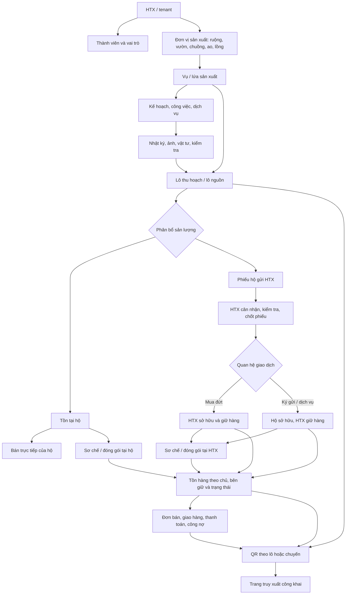

# Thiết kế luồng nghiệp vụ và dữ liệu để demo hệ thống HTX Hưng Yên

| Thuộc tính | Nội dung |
|---|---|
| Phiên bản | 1.0 |
| Ngày lập | 30/09/2026 |
| Mục đích | Chuẩn bị demo xuyên vai trò và thống nhất luồng dữ liệu giữa Zalo Mini App với Web Portal |
| Phạm vi đối chiếu | Mã nguồn mobile hiện có, dữ liệu demo, SRS Web/Mini App/API v2.1 |

## Cách đọc tài liệu

- **Hiện trạng mobile**: hành vi thấy trong mã nguồn của repo này.
- **Luồng mục tiêu**: nghiệp vụ cần thống nhất theo [SRS v2.1](SRS_He_Thong_HTX_Hung_Yen_Web_Zalo_v2.1.md).
- **Cần Web/API xác nhận**: repo chưa có mã Web hoặc backend để chứng minh hành vi đã chạy thật.

SRS v2.1 là bản dự thảo yêu cầu, không phải bằng chứng rằng Web/API đã triển khai. Hướng dẫn demo cũ [HUONG_DAN_TRAI_NGHIEM_DEMO.md](../HUONG_DAN_TRAI_NGHIEM_DEMO.md) chủ yếu mô tả Mini App đời trước; dùng tài liệu này để diễn giải các quyết định dữ liệu và quyền mới hơn.

## 1. Tóm tắt phạm vi dự án hiện tại

Repo chứa Zalo Mini App viết bằng React/TypeScript và Vite. App có các màn hình vùng sản xuất, mùa vụ/lứa, nhật ký, thu hoạch, phiếu giao HTX, sơ chế, đóng gói/QR, hai loại tồn kho, bán hàng, thành viên chỉ đọc, thông báo và dashboard.

Môi trường hiện mặc định dùng dữ liệu mẫu (`VITE_USE_MOCK` mặc định bật). Dữ liệu demo được lưu trong `localStorage` của trình duyệt/app. Repo có cấu hình các endpoint và service client, nhưng không có mã nguồn backend hay Web Portal. Vì vậy:

1. Chuyển vai trò trong cùng phiên demo giúp xem cùng dữ liệu local của HTX.
2. Tab ẩn danh hoặc trình duyệt khác có vùng lưu trữ riêng; dữ liệu vừa tạo ở tab thường không tự xuất hiện ở đó.
3. Chưa thể khẳng định Web và Mini App đang đồng bộ trên một cơ sở dữ liệu thật. Thiết kế đích trong SRS yêu cầu cả hai dùng chung API và định danh nghiệp vụ.
4. Đăng nhập hiện đối chiếu số điện thoại với tài khoản demo/thành viên mẫu. Khi demo, cần gọi đây là luồng giả lập; chưa nên giới thiệu là xác thực Zalo production.

Mã mobile hiện có bốn vai trò nội bộ: **R06 hộ nông dân, R04 kế toán/kho, R03 cán bộ kỹ thuật, R02 ban quản trị HTX**. SRS v2.1 còn định nghĩa **R01 quản trị hệ thống** và **R07 người quét QR công khai**; R05 là vai trò tùy chọn theo HTX. R01/R07 không phải vai trò nội bộ trong Mini App hiện tại.

## 2. Mô hình nghiệp vụ tổng thể

### 2.1. Luồng dữ liệu xuyên suốt

Các bước **sơ chế** và **đóng gói** là tùy chọn. Lúa thô, gà sống, cá sống hoặc nhãn chưa đóng gói vẫn có thể được giao/bán và gắn QR theo lô/chuyến nếu chính sách HTX cho phép.

### 2.2. Thực thể dữ liệu và vai trò của chúng

| Thực thể | Ý nghĩa nghiệp vụ | Quan hệ cần giữ |
|---|---|---|
| HTX (`htxId`) | Ranh giới dữ liệu/tenant | Mọi bản ghi nghiệp vụ mang đúng HTX; không suy quyền chỉ từ việc cùng HTX. |
| Thành viên, người dùng, vai trò | Người sản xuất hoặc người tác nghiệp | Thành viên/hộ gắn HTX; người dùng có vai trò và phạm vi được cấp. |
| Đơn vị sản xuất (`FarmZone` / `ProductionUnit`) | Hồ sơ ổn định: thửa, vườn, chuồng, ao, lồng | Thuộc hộ/HTX; tồn tại độc lập với từng vụ/lứa. |
| Vụ/lứa (`ProductionCycle`) | Chu kỳ sản xuất trên một đơn vị | Khi tạo chọn đơn vị đã có; một vườn/chuồng/lồng có thể có nhiều chu kỳ theo thời gian. |
| Công việc (`ProductionTask`) và nhật ký (`DiaryEntry`) | Kế hoạch và sự kiện thực tế | Nhật ký nên gắn đơn vị + chu kỳ + người thực hiện; có thể nối công việc đã giao. |
| Lô thu hoạch (`HarvestLot`) | Đầu ra nguồn đầu tiên | Gắn HTX, đơn vị, chu kỳ, chủ sở hữu ban đầu, lượng, đơn vị và phân hạng. |
| Phiếu giao HTX (`ProductHandover`) | Đề nghị và chứng từ bàn giao | Gắn lô nguồn, hộ, loại giao dịch, lượng khai báo/thực nhận, tình trạng, chất lượng và giá nếu là mua đứt. |
| Tồn sản phẩm (`ProductStockItem`) | Hàng vật lý có thể bán/xử lý | Gắn lô nguồn, trạng thái sản phẩm, chủ sở hữu, bên giữ, vị trí và phiếu nhập nguồn. |
| Lô sơ chế (`ProcessingLot`) | Sự kiện biến đổi hàng | Ghi đầu vào, đầu ra, hao hụt, phương pháp, người làm và liên kết lô nguồn. |
| Lô đóng gói (`PackagedProduct`) | Sự kiện/quy cách đóng gói và mã QR | Gắn lô/nguồn tồn, chủ hàng, người thực hiện, mã gói và trạng thái QR. Đóng gói lại cần nối gói cũ với gói mới. |
| Đơn hàng (`SalesOrder`) | Thỏa thuận bán | Gắn bên bán, khách hàng, lô/dòng tồn, phiếu nguồn nếu bán ký gửi, lượng, giá và giao nhận. |
| Vật tư và phiếu kho (`InventoryItem`, `StockTransaction`) | Đầu vào sản xuất do HTX quản lý | Tách khỏi tồn nông sản/thành phẩm; cấp phát phải có phiếu và người nhận. |
| Thông báo, phản hồi, đề nghị điều chỉnh | Theo dõi công việc và xử lý ngoại lệ | Liên kết tới đúng bản ghi cần mở; lưu trạng thái và người xử lý. |

SRS mục tiêu còn yêu cầu sổ phát sinh tồn, lượng giữ chỗ, sự kiện chuyển chủ, phả hệ nhiều đầu vào/nhiều đầu ra, audit log và bản công bố QR có phiên bản. Các cấu trúc này rộng hơn model demo hiện tại; cần được thiết kế ở Web/API, không nên giả định rằng một `harvestLotId` đơn lẻ đã giải quyết đủ truy xuất nhiều nguồn.

### 2.3. Những trường không được gộp nghĩa

| Trường/khái niệm | Câu hỏi nó trả lời | Ví dụ ký gửi |
|---|---|---|
| `htxId` | Giao dịch thuộc không gian HTX nào? | `quyetthang` |
| `ownerType`, `ownerId` | Ai sở hữu hàng? | Hộ Phạm Thị Mai |
| `holderId` | Ai đang giữ hàng? | HTX Quyết Thắng |
| `locationName` | Hàng đang ở vị trí vật lý nào? | Kho trung tâm HTX |
| `sellerType`, `sellerId` | Ai là bên bán trên giao dịch? | Theo hợp đồng/ký gửi và cấu hình đại diện bán |
| `actorId`, `actorName` | Ai trực tiếp thao tác trong app? | R03 đóng gói hộ |
| `sourceHandoverId`, `sourceStockItemId` | Hàng đi vào dòng tồn này qua phiếu/dòng tồn nào? | Phiếu ký gửi GN-QT-2026-002 |

**Nguyên tắc:** hàng vào kho HTX không có nghĩa là HTX sở hữu hàng. Giao dịch dịch vụ hoặc ký gửi không tự đổi chủ. Nên thể hiện riêng nhãn **“HTX sở hữu”**, **“Hộ sở hữu – HTX đang giữ”**, **“Hộ đang giữ”**.

## 3. Các luồng nghiệp vụ để trình bày

### 3.1. Thiết lập sản xuất

1. Web quản lý HTX, thành viên, danh mục, biểu mẫu/quy trình và quyền.
2. Người có quyền tạo **đơn vị sản xuất** mà không bắt buộc chọn mùa vụ.
3. R03 lập vụ/lứa bằng cách chọn đơn vị đã tạo, giống/sản phẩm, thời gian, sản lượng dự kiến và người phụ trách.
4. R03 giao công việc/dịch vụ; R06 xem công việc được giao và ghi nhận việc thực hiện.
5. R06/R03 ghi nhật ký có thời điểm, nội dung, vật tư, ảnh và chu kỳ liên quan. Khi quá thời hạn sửa, sửa sai theo yêu cầu điều chỉnh và phê duyệt thay vì âm thầm sửa bản cũ.

### 3.2. Thu hoạch và phân bổ lượng

1. Tạo lô thu hoạch từ đơn vị/vụ/lứa; ghi ngày, lượng, đơn vị, chất lượng/phân hạng, chủ hộ và ảnh.
2. Chia lượng thành các nhánh: hộ giữ, bán trực tiếp, gửi HTX, sơ chế, đóng gói.
3. Không để tổng phần phân bổ vượt lượng còn khả dụng. Lượng phiếu đang chờ kiểm nhận được giữ khỏi lượng hộ có thể dùng tiếp.
4. R06 xem lô/tồn của hộ mình. R04 chỉ nên thấy nguồn HTX tự sản xuất và phần hộ đã gửi trong phạm vi phiếu; R02/R03 tuân theo phân công/ủy quyền.

### 3.3. Hộ giao HTX: mua đứt và ký gửi

| Giai đoạn | Hộ R06 | R04 / người nhận có quyền | Tác động dữ liệu |
|---|---|---|---|
| Lập phiếu | Chọn lô/dòng tồn, loại giao dịch, lượng, giá/điều khoản nếu mua đứt | Nhận phiếu trong danh sách tiếp nhận | Giữ lượng khai báo; chưa cộng vào tồn HTX |
| Cân nhận | Theo dõi trạng thái, phản hồi chênh lệch nếu cần | Ghi lượng thực nhận, chất lượng, ảnh/chứng từ, chênh lệch | Chưa chốt cho đến khi người có quyền xác nhận |
| Chốt mua đứt | Xem kết quả và thanh toán | Xác nhận nhận hàng | Chủ chuyển sang HTX; bên giữ là HTX; vào Kho thành phẩm HTX |
| Chốt ký gửi | Theo dõi hàng của mình đang do HTX giữ | Xác nhận nhận hàng | Chủ vẫn là hộ; bên giữ là HTX; vào Kho thành phẩm HTX dưới nhãn ký gửi |
| Từ chối/hủy | Xem lý do và lượng được trả/giải phóng | Từ chối hoặc hủy theo quyền | Mở lại lượng chưa nhận; không để tồn ảo ở HTX |

Không cộng lượng phiếu chờ vào kho thành phẩm. Chênh lệch giữa khai báo và thực nhận phải được tính rõ: lượng nhận được vào tồn HTX; phần chưa nhận quay về khả dụng của hộ hoặc xử lý theo chứng từ giao nhận.

### 3.4. Sơ chế, đóng gói và đóng gói hộ

- Sơ chế ghi đầu vào, đầu ra, hao hụt, phụ phẩm, đơn vị và người thực hiện; không tính đầu ra lần nữa như sản lượng thu hoạch mới.
- Đóng gói trừ đúng dòng tồn nguồn và tạo dòng tồn đóng gói tương ứng. Ghi rõ đóng gói từ hàng thô hay hàng đã sơ chế.
- R03 có thể thao tác đóng gói hộ trong luồng được cấp quyền: chủ sở hữu vẫn là hộ, còn R03 là người thực hiện. Danh sách cần phân biệt hàng hộ với hàng HTX bằng nhãn dễ thấy.
- Đóng gói lại là sự kiện mới: liên kết bao bì/gói cũ, lượng tháo ra, lượng gói mới và hao hụt. Không nhân đôi tồn hoặc sản lượng.
- Với R04, **Lô đóng gói & QR** chỉ hiện hàng HTX sở hữu hoặc HTX đang giữ, gồm hàng mua đứt và hàng hộ ký gửi đã nhận. Hàng còn tại hộ không hiện trong kho/list của HTX.

### 3.5. Bán, giao hàng và công nợ

1. Tạo đơn nháp từ đúng dòng tồn/lô, ghi bên bán, khách hàng, lượng, đơn vị, giá, kênh và hạn giao.
2. Đơn xác nhận giữ lượng khả dụng; chưa trừ tồn vật lý.
3. Ghi nhận giao/xuất thực tế thì mới trừ đúng dòng tồn và cập nhật tiến độ giao.
4. Hủy đơn giải phóng lượng chưa giao đúng một lần. Trả hàng và điều chỉnh sau chốt cần chứng từ liên kết đơn gốc.
5. Bán trực tiếp của hộ thuộc doanh thu/giao dịch hộ. Bán hàng ký gửi phải theo dõi chủ hàng, nguồn phiếu, khoản phải trả/phí theo thỏa thuận; không tự ghi thành mua đứt hay doanh thu hàng HTX sở hữu.

### 3.6. QR và truy xuất

QR nên trỏ tới định danh công khai của lô/chuyến, không nhúng số điện thoại, giá mua, công nợ hay vị trí nhạy cảm vào mã. Trang công khai chỉ hiển thị trường được HTX duyệt và chứng nhận còn hiệu lực. Nếu lô bị cách ly, QR sai hoặc hết hiệu lực thì trang phải phản ánh trạng thái/tạm dừng/thu hồi.

## 4. Nghiệp vụ theo vai trò và theo kênh

| Vai trò | Nghiệp vụ chính | Zalo Mini App hiện tại | Web Portal theo SRS v2.1 |
|---|---|---|---|
| **R01 Quản trị hệ thống** | Tạo HTX, tài khoản quản trị, cấu hình tenant, danh mục/quyền nền tảng | Không có vai trò R01 nội bộ trong app hiện tại | Kênh chính; truy cập dữ liệu HTX cần phân quyền và audit |
| **R02 Ban quản trị HTX** | Theo dõi kết quả, phê duyệt/điều chỉnh theo quyền, xử lý ngoại lệ, báo cáo | Có dashboard, thông báo và một số quyền duyệt tác nghiệp; không quản trị cấu hình đầy đủ | Quản trị nghiệp vụ HTX, thành viên, phân công, phê duyệt, báo cáo và đối soát |
| **R03 Cán bộ kỹ thuật** | Đơn vị/vụ/lứa, công việc, nhật ký/kiểm tra, thu hoạch, sơ chế, đóng gói hộ theo ủy quyền | Có luồng hiện trường, tạo đơn vị/vụ, ghi nhật ký/thu hoạch, sơ chế/đóng gói và bán hộ theo điều kiện app | Lập kế hoạch/SOP, phân công, kiểm tra, đối soát và hồ sơ sản xuất |
| **R04 Kế toán/kho** | Tiếp nhận phiếu hộ gửi, xác nhận cân/chất lượng, quản lý kho và bán/giao | Có hộp phiếu, xác nhận/từ chối, kho vật tư/thành phẩm, đơn bán; đóng gói là màn chỉ đọc | Quản lý khách hàng/giá, kho, phiếu giao, bán hàng, giao hàng, công nợ và báo cáo |
| **R05 Tổ trưởng** | Hỗ trợ tổ sản xuất nếu HTX bật vai trò này | Không có trong `UserRole` hiện tại | Vai trò tùy chọn; phạm vi và quyền phải cấu hình riêng, không giả định được bật |
| **R06 Hộ nông dân** | Nhật ký, lô/tồn của hộ, phiếu gửi HTX, bán trực tiếp, đóng gói sản phẩm của hộ | Tác nghiệp trên dữ liệu được gắn hộ; không tạo/duyệt thành viên | Mặc định Web không bắt buộc; chỉ dùng nếu HTX cấp tài khoản Web riêng |
| **R07 Người tiêu dùng** | Quét QR, xem nguồn gốc công khai | Có màn quét/kết quả demo | Mở trang công khai không cần đăng nhập |

### 4.1. Phân quyền mobile đang có trong mã nguồn

| Nhóm chức năng | R06 | R03 | R04 | R02 |
|---|---|---|---|---|
| Đơn vị sản xuất | Xem đơn vị hộ; không tạo theo quyền mặc định | Tạo/quản lý đơn vị và vụ/lứa | Không phải luồng chính | Xem/giám sát |
| Nhật ký | Tạo/sửa nhật ký của hộ theo thời hạn | Ghi/điều chỉnh tác nghiệp kỹ thuật | Không có module nhật ký | Xem; phê duyệt phiếu điều chỉnh theo quyền |
| Thu hoạch | Tạo/xem lô hộ mình | Tạo/xem lô trong HTX | Xem nguồn HTX và phiếu hộ gửi | Xem lô trong HTX |
| Phiếu giao HTX | Tạo/xem phiếu hộ | Xem/tác nghiệp theo màn hình được phép | Xác nhận hoặc từ chối | Xác nhận hoặc từ chối |
| Sơ chế/đóng gói | Lô hộ mình | Tạo/sơ chế và đóng gói; có cờ người thao tác hộ | Chỉ xem lô đóng gói/QR đủ điều kiện | Tạo và quản lý theo quyền |
| Tồn thành phẩm | Tồn của hộ; ký gửi của chính hộ | Tồn HTX đang giữ và tồn theo quyền | Chỉ hàng HTX đang giữ | Hàng HTX đang giữ |
| Kho vật tư | Chỉ vật tư đã cấp cho hộ | Xem theo quyền | Quản lý kho/phiếu nhập xuất | Xem theo quyền |
| Bán hàng | Bán trực tiếp của hộ | Tạo bán thay hộ trong luồng có xác nhận | Tạo đơn HTX | Tạo/duyệt theo quyền |
| Thành viên | Không có danh sách | Danh sách/hồ sơ chỉ đọc | Danh sách/hồ sơ chỉ đọc | Danh sách/hồ sơ; không có quản trị thành viên đầy đủ trên Mini App |

Ma trận này phản ánh các màn hình/hàm quyền trong mã mobile hiện có, không thay thế RBAC kiểm tra ở API. Chi tiết kiểm soát phải xác nhận cùng Web/API.

## 5. Khác biệt mobile và Web cần giữ khi phối hợp

| Chủ đề | Mobile/Zalo Mini App | Web Portal | Điều phải dùng chung |
|---|---|---|---|
| Trải nghiệm | Card, thao tác ngắn, nút lớn, chụp ảnh tại hiện trường | Bảng, bộ lọc, nhiều trường, đối soát/in/xuất | Tên nghiệp vụ, mã định danh, trạng thái và quy tắc tính |
| Thành viên | Đăng nhập và xem hồ sơ được phép; không đăng ký/duyệt | Tạo, cập nhật, duyệt, khóa/mở, gắn tài khoản theo quyền | Một `memberId` và lịch sử trạng thái/ủy quyền |
| Đơn vị/vụ | R06 xem; R03 tác nghiệp theo quyền | Quản trị, lập kế hoạch, cấu hình quy trình | Đơn vị sản xuất tách khỏi chu kỳ; nhật ký gắn rõ cả hai |
| Giao nhận | R06 lập phiếu; R04/R02 nhận và xử lý | Hộp tiếp nhận và đối soát đầy đủ | Cùng `handoverId`, lượng, đơn vị, loại giao dịch và trạng thái |
| Kho | Xem nhanh tồn/phiếu theo quyền | Quản lý sổ phát sinh, lọc, đối chiếu và xuất | Cùng dòng tồn; tách kho vật tư khỏi kho thành phẩm |
| Bán hàng | Tạo/xác nhận tác nghiệp tại hiện trường theo quyền | Đơn, giao hàng, công nợ và báo cáo đầy đủ | Cùng `orderId`, bên bán, nguồn hàng, giữ chỗ, lượng giao và trạng thái |
| QR | Quét/chia sẻ/xem tem | Duyệt trường công khai, phát hành/thu hồi, phân tích | Cùng định danh QR và phiên bản dữ liệu công bố |

### 5.1. Hợp đồng dữ liệu cần Web/API thống nhất

1. **ID ổn định**: `htxId`, `memberId/userId`, `productionUnitId`, `cycleId`, `harvestLotId`, `handoverId`, `stockItemId`, `processingLotId`, `packageId`, `orderId`, `qrId` không được thay bằng tên hiển thị.
2. **Số lượng**: luôn gửi lượng kèm đơn vị; chỉ quy đổi qua bảng hệ số hợp lệ. Không tự đổi con sang kg khi không có cân.
3. **Sở hữu/giữ hàng**: API trả đủ `ownerType`, `ownerId`, `holderId`, `locationId/locationName`; cập nhật bên giữ sau khi giao nhận được chốt.
4. **Nguồn gốc**: lưu quan hệ từ lô nguồn qua biến đổi, đóng gói, tồn và đơn; giữ cả chiều ngược để từ QR tìm về nguồn.
5. **Trạng thái**: dùng mã máy ổn định, tên hiển thị tiếng Việt có thể cấu hình; không để Web và mobile tự suy trạng thái từ chuỗi mô tả.
6. **Đóng gói hộ**: tách chủ sở hữu hàng khỏi `actorId/actorName`; lưu xác nhận/ủy quyền hộ nếu nghiệp vụ yêu cầu.
7. **Giữ chỗ/idempotency**: xác nhận đơn hoặc phiếu gửi phải chống gửi lặp; chỉ chốt giao nhận mới chuyển tồn vật lý.
8. **Quyền riêng tư**: kiểm tra quyền ở server trên danh sách, chi tiết bằng ID, tìm kiếm, dashboard, ảnh và export; ẩn dữ liệu hộ chưa chia sẻ.
9. **Đồng bộ thay đổi**: Web tạo phiếu/giao việc thì mobile nhận đúng ID; mobile gửi phiếu thì Web nhận cùng bản ghi và có thể mở từ thông báo.

### 5.2. Sai khác hiện tại cần xử lý trước khi gọi là đồng bộ thật

- **Chưa có Web/API trong repo**: service endpoint có cấu hình, nhưng app mặc định dùng mock/local storage. Chưa có bằng chứng hai kênh đọc/ghi chung nguồn.
- **Quyền xem lô hộ**: helper mobile hiện cho R02/R03 xem lô cùng HTX rộng hơn nguyên tắc quyền riêng tư hộ trong SRS. Cần chuyển lọc xuống API và chỉ cấp quyền qua dữ liệu đã chia sẻ/ủy quyền.
- **Vai trò demo**: thanh đổi vai trò/HTX là công cụ demo, không phải cơ chế phân quyền an toàn. Không dùng nó làm tiêu chí chứng minh kiểm soát server.
- **Sổ tồn**: app có `ProductStockItem` và phép tính khả dụng, nhưng SRS đích cần ledger, giữ chỗ, đối soát và lịch sử điều chỉnh đầy đủ. Web cần thiết kế phần này nhất quán để không trừ/nhập lặp.
- **Đóng gói/QR**: app có QR xem trước và các trạng thái gói; quy trình Web duyệt, công bố, tạm dừng/thu hồi theo SRS cần xác nhận riêng.
- **Chứng từ/tiền**: màn xem trước hoặc trạng thái thanh toán demo không phải hóa đơn điện tử hay sổ kế toán pháp lý.

## 6. Kịch bản demo xuyên vai trò

### Kịch bản chính: lô lúa 1.500 kg của hộ Nguyễn Văn An

Đây là câu chuyện demo số lượng dùng trong fixture/kiểm thử của dự án. Có thể dùng lô mẫu `TH-AN-2026-003` (`h-05`) trên bộ dữ liệu sạch; số liệu dưới đây dùng để giải thích nghiệp vụ và cần kiểm tra lại trạng thái nếu dữ liệu local đã được thao tác trước.

| Bước | Vai trò / màn hình | Thao tác demo | Kết quả cần nói rõ |
|---|---|---|---|
| 1. Sản xuất | R03 → Vùng sản xuất / Vụ lứa | Mở đơn vị sản xuất và chu kỳ lúa; giới thiệu công việc được giao | Đơn vị sản xuất là hồ sơ ổn định; vụ/lứa là một chu kỳ trên đơn vị đó |
| 2. Nhật ký | R06 → Nhật ký | Mở hoặc ghi một nhật ký có ngày, việc đã làm, vật tư/ảnh | Dữ liệu ghi nhận việc thực tế và gắn với hộ/đơn vị/chu kỳ |
| 3. Thu hoạch | R06 → Thu hoạch | Mở lô 1.500 kg; xác nhận chủ hộ An và lượng ban đầu | Lô nguồn thuộc hộ; R04 chưa được xem toàn bộ tồn hộ |
| 4. Mua đứt | R06 → Chi tiết lô → Giao HTX | Mở phiếu mẫu đã xác nhận 1.000 kg (`GN-AN-2026-008`) | HTX đã sở hữu 1.000 kg; lô còn 500 kg tại hộ |
| 5. Ký gửi | R06 → Chi tiết lô → Giao HTX | Tạo phiếu ký gửi mới 300 kg | Khi chờ chưa vào kho HTX; hộ còn 200 kg khả dụng và vẫn là chủ hàng |
| 6. Nhận hàng | R04 → Phiếu giao HTX | Nhận 280 kg, ghi chất lượng và chênh lệch -20 kg, xác nhận | Kho HTX có 1.000 kg sở hữu HTX + 280 kg ký gửi hộ; hộ còn khả dụng 220 kg |
| 7. Đóng gói hộ | R03 → Đóng gói sản phẩm & QR | Chọn dòng tồn đủ quyền, tạo quy cách đóng gói cho hộ An | Chủ vẫn là hộ nếu nguồn là hộ; R03 là người thao tác. Nêu rõ trên card/QR |
| 8. Kiểm tra R04 | R04 → Kho thành phẩm / Lô đóng gói & QR | Mở danh sách và một mã QR | R04 thấy hàng HTX đang giữ, gồm mua đứt và ký gửi; không thấy lượng còn ở hộ |
| 9. Bán và giao | R04 hoặc R06 → Đơn hàng | Tạo đơn từ đúng nguồn tồn; cập nhật lượng giao | Đơn giữ hàng trước; xuất/giao thực tế mới giảm tồn; bên bán phải đúng thỏa thuận |
| 10. Truy xuất | Quét QR / Kết quả nguồn gốc | Mở QR lô hoặc gói | Cho người xem thấy hành trình đã được phép công khai, không lộ giá mua/công nợ |

**Tính lượng để người demo giải thích:** 1.500 kg ban đầu; 1.000 kg mua đứt + 300 kg đề nghị ký gửi còn chờ ⇒ hộ tạm còn 200 kg khả dụng. HTX cân nhận 280 kg ký gửi ⇒ 20 kg chênh lệch không vào kho HTX và trở lại lượng hộ; tổng tồn đang do HTX giữ là 1.280 kg, gồm 1.000 kg HTX sở hữu và 280 kg hộ sở hữu.

Không cần đi hết sơ chế và đóng gói mới chứng minh được luồng. Nếu dùng nhánh đóng gói, trình bày tồn giảm ở đúng nguồn và đầu ra mới kế thừa chủ sở hữu/nguồn gốc.

### Kịch bản ngắn theo ba HTX

| HTX | Vai trò sản xuất nổi bật | Điểm nên demo |
|---|---|---|
| An Ninh | Lúa; hỗ trợ dịch vụ cấy/gặt/sấy | Nhật ký theo vụ, thu hoạch kg, mua đứt/ký gửi, cân nhận lệch, sơ chế sấy/xay xát |
| Đông Tảo | Gà theo đàn/lứa | Nhật ký tiêm phòng/thức ăn/hao hụt; xuất bán từng phần; gà sống có thể bán và truy xuất không cần đóng gói |
| Quyết Thắng | Vườn nhãn và thủy sản | Nhiều đợt thu nhãn; cá lồng theo chuyến, môi trường nước; đóng gói nhãn hoặc bán cá sống |

Các loại trường và yêu cầu kiểm dịch/chứng nhận phải theo cấu hình đã được HTX duyệt; không tự tuyên bố lô đạt VietGAP/OCOP hay đạt kiểm dịch chỉ từ tên sản phẩm.

## 7. Chuẩn bị demo mobile và phối hợp với người làm Web

### 7.1. Trước khi demo

- Chọn một HTX và giữ nguyên HTX đó xuyên suốt kịch bản; bắt đầu từ R06 rồi chuyển R04/R03/R02 bằng thanh **Đổi vai trò / HTX**.
- Dùng cùng trình duyệt/app context nếu muốn các vai trò demo nhìn cùng `localStorage`. Không dùng tab ẩn danh cho một vai trò nếu kỳ vọng vai trò khác thấy ngay dữ liệu vừa tạo.
- Ghi trước mã lô, mã phiếu và lượng cần trình bày; dữ liệu demo đã lưu có thể khác seed gốc sau các lần thao tác.
- Nếu có Web riêng, xác nhận Web đang kết nối cùng backend/tenant với mobile trước khi demo đồng bộ. Nếu chưa có API dùng chung, trình bày hai kênh như hai bản demo độc lập.
- Chỉ khôi phục dữ liệu demo khi đã chấp nhận xóa dữ liệu local hiện có hoặc đã sao lưu; thao tác khôi phục làm mất các bản ghi demo người dùng đã tạo trong storage đó.

### 7.2. Tài khoản mẫu trong login giả lập

| Vai trò | HTX An Ninh | HTX Đông Tảo | HTX Quyết Thắng |
|---|---|---|---|
| R06 | 0978 123 456 — Nguyễn Văn An | 0988 765 432 — Trần Đình Trọng | 0904 555 888 — Phạm Thị Mai |
| R04 | 0983 234 567 — Nguyễn Thị Dung | Chọn bằng thanh đổi vai trò demo | Chọn bằng thanh đổi vai trò demo |
| R03 | 0936 888 777 — Lê Văn Hoàng | Chọn bằng thanh đổi vai trò demo | Chọn bằng thanh đổi vai trò demo |
| R02 | 0912 345 678 — Phạm Văn Minh | Chọn bằng thanh đổi vai trò demo | Chọn bằng thanh đổi vai trò demo |

Số điện thoại là dữ liệu đăng nhập demo trong repo. Không dùng bảng này như danh sách tài khoản production; vai trò/HTX thực tế phải do Web/API cấp.

### 7.3. Chia việc với người làm Web

Trước khi ghép demo, hai bên thống nhất tối thiểu:

1. API base URL, môi trường test, tenant và cách cấp phiên đăng nhập.
2. Mã ID/code của lô, phiếu, tồn, gói, đơn; không ghép dữ liệu bằng tên sản phẩm.
3. Các trạng thái và điểm chốt lượng: phiếu đề nghị, đang giao/nhận, đã xác nhận, từ chối/hủy; đơn nháp, giữ hàng, giao một phần/đủ, hủy.
4. Quy tắc mua đứt/ký gửi/dịch vụ, người sở hữu, người giữ, bên bán, người thao tác và chứng từ xác nhận.
5. Ranh giới dữ liệu hộ: khi nào HTX được xem bản chụp nguồn, ai có thể mở chi tiết, có thời hạn ủy quyền không.
6. Quy tắc kho: vật tư riêng thành phẩm; lượng chờ chưa là tồn HTX; đơn xác nhận giữ lượng; giao thực tế mới xuất.
7. Phả hệ sơ chế/đóng gói lại và QR: nguồn nhiều lô, trường công khai, người duyệt, trạng thái tạm dừng/thu hồi.
8. Lỗi/mất mạng: retry không tạo phiếu hoặc trừ tồn hai lần; giao diện chỉ báo thành công sau khi API xác nhận.

## 8. Các quyết định nghiệp vụ còn cần chốt

SRS v2.1 liệt kê các điểm mở cần HTX/chủ dự án xác nhận. Ưu tiên chốt trước khi demo nghiệp vụ như quy định chính thức:

- Sản phẩm/kênh nào cho phép hộ bán trực tiếp; HTX mua đứt, ký gửi hay cung cấp dịch vụ ở bước nào.
- Giá, phí/hoa hồng, thời điểm chuyển quyền sở hữu, cách thanh toán và đối soát hộ ký gửi.
- Ngưỡng lệch cân/hao hụt, phân hạng, đơn vị và ai duyệt ngoại lệ.
- Quy định thuốc/vaccine, kiểm dịch gà/cá; hồ sơ cần có trước khi bán.
- Ai duyệt QR, ai được thu hồi/cách ly lô và dữ liệu nào được công bố.
- Mức độ Web/Mini App cần offline; tiêu chí đồng bộ và xử lý xung đột.
- Baseline/endline và công thức báo cáo; không coi mục tiêu dự kiến trong thuyết minh là kết quả thực đo.

## 9. Điểm chính cần nhấn mạnh khi demo

1. Một lô có thể chia thành nhiều nhánh bán, gửi HTX, sơ chế, đóng gói hoặc tồn; phải bảo toàn lượng.
2. R06 thấy dữ liệu hộ mình; HTX chỉ nhận dữ liệu nguồn tối thiểu qua phiếu đã gửi hoặc quyền được cấp.
3. “Chủ sở hữu”, “bên giữ”, “vị trí”, “bên bán” và “người thao tác” là các thông tin riêng.
4. Mua đứt chuyển chủ khi phiếu chốt; ký gửi chuyển nơi giữ nhưng không tự chuyển chủ.
5. Kho vật tư và kho thành phẩm là hai luồng khác nhau. Kho thành phẩm HTX chỉ gồm hàng HTX đang giữ.
6. Sơ chế/đóng gói là biến đổi lô, không tạo thêm sản lượng ban đầu.
7. Web và Mini App có giao diện/độ sâu khác nhau nhưng phải dùng cùng ID, quyền, trạng thái, phép tính và dữ liệu phía API.

## Tài liệu/mã nguồn đã đối chiếu

- [SRS Web, Mini App, API v2.1](SRS_He_Thong_HTX_Hung_Yen_Web_Zalo_v2.1.md) — nguồn thiết kế đích; còn các điểm mở ở mục 18.
- [Hướng dẫn trải nghiệm demo hiện có](../HUONG_DAN_TRAI_NGHIEM_DEMO.md) — các đường đi màn hình và dữ liệu mẫu trên Mini App.
- `src/types/index.ts` — kiểu dữ liệu vai trò, đơn vị/vụ, nhật ký, lô, phiếu, tồn, đóng gói và đơn hàng.
- `src/context/AppContext.tsx` — xử lý đăng nhập demo, lưu nghiệp vụ, nhận hàng, tồn, đóng gói và bán hàng.
- `src/utils/permissions.ts`, `src/utils/harvestBalance.ts` — quy tắc quyền hiện tại và tính lượng khả dụng.
- `src/mock/data.ts`, `src/mock/demoRepository.ts`, `src/config/api.ts` — dữ liệu HTX mẫu, lưu trữ demo và cấu hình mock/API.

